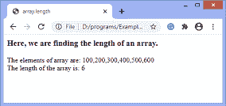
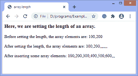
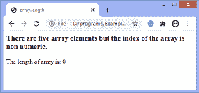
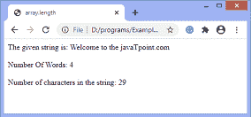

# JavaScript 数组. length 属性

> 原文:[https://www.javatpoint.com/javascript-array-length-property](https://www.javatpoint.com/javascript-array-length-property)

length 属性以 32 位无符号整数的形式返回数组中的元素数。我们也可以说 **length** 属性返回一个代表数组元素个数的数字。返回值总是大于最高数组索引。

**长度**属性也可以用来设置数组中的元素数量。我们必须结合使用赋值操作符和 length 属性来设置数组的长度。

JavaScript 中的 **array.length** 属性与 [jQuery](https://www.javatpoint.com/jquery-tutorial) 中的 **array.size()** 方法相同。在 [JavaScript](https://www.javatpoint.com/javascript-tutorial) 中，使用 **array.size()** 方法是无效的，所以我们使用 **array.length** 属性来计算数组的大小。

### 句法

**以下语法用于返回数组的长度**

```

array.length

```

**以下语法用于设置数组的长度**

```

array.length = number

```

为了更好的理解，让我们看一些使用 **array.length** 属性的例子。

### 示例 1

这是一个简单的例子来理解如何使用 **array.length** 属性计算数组的长度。

```

<html>
<head>
<title> array.length </title>
</head>

<body>
<h3> Here, we are finding the length of an array. </h3>
<script>
var arr = new Array( 100, 200, 300, 400, 500, 600 );
document.write(" The elements of array are: " + arr);
document.write(" <br>The length of the array is: " + arr.length);
</script>
</body>
</html>

```

[Test it Now](https://www.javatpoint.com/oprweb/test.jsp?filename=javascript-array-length-property1)

**输出**

在输出中，我们可以看到数组的长度为**六，**大于数组最高索引的值。上例中指定数组的最高索引是 **5。**



### 示例 2

在这个例子中，我们使用 **array.length** 属性来设置数组的长度。最初，数组包含两个元素，所以开始时，长度是 2。然后我们把数组的长度增加到 9。

在输出中，数组的值用逗号分隔。增加长度后，数组包含两个已定义值和七个未定义值，用逗号分隔。然后我们插入五个数组元素并打印出来。现在，数组包含七个已定义的值和两个未定义的值。

```

<html>
<head>
<title> array.length </title>
</head>

<body>
<h3> Here, we are setting the length of an array. </h3>
<script>
var arr = [100, 200];
document.write(" Before setting the length, the array elements are: " + arr);

arr.length = 9;
document.write("<br><br> After setting the length, the array elements are: " + arr);
// It will print [ 1, 2, <7 undefined items> ]
arr[2] = 300;
arr[3] = 400;
arr[4] = 500;
arr[5] = 600;
document.write("<br><br> After inserting some array elements: " + arr);
</script>
</body>
</html>

```

[Test it Now](https://www.javatpoint.com/oprweb/test.jsp?filename=javascript-array-length-property2)

**输出**



在下一个示例中，我们将使用非数字索引测试数组的 length 属性。

### **示例 3**

在本例中，数组的索引是非数字的。这里，数组包含五个带有非数字索引的元素。我们在给定的数组上应用 length 属性来查看效果。现在让我们看看**数组. length** 属性在数组的非数字索引上是如何工作的。

```

<html>
<head>
<title> array.length </title>
</head>

<body>
<h3> There are five array elements but the index of the array is non numeric. </h3>
<script>
var arr = new Array();
arr['a'] = 100;
arr['b'] = 200;
arr['c'] = 300;
arr['d'] = 400;
arr['e'] = 500;

document.write("The length of array is: " + arr.length);
</script>
</body>
</html>

```

[Test it Now](https://www.javatpoint.com/oprweb/test.jsp?filename=javascript-array-length-property3)

**输出**

在输出中，我们可以看到数组的长度显示为 **0** 。执行上述代码后，输出将是-



我们还可以使用 length 属性找出字符串中的字数。我们用一个例子来理解。

### 示例 4

在本例中，我们使用 length 属性来显示字符串中出现的单词数。这里，我们正在创建一个数组，并对数组元素使用 **split()** 函数。我们将字符串从空白( **" "** )字符中分离出来。

如果我们直接对字符串应用 length 属性，那么它会给出字符串中的字符数。但是在这个例子中，我们将理解如何计算字符串中的字数。

```

<html>
   <head>
      <title> array.length </title>
   </head>

   <body>   
      <script>
var str = "Welcome to the javaTpoint.com";
var arr = new Array();
arr = str.split(" ");
document.write(" The given string is: " + str); 
document.write("<br><br> Number Of Words: "+ arr.length);
document.write("<br><br> Number of characters in the string: " + str.length);
      </script>      
   </body>
</html>

```

[Test it Now](https://www.javatpoint.com/oprweb/test.jsp?filename=javascript-array-length-property4)

**输出**



* * *