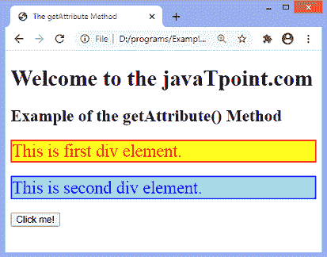
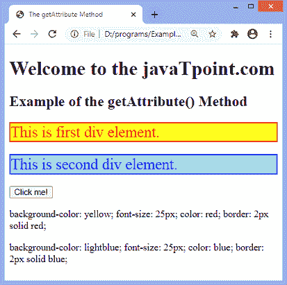
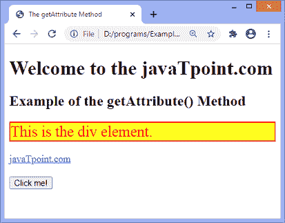
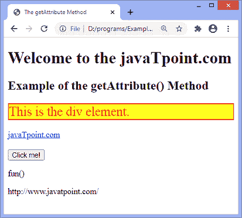

# JavaScript getAttribute()方法

> 原文:[https://www.javatpoint.com/javascript-getattribute-method](https://www.javatpoint.com/javascript-getattribute-method)

**getAttribute()** 方法用于获取特定元素的属性值。如果该属性存在，它将返回表示相应属性的值的字符串。如果相应的属性不存在，它将返回空字符串或 null。

不同于 **getAttributeNode()** 方法。 **getAttributeNode()** 方法将属性作为 Attr 对象返回。

### 句法

```

element.getAttribute(attributename)

```

### 参数值

**属性名:**必选参数。这是我们想要从中获取值的属性的名称。

让我们用一些例子来理解它。

### 示例 1

在本例中，有两个 id 为 **div1** 和 **div2** 的 **div** 元素，每个元素都有**样式**属性。我们正在使用 **getAttribute()** 方法获取 [**样式**](https://www.javatpoint.com/html-style) 属性的值。

我们必须点击给定的按钮来获取给定 div 元素的**样式**属性的值。

```

<!DOCTYPE html>
<html>
<head>
<title>
The getAttribute Method
</title>
</head>
<body>
<h1>
Welcome to the javaTpoint.com
</h1>

<h2>
Example of the getAttribute() Method
</h2>

<div id = "div1" style = "background-color: yellow; font-size: 25px; color: red; border: 2px solid red;">
This is first div element.
</div>
<br>
<div id = "div2" style = "background-color: lightblue; font-size: 25px; color: blue; border: 2px solid blue;">
This is second div element.
</div>
<br>
<button onclick = "fun()">
Click me!
</button>
<p id = "p"></p>
<p id = "p1"></p>
<script>
function fun() {
var val = document.getElementById("div1").getAttribute("style");
document.getElementById("p").innerHTML = val;
var val1 = document.getElementById("div2").getAttribute("style");
document.getElementById("p1").innerHTML = val1;
}
</script>
</body>

</html>

```

[Test it Now](https://www.javatpoint.com/oprweb/test.jsp?filename=javascript-getattribute-method1)

**输出**

执行后，输出是-



点击按钮后，输出将是-



### 示例 2

我们还可以得到按钮元素的 **onclick** 属性的值。在这个例子中，我们提取了 **onclick** 属性的值和 **href** 属性的值。有一个带有 **href** 属性的锚点元素；我们正在使用 **getAttribute()** 方法获取该属性的值。

```

<!DOCTYPE html>
<html>
<head>
<title>
The getAttribute Method
</title>
</head>
<body>
<h1>
Welcome to the javaTpoint.com
</h1>

<h2>
Example of the getAttribute() Method
</h2>

<div id = "div1" style = "background-color: yellow; font-size: 25px; color: red; border: 2px solid red;">
This is the div element.
</div>
<br>
<a href = "http://www.javatpoint.com/" id = "link"> javaTpoint.com </a>
<br><br>
<button onclick = "fun()" id = "btn">
Click me!
</button>
<p id = "p"></p>
<p id = "p1"></p>
<script>
function fun() {
var val = document.getElementById("btn").getAttribute("onclick");
document.getElementById("p").innerHTML = val;
var val1 = document.getElementById("link").getAttribute("href");
document.getElementById("p1").innerHTML = val1;
}
</script>
</body>

</html>

```

[Test it Now](https://www.javatpoint.com/oprweb/test.jsp?filename=javascript-getattribute-method2)

**输出**

执行后，输出将是-



点击按钮后，输出为-



* * *