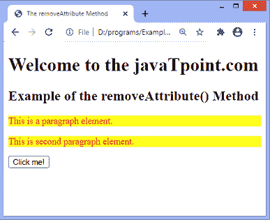
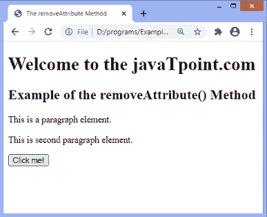
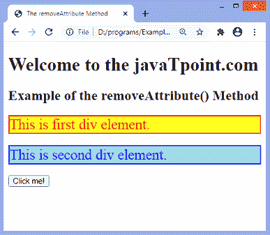
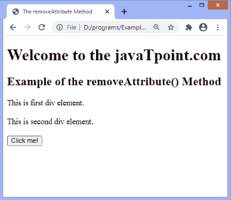

# JavaScript removeAttribute()方法

> 原文：<https://www.javatpoint.com/javascript-removeattribute-method>

此方法用于从元素中移除指定的属性。不同于 **removeAttributeNode()** 方法。**移除属性节点()**方法移除特定的属性对象，但是**移除属性()**方法移除具有指定名称的属性。

### 句法

```js

element.removeAttribute(attributename)

```

### 参数值

**属性名:**是指定要从元素中移除的属性名的必需参数。如果属性不存在，该方法不会产生任何错误。

让我们用一些例子来理解它。

### 示例 1

在本例中，id 为 **para、**和 **para1** 的两个段落元素属于同一类 **jtp** 。这里，我们移除这些段落元素的**类**属性。我们要点击给定的 [HTML 按钮](https://www.javatpoint.com/html-button-tag)才能看到效果。

```js

<!DOCTYPE html>
<html>
<head>
<title>
The removeAttribute Method
</title>
<style>
.jtp {
color: red;
background-color: yellow;
}
</style>
</head>
<body>
<h1>
Welcome to the javaTpoint.com
</h1>

<h2>
Example of the removeAttribute() Method
</h2>

<p id = "para" class = "jtp">
This is a paragraph element.
</p>
<p id = "para1" class = "jtp">
This is second paragraph element.
</p>

<button onclick = "fun()">
Click me!
</button>

<script>
function fun() {
document.getElementById("para").removeAttribute("class");
document.getElementById("para1").removeAttribute("class");
}
</script>
</body>

</html>

```

[Test it Now](https://www.javatpoint.com/oprweb/test.jsp?filename=javascript-removeattribute-method1)

**输出**

执行上述代码后，输出将是-



点击给定按钮后，我们将看到以下输出-



### 示例 2

在本例中，有两个 id 为 **div1** 和 **div2** 的 div 元素。我们将**风格**属性应用于这些 div 元素。

这里，我们移除这些 div 元素的**样式**属性。我们必须点击给定的 [HTML](https://www.javatpoint.com/html-tutorial) 按钮才能看到效果。

```js

<!DOCTYPE html>
<html>
<head>
<title>
The removeAttribute Method
</title>
<style>
.jtp {
color: red;
background-color: yellow;
}
</style>
</head>
<body>
<h1>
Welcome to the javaTpoint.com
</h1>

<h2>
Example of the removeAttribute() Method
</h2>

<div id = "div1" style = "background-color: yellow; font-size: 25px; color: red; border: 2px solid red;">
This is first div element.
</div>
<br>
<div id = "div2" style = "background-color: lightblue; font-size: 25px; color: blue; border: 2px solid blue;">
This is second div element.
</div>
<br>
<button onclick = "fun()">
Click me!
</button>

<script>
function fun() {
document.getElementById("div1").removeAttribute("style");
document.getElementById("div2").removeAttribute("style");
}
</script>
</body>

</html>

```

[Test it Now](https://www.javatpoint.com/oprweb/test.jsp?filename=javascript-removeattribute-method2)

**输出**

执行后，输出将是-



点击按钮后，输出将是-



同样，我们可以使用 **removeAttribute()** 方法移除**目标**属性、**对齐**属性、**只读**属性等等。

* * *