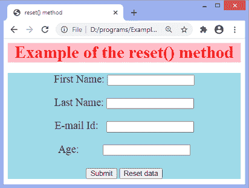
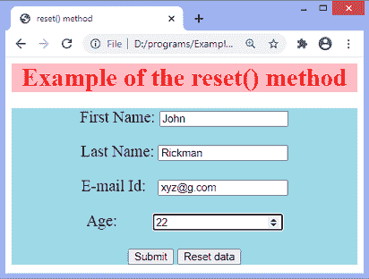
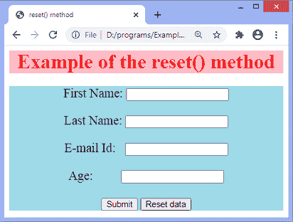

# JavaScript 复位

> 原文：<https://www.javatpoint.com/javascript-reset>

在 HTML 中，我们可以使用**重置**按钮来重置表单。在本文中，我们将讨论如何使用 JavaScript 重置表单。

在 JavaScript 中， **reset()** 方法的作用与 HTML **reset** 按钮相同。它用于清除表单元素的所有值。它可用于将值设置为默认值。它不需要任何参数值，也不返回值。

### 句法

```js

formElement.reset()

```

### 例子

为了说明 [JavaScript](https://www.javatpoint.com/javascript-tutorial) 中 **reset()** 方法的使用，我们正在创建一个简单的 [HTML](https://www.javatpoint.com/html-tutorial) 文档，我们在其中创建了一个表单，其 id 为 **id = "myForm"** 。在此表单中，有四个文本字段:**“名字”、“姓氏”、“年龄”、**和**“电子邮件 Id”**。有**【提交】****【重置数据】**两个按钮。当我们点击**重置数据**按钮时，它会调用函数 **fun()，**，在这里我们已经定义了 JavaScript 的 ***重置()*** 方法。

在函数 **fun()** 中，我们首先取需要重置的表单的引用，然后对其应用 **reset()** 方法。现在，让我们看看相同的代码。

```js

<!DOCTYPE html> 
<html>
<head> 
<title> reset() method </title>
</head>
<body style = "text-align: center;">
<div style = "background: pink;">
  <font color = "red" size = "6px">
	<b> Example of the reset() method </b>
  </font>
 </div>
    <div style = "background: lightblue;">
	<form id = "myForm" action = "#" style = "font-size: 20px;" >
	<p> First Name: <input type = "text" id = "fname" /></p>
	<p> Last Name: <input type = "text" id = "lname" /></p>
	<p> E-mail Id:  <input type = "email" id = "email" /></p>
	<p> Age:  <input type = "number" id = "age" /></p>
	<input type = "submit">
	<input type = "button" value = "Reset data" onClick = "fun()"/>
	</form>
    </div>
<script>
 function fun(){
   document.getElementById("myForm").reset();
 } 
</script>

</body>
</html>

```

[Test it Now](https://www.javatpoint.com/oprweb/test.jsp?filename=javascript-reset1)

**输出**

执行上述代码后，输出将是-



现在，让我们填充文本字段值-



最后，点击**重置数据**按钮，数值将被恢复-



* * *