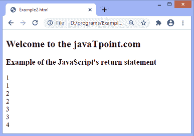

# JavaScript 返回

> 原文：<https://www.javatpoint.com/javascript-return>

**return** 语句用于将函数的特定值返回给函数调用方。当调用**返回**语句时，该函数将停止执行。 **return** 语句应该是函数中的最后一个语句，因为 **return** 语句之后的代码将不可访问。

我们可以返回原始值(如布尔值、数字、字符串等)。)和对象类型(如函数、对象、数组等。)通过使用**返回**语句。

我们也可以使用**返回**语句返回多个值。不能直接做。我们必须使用**数组**或**对象**从一个函数中返回多个值。

### 句法

```

return expression;

```

上面语法中的 ***表达式*** 是返回给函数调用方的值。它是可选的。如果未指定 ***表达式*** ，则函数返回**未定义的**。

不允许在**返回**关键字和值之间使用行终止符。我们可以用下面几行来理解。假设我们正在编写如下的**返回**语句:

```

return
x + y;

```

然后，它会变成-

```

return;
x + y;

```

在**返回**语句后自动插入分号。**返回**语句后写的代码(**x+y；**)将被视为**不可达码**。

我们可以用括号来防止这个问题。可以写成-

```

return (
x + y;
);

```

现在，让我们看一些在 [JavaScript](https://www.javatpoint.com/javascript-tutorial) 中使用**返回**语句的例子。

### 示例 1

这是一个使用**返回**语句的简单例子。这里，我们返回两个数乘积的结果，并将该值返回给函数调用方。

变量 **res** 是函数调用方；它正在调用函数 **fun()** ，并传递两个整数作为函数的参数。结果将存储在 **res** 变量中。在输出中，值 **360** 是参数 **12** 和 **30** 的乘积。

```

<!DOCTYPE html> 
<html> 

<head> 
</head> 

<body>

<h2> Welcome to the javaTpoint.com </h2>
<h3> Example of the JavaScript's return statement </h3>
	<script> 
var res = fun(12, 30);
function fun(x, y)
{
return x * y;
}
document.write(res);
	</script> 
</body> 

</html>

```

[Test it Now](https://www.javatpoint.com/oprweb/test.jsp?filename=javascript-return1)

**输出**

执行上述代码后，输出是-


### 示例 2

这里，我们使用**返回**语句中断一个功能。当调用**返回**语句时，该函数立即停止执行。

有一个无限的**而**循环和变量 **i，**被初始化为 1。循环继续，直到 **i** 的值达到 **4** 。当变量的值为 4 时，由于**返回**语句，循环停止执行。循环后的语句永远不会被执行。

这里**返回**语句没有使用 ***表达式*** ，所以返回**未定义。**

```

<!DOCTYPE html> 
<html> 

<head> 
</head> 

<body>
<h2> Welcome to the javaTpoint.com </h2>
<h3> Example of the JavaScript's return statement </h3>
	<script> 
	var x = fun();
function fun() {
var i = 1;
  while(i) { 
    document.write(i + '<br>');
      if (i == 4) {          
        return;
      }
      document.write(i + '<br>');
	  i++;
    }
  document.write('Hello world');
}
</script> 
</body> 

</html>

```

[Test it Now](https://www.javatpoint.com/oprweb/test.jsp?filename=javascript-return2)

**输出**

执行上述代码后，输出将是-



现在，我们将看到如何使用**返回**语句返回多个值。通常，JavaScript 函数返回一个值，但是我们可以使用**数组**或**对象**返回多个值。要返回多个值，我们可以将这些值打包为对象的属性或数组元素。

### 示例 3 -使用数组返回多个值

在这个例子中，我们使用**数组**返回多个值。这里，我们使用 **ES6 数组析构**语法来解包数组的值。

```

<!DOCTYPE html>
<html>
<head>
<title> JavaScript return </title>
</head>
<body>
<h1> Welcome to the javaTpoint.com </h1>
<h3> This is an example of returning multiple values using array </h3>
<script>
function getData() {
let fname = 'John',
lname = 'Rickman',
age = '25',
occupation = 'Private Employee';

return [fname, lname, age, occupation];
}
const [fname, lname, age, occupation] = getData();

document.write("Name = " + fname + " " + lname + "<br>");
document.write("Age = " + age + "<br>");
document.write("Occupation = " + occupation);
</script>
</body>
</html>

```

[Test it Now](https://www.javatpoint.com/oprweb/test.jsp?filename=javascript-return3)

**输出**


### **示例 4 -** 使用**对象**返回多个值

在这个例子中，我们使用**对象**返回多个值。这里，我们使用 **ES6 对象析构**语法来解包对象的值。

```

<!DOCTYPE html>
<html>
<head>
<title> JavaScript return </title>
</head>
<body>
<h1> Welcome to the javaTpoint.com </h1>
<h3> This is an example of returning multiple values using object </h3>
<script>
function getData() {
let fname = 'John',
lname = 'Rickman',
age = '25',
occupation = 'Private Employee';

return {
fname,
lname,
age,
occupation
};
}
let {fname, lname, age, occupation} = getData();
document.write("Name = " + fname + " " + lname + "<br>");
document.write("Age = " + age + "<br>");
document.write("Occupation = " + occupation);
</script>
</body>
</html>

```

[Test it Now](https://www.javatpoint.com/oprweb/test.jsp?filename=javascript-return4)

**输出**


* * *