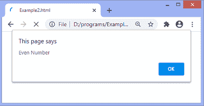

# JavaScript 三元运算符

> 原文：<https://www.javatpoint.com/javascript-ternary-operator>

在任何语言的编码过程中，我们都使用各种方法来处理条件情况。常见的是使用 **if** 语句；我们可以在 JavaScript 中使用三元运算符，而不是使用**if**语句。三元运算符根据提供给它的条件为变量赋值。

它是 [JavaScript](https://www.javatpoint.com/javascript-tutorial) 中唯一一个接受三个操作数的运算符。该运算符的工作方式与 **if-else** 条件语句相同。我们可以说这是**的捷径。**

该运算符包括三个操作数:一个条件后跟一个问号(？)符号，以及由冒号(:)分隔的两个表达式。第一个表达式在条件为真时执行，第二个表达式在条件为假时执行。

### 句法

```

var a = (condition) ? expr1 : expr2;

```

在上面的语法中，**条件、expr1、**和 **expr2** 是三进制运算符中使用的三个操作数。基于所提供的条件，该值被分配给变量**‘a’**。该条件被评估为布尔值；根据其结果，运算符将结果赋给变量。它将第一个表达式赋给条件的真值，将第二个表达式赋给条件的假值。

我们来看一个在 JavaScript 中使用**三元** [运算符的例子。](https://www.javatpoint.com/javascript-operators)

### 例子

这是一个使用三进制运算符检查数字是奇数还是偶数的简单示例。结果将使用**警报()**对话框显示。

```

<!DOCTYPE html>
<html>
<head>
<script>
let a = 358;
let val = ( a % 2 == 0) ? 'Even Number' : 'Odd Number';
alert(val);
</script>

</head>
<body>
<h1> Welcome to the javaTpoint.com </h1>
<h3> This is an example of ternary operator.  </h3>
</body>
</html>

```

[Test it Now](https://www.javatpoint.com/oprweb/test.jsp?filename=javascript-ternary-operator1)

**输出**

执行后，输出将是-



* * *