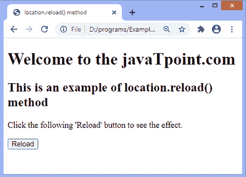

# JavaScript reload()方法

> 原文:[https://www.javatpoint.com/javascript-reload-method](https://www.javatpoint.com/javascript-reload-method)

在 JavaScript 中， **reload()** 方法用于重新加载网页。它类似于浏览器的刷新按钮。此方法不返回值。

### 句法

```

location.reload()

```

该方法可以有可选参数**真**和**假**。 **true** 关键字强制从服务器重新加载页面，而 **false** 关键字从缓存重新加载页面。

**false** 是这个方法的默认参数，所以如果我们省略了参数的值， **reload()** 方法从缓存中重新加载页面。表示**对象. reload()** 与**对象. reload(假)**相同。

让我们看一个使用 **location.reload()** 方法的例子。

### 例子

在这里，函数 **fun()** 包含 **location.reload()** 方法。我们使用**按钮**元素的 **onclick** 属性调用函数 **fun()** 。所以，我们要点击给定的 [HTML](https://www.javatpoint.com/html-tutorial) **【重载】**按钮才能看到效果。点击按钮后，页面将重新加载。

```

<!DOCTYPE html>
<html>
<head>
<title>
location.reload() method
</title>
<script>
function fun() {
location.reload();
}
</script>
</head>

<body>
<h1> Welcome to the javaTpoint.com </h1>

<h2> This is an example of location.reload() method </h2>

<p> Click the following 'Reload' button to see the effect. </p>

<button onclick = "fun()"> Reload </button>
</body>
</html>

```

[Test it Now](https://www.javatpoint.com/oprweb/test.jsp?filename=javascript-reload-method1)

**输出**



在上面的例子中，我们也可以将 **location.reload()** 方法附加到按钮标记上，而不是调用 **fun()** 函数。可以按如下方式进行:

```

<button onclick = "location.reload()"> Reload </button>

```

使用上面的语法，我们不需要创建任何 [JavaScript](https://www.javatpoint.com/javascript-tutorial) 函数来重新加载页面。

* * *