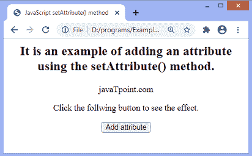
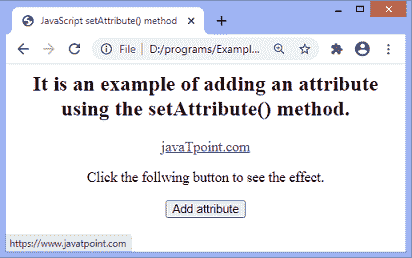
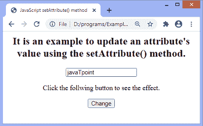
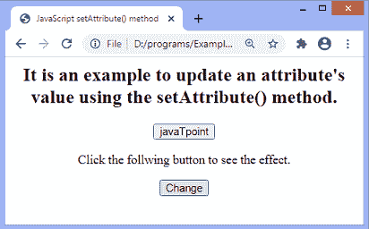
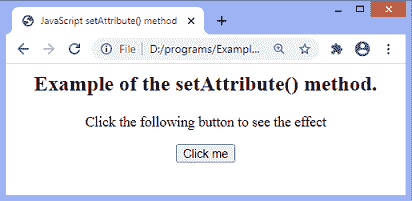
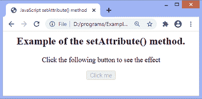

# JavaScript setAttribute()

> 原文：<https://www.javatpoint.com/javascript-setattribute>

**setAttribute()** 方法用于为特定元素设置或添加属性，并为其提供值。如果属性已经存在，它只设置或更改属性的值。因此，我们也可以使用 **setAttribute()** 方法来更新现有属性的值。如果相应的属性不存在，它将使用指定的名称和值创建一个新属性。此方法不返回值。当我们在 [HTML](https://www.javatpoint.com/html-tutorial) 元素上使用属性名称时，它会自动转换为小写。

虽然我们可以使用 **setAttribute()** 方法添加**样式**属性，但是建议不要使用该方法进行样式设置。对于添加样式，我们可以使用样式对象的属性来有效地更改样式。用下面的代码就可以清楚了。

**方式不正确**

建议不要用它来改变风格。

```js

element.setAttribute("style", "background-color: blue;");

```

**正确方式**

下面给出了改变样式的正确方法。

```js

element.setAttribute.backgroundColor = "blue";

```

要获取属性的值，我们可以使用 **getAttribute()** 方法，要从元素中移除特定属性，我们可以使用**removeattribute()**方法。

如果我们添加一个布尔属性，比如 ***【禁用的*** ，那么不管它有什么值，它总是被认为是 ***真*** 。如果我们要求将布尔属性的值设置为 ***false*** ，我们必须使用 [**removeAttribute()** 方法](https://www.javatpoint.com/javascript-removeattribute-method)移除整个属性。

### 句法

```js

element.setAttribute(attributeName, attributeValue)

```

此方法的参数不是可选的。使用此方法时，必须包括这两个参数。该方法的参数值定义如下。

### 参数值

**属性名称:**是我们要添加到元素中的属性的名称。不能留空；即它不是可选的。

**属性值:**是我们要添加到元素中的属性值。它也不是可选值。

用一些插图来了解一下如何使用 **setAttribute()** 方法。

### 示例 1

在本例中，我们向带有 **id = "link"** 的 **< a >** 标记添加了一个值为**“https://www . javatpoint . com/”**的 ***href*** 属性。

```js

<html>
<head>
<title> JavaScript setAttribute() method </title>
<script>
function fun() {
document.getElementById("link").setAttribute("href", "https://www.javatpoint.com/");
}
</script>
</head>

<body style = "text-align: center;">
<h2> It is an example of adding an attribute using the setAttribute() method. </h2>
<a id = "link"> javaTpoint.com </a>
<p> Click the follwing button to see the effect. </p>
<button onclick = "fun()"> Add attribute </button>
</body>
</html>

```

[Test it Now](https://www.javatpoint.com/oprweb/test.jsp?filename=javascript-setattribute1)

**输出**

执行上述代码后，输出将是-



我们可以看到，在单击给定的按钮之前，不会创建链接。点击按钮后，输出将是-



现在，我们可以看到链接被创建了。

### 示例 2

在本例中，我们使用 **setAttribute()** 方法更新现有属性的值。这里，我们通过将 ***类型*** 属性的值从**文本**更改为**按钮**，将文本字段转换为按钮。

我们必须点击指定的按钮才能看到效果。

```js

<html>
<head>
<title> JavaScript setAttribute() method </title>
<script>
function fun() {
document.getElementById("change").setAttribute("type", "button");
}
</script>
</head>

<body style = "text-align: center;">
<h2> It is an example to update an attribute's value using the setAttribute() method. </h2>
<input id = "change"  type = "text" value = "javaTpoint"/>
<p> Click the follwing button to see the effect. </p>
<button onclick = "fun()"> Change </button>
</body>
</html>

```

[Test it Now](https://www.javatpoint.com/oprweb/test.jsp?filename=javascript-setattribute2)

**输出**

执行上述代码后，输出将是-



点击按钮后，输出将是-



### 示例 3

这里，我们添加一个布尔属性 ***禁用*** 来禁用指定按钮。如果我们将 ***禁用*** 属性的值设置为空字符串，那么它会自动设置为 true，从而导致按钮被禁用。

```js

<html>   
   <head>
      <title> JavaScript setAttribute() method </title>
      <script>
            function fun() {
               document.getElementById("btn").setAttribute("disabled", "");
            }
      </script>
   </head>

   <body style = "text-align: center;">
   <h2> Example of the setAttribute() method. </h2>
   <p> Click the following button to see the effect </p>
<button onclick = "fun()" id = "btn"> Click me </button>
   </body>
</html>

```

[Test it Now](https://www.javatpoint.com/oprweb/test.jsp?filename=javascript-setattribute3)

**输出**

执行上述代码后，输出将是-



点击按钮后，输出将是-



* * *