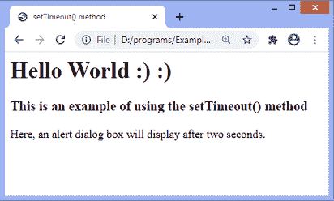
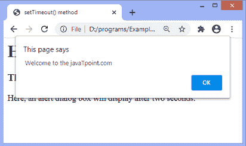
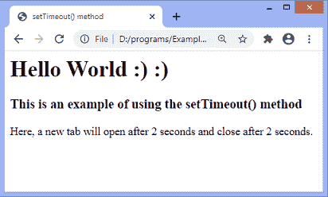
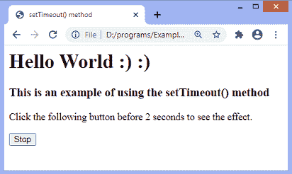

# JavaScript setTimeout()方法

> 原文：<https://www.javatpoint.com/javascript-settimeout-method>

JavaScript 中的 **setTimeout()** 方法用于在等待指定的时间间隔后执行一个函数。此方法返回一个代表计时器标识值的数值。

与 **setInterval()** 方法不同， **setTimeout()** 方法只执行一次函数。这个方法可以写有或没有 ***窗口*** 前缀。

我们可以使用 **clearTimeout()** 方法来停止超时或者阻止执行 **setTimeout()** 方法中指定的功能。 **setTimeout()** 方法返回的值可以作为 **clearTimeout()** 方法的参数来取消定时器。

**setTimeout()** 方法的常用语法如下。

### 句法

```js

window.setTimeout(function, milliseconds);

```

### 参数值

该方法取两个参数值 ***函数*** 和 ***毫秒*** ，定义如下。

**函数:**是包含将要执行的代码块的函数。

**毫秒:**该参数表示函数执行的时间间隔。间隔以毫秒为单位。其默认值为 0。它定义了代码执行的频率。如果未指定，则使用值 **0** 。

用一些插图来了解一下 **setTimeout()** 方法的用法。

### 示例 1

这是一个使用 **setTimeout()** 方法的简单例子。这里，警报对话框将每隔两秒钟显示一次。我们没有使用任何方法来阻止执行 **setTimeout()** 方法中指定的功能。所以 **setTimeout()** 方法在给定的时间间隔后只执行一次指定的函数。

```js

<html>
<head>
<title> setTimeout() method </title>
</head>
<body>
<h1> Hello World :) :) </h1>
<h3> This is an example of using the setTimeout() method </h3>
<p> Here, an alert dialog box will display after two seconds. </p>

<script>

var a;

a = setTimeout(fun, 2000);

function fun() {
alert(" Welcome to the javaTpoint.com ");
}
</script>

</body>

</html>

```

[Test it Now](https://www.javatpoint.com/oprweb/test.jsp?filename=javascript-settimeout-method1)

**输出**



间隔两秒钟后，输出将为-



### 示例 2

这是使用 **setTimeout()** 方法的另一个例子。这里，一个新的选项卡在两秒钟的时间间隔后打开，并在打开两秒钟后关闭。我们使用 **window.open()** 方法打开一个新标签页，使用 **window.close()** 方法关闭打开的标签页。

因为我们没有使用任何方法来阻止 **setTimeout()** 方法中指定的函数的执行。因此，在给定的时间间隔后，该函数只执行一次。

```js

<html>
<head>
<title> setTimeout() method </title>
</head>
<body>
<h1> Hello World :) :) </h1>
<h3> This is an example of using the setTimeout() method </h3>
<p> Here, a new tab will open after 2 seconds and close after 2 seconds. </p>

<script>
var a = setTimeout(fun1, 2000);
function fun1()
{
var win1 = window.open();
win1.document.write(" <h2> Welcome to the javaTpoint.com </h2>");
setTimeout(function(){win1.close()}, 2000);
}
</script>

</body>

</html>

```

[Test it Now](https://www.javatpoint.com/oprweb/test.jsp?filename=javascript-settimeout-method2)

**输出**



两秒钟后，将打开一个新的选项卡，如下所示-


两秒钟后，新选项卡关闭。

### 示例 3

在上面的例子中，我们没有使用任何方法来阻止 **setTimeout()** 中指定的函数的执行。这里，我们使用 **clearTimeout()** 方法来停止函数的执行。

我们要在两秒钟前点击给定的 ***停止*** 按钮才能看到效果。

```js

<html>
<head>
<title> setTimeout() method </title>
</head>
<body>
<h1> Hello World :) :) </h1>
<h3> This is an example of using the setTimeout() method </h3>
<p> Click the following button before 2 seconds to see the effect. </p>
<button onclick = "stop()"> Stop </button>
<script>
var a = setTimeout(fun1, 2000);
function fun1()
{
var win1 = window.open();
win1.document.write(" <h2> Welcome to the javaTpoint.com </h2>");
setTimeout(function(){win1.close()}, 2000);
}
function stop() {
  clearTimeout(a);
}
</script>

</body>

</html>

```

[Test it Now](https://www.javatpoint.com/oprweb/test.jsp?filename=javascript-settimeout-method3)

**输出**



如果用户在两秒钟前点击 ***停止*** 按钮，输出将保持不变。否则，两秒钟后会打开一个新标签，两秒钟后关闭。

* * *