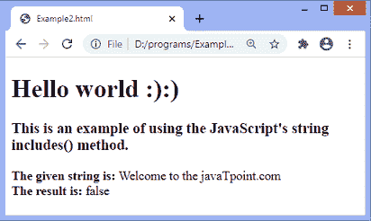
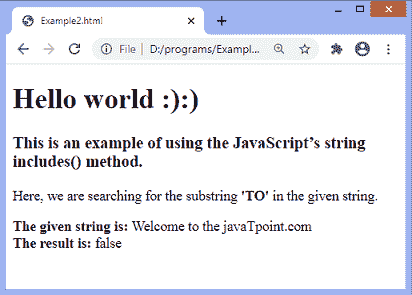
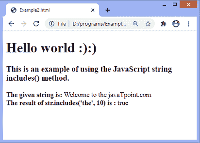

# JavaScript 字符串包括()

> 原文：<https://www.javatpoint.com/javascript-string-includes>

JavaScript 字符串**include()**方法用于确定给定字符串中是否存在指定的子字符串。这是一个区分大小写的方法。它返回布尔值，要么是 ***真*** 要么是 ***假*** 。如果字符串包含指定的子字符串，则返回 true，否则返回 false。

它不会改变原始字符串的值。

### 句法

以下语法表示**包含()**方法:

```js

string.includes(searchValue, start);

```

### 参数值

该方法的参数值定义如下:

**搜索值:**必选参数。它是要搜索的子字符串。

**start:** 为可选参数。它表示字符串中开始搜索的位置。其默认值为 0。如果省略，搜索将从字符串的初始位置开始，即从 **0** 开始。

让我们用一些例子来理解**包含()**的方法。

### 示例 1

这是一个确定给定字符串是否包含指定子字符串的简单示例。在这里，我们声明了一个变量 ***str*** ，并为其分配了一个字符串值**【欢迎来到 JavaPoint . com】**。然后我们使用 **includes()** 方法来确定给定的子串(**到**)是否存在。

这里，我们没有定义开始搜索的位置。因此，搜索将从字符串的初始位置开始。

```js

<!DOCTYPE html>
<html>
<head>
</head>

<body>
<h1> Hello world :):) </h1>
<h3> This is an example of using the JavaScript's string includes() method. </h3>
<script>
let str = "Welcome to the javaTpoint.com";  
document.write(" <b> The given string is: </b>", str);
document.write("<br>");
let res = str.includes('tO');
document.write(" <b> The result is: </b> ", res); 
</script>
</body>
</html>

```

[Test it Now](https://www.javatpoint.com/oprweb/test.jsp?filename=javascript-string-includes1)

**输出**



### 示例 2

在本例中，我们正在确定**包含()**方法是否区分大小写。给定的字符串是**“欢迎来到 JavaPoint . com”**。我们正在给定字符串中搜索子字符串**‘到’**。

虽然单词**‘to’**在给定的字符串中存在，但是该方法是区分大小写的，所以它将返回布尔值 ***false*** 。

```js

<!DOCTYPE html>
<html>
<head>
</head>

<body>
<h1> Hello world :):) </h1>
<h3> This is an example of using the JavaScript's string includes() method. </h3>
<p> Here, we are searching for the substring <b> 'TO' </b> in the given string. </p>
<script>
let str = "Welcome to the javaTpoint.com";  
document.write(" <b> The given string is: </b>", str);
document.write("<br>");
let res = str.includes('TO');
document.write(" <b> The result is: </b> ", res); 
</script>
</body>
</html>

```

[Test it Now](https://www.javatpoint.com/oprweb/test.jsp?filename=javascript-string-includes2)

**输出**



### 示例 3

在本例中，我们定义了开始搜索的位置。因此，搜索将从指定位置开始。

```js

<!DOCTYPE html>
<html>
<head>
</head>

<body>
<h1> Hello world :):) </h1>
<h3> This is an example of using the JavaScript string includes() method. </h3>
<script>
let str = "Welcome to the javaTpoint.com";  
document.write(" <b> The given string is: </b>", str);
document.write("<br>");
let res = str.includes('the', 10);
document.write(" <b> The result of str.includes('the', 10) is : </b> ", res); 
</script>
</body>
</html>

```

**输出**



* * *