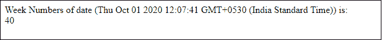
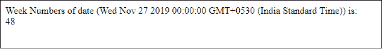
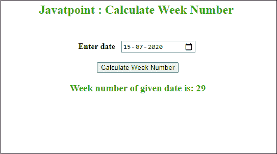

# 用 JavaScript 计算当前周数

> 原文：<https://www.javatpoint.com/calculate-current-week-number-in-javascript>

有时我们需要计算当前的周数或给定日期的周数。这个问题可以使用 [JavaScript 编程语言](https://www.javatpoint.com/javascript-tutorial)来解决。JavaScript 提供了几个日期函数，比如 getDays()，getMonth()，getTime()，来解决与日期相关的任务。除此之外，数学函数[数学地板()](https://www.javatpoint.com/javascript-math-floor-method)和[数学天花板()](https://www.javatpoint.com/javascript-math-ceil-method)也有助于计算周数。

**情况**

在这种方法中，我们将为一周的每一天分配一个数字，例如，1 代表星期日，2 代表星期一，3 代表星期二，依此类推。同样，我们将把数字分配给一周中的其他日子。请注意，工作日从周日开始，到周六结束。

假设今天是星期一，周数是 1。因此，如果我们计算 25 天后的周数，周数将是第 4 周。

按周数计算:

```

25 days = 7 + 7 + 7 + 4 days

```

下面提到的公式用于计算 p 天后的周数:

```

Week Number = least integer [ p / 7 ]

```

我们可以在我们的 JavaScript 示例中使用这个概念来计算周数。我们将通过两种方式计算周数:

*   计算当前日期的周数
*   计算预定义日期的周数

我们将通过例子详细讨论这两种方法。与此同时，我们将通过使用动态 [HTML](https://www.javatpoint.com/html-tutorial) 表单从用户处获取日期输入来动态计算工作日。

*   以日期输入动态 HTML 形式计算周数

### 方法 1:计算当前日期的周数

在这种方法中，我们会发现当前日期的周数意味着该日期将取自系统。这是计算周数的静态方法。遵循计算工作日的每个步骤:

1.  在 JavaScript 中定义一个日期变量**今天更新**和**一月**。
2.  通过使用**新日期()**创建日期对象来初始化 todaydate 变量，默认情况下，该日期对象将采用系统日期。
3.  通过使用新的 date()创建日期对象来初始化另一个变量 oneJan，但这次是在其中使用 **getFullYear()** 方法。
4.  **getFullYear()** 函数将返回当前日期的年份以及该年的第一个日期，例如 2020 年 1 月 1 日。
5.  获取当前日期和年份后，现在使用 **Math.floor()** 方法计算天数。所以，计算当前日期和当前年份日期的差值，除以一天中的总毫秒数(1000*60*60*24)。
6.  现在，将上一个结果中计算的 1 和天数加到当前日期的当天，然后除以 7，即(this.getDay() + 1 +天数)/ 7。别忘了把第六步的整个计算放在 **Math.ceil()** 方法里面。
7.  最后，使用 **document.write()** 在 web 上显示计算出的工作日。

现在，我们将把这些步骤转化为实际的实现。请参见下面的代码:

***复制代码***

```

<html>
<head>
      <title>Calculate week number of current date</title>
</head>
<body>
   <script>

      //define a date object variable that will take the current system date
       todaydate = new Date();

      //find the year of the current date
       var oneJan =  new Date(todaydate.getFullYear(), 0, 1); 

       // calculating number of days in given year before a given date 
       var numberOfDays =  Math.floor((todaydate - oneJan) / (24 * 60 * 60 * 1000)); 

       // adding 1 since to current date and returns value starting from 0 
       var result = Math.ceil(( todaydate.getDay() + 1 + numberOfDays) / 7);   

       //display the calculated result       
       document.write("Week Numbers of current date (" + todaydate + 
       ") is: <br>" + result);

   </script>  
</body>
</html>

```

[Test it Now](https://www.javatpoint.com/oprweb/test.jsp?filename=calculate-of-current-week-number-in-javascript1)

**输出**

```
Week number of current date (Tue Sep 29 2020 15:32:19 GMT+0530 (India Standard Time)) is: 
40 

```

**截图**



### 方法 2:计算预定义日期的周数

这种方法通过在代码中提供日期来帮助计算周数。遵循以下步骤:

1.  在 JavaScript 中定义一个日期变量，即日期 1
2.  通过使用**新日期()**创建日期对象来初始化它，并在其中提供日期。
3.  定义日期后，用**date 2 . gettime()-date 1 . gettime()从另一个日期减去一个日期，计算两者之间的时间差；**
4.  现在下一步是计算日期之间的天数。所以，我们将两个日期的时间差除以一天中的毫秒数，即 1000*60*60*24
5.  最后，使用 **document.write()** 方法打印计算结果。

现在，我们将把这些步骤转化为实际的实现。请参见下面的代码:

***复制代码***

```

<html>
<head>
      <title>Calculate week number of predefined date</title>
</head>
<body>
   <script>

      //define a date object variable with date inside it
      var date1 = new Date("11/27/2019");

      //find the year of the entered date
       var oneJan =  new Date(date1.getFullYear(), 0, 1); 

       // calculating number of days in given year before the given date 
       var numberOfDays =  Math.floor((date1 - oneJan) / (24 * 60 * 60 * 1000)); 

       // adding 1 since to current date and returns value starting from 0 
       var result = Math.ceil(( date1.getDay() + 1 + numberOfDays) / 7);   

       //display the calculated result       
       document.write("Week Numbers of date (" + date1 + 
       ") is: <br>" + result);

   </script>  
</body>
</html>

```

[Test it Now](https://www.javatpoint.com/oprweb/test.jsp?filename=calculate-of-current-week-number-in-javascript2)

**输出**

```
Week number of date Wed Nov 27 2019 00:00:00 GMT+0530 (India Standard Time):
48 

```

**截图**



## 通过使用 HTML 表单输入日期来计算周数

在这种方法中，我们将通过使用动态 HTML 表单提供日期来找到周数。用户可以从日历中选择日期，进入 [HTML 表单](https://www.javatpoint.com/html-form)的输入栏。这是一种计算周数的动态方法，用户可以在网上自行输入，而不用程序员用代码输入日期。

请参见下面的代码:

***复制代码***

```

<html> 
<head> 
    <title> Calculate week number by user input </title> 
      <script>
       function weekNumber() {

         //define a variable and fetch the input from HTML form
         var dateinput = document.getElementById("dateInput1").value;

        //create a date object variable to store the date values
         var date1 = new Date(dateinput);

      //find the year of the current date
       var oneJan =  new Date(date1.getFullYear(), 0, 1); 

       // calculating number of days in given year before the given date 
       var numberOfDays =  Math.floor((date1 - oneJan) / (24 * 60 * 60 * 1000)); 

       // adding 1 since to current date and returns value starting from 0 
       var result = Math.ceil(( date1.getDay() + 1 + numberOfDays) / 7);   

       //return the calculated result and display it
       return document.getElementById("result").innerHTML =  "Week number of given date is: " + result;
       }
      </script>  
</head>  
<body> 

    <h2 style="color: 32A80F" align="Center">  
            Javatpoint: Calculate Week Number using user input 
        <br> <br> </h2> 

        <p align="Center"> <b> Enter date  </b> 
        <input type="date" id="dateInput1"> 
        <br> <br>    

        <button onclick="weekNumber()"> 
          Calculate Week Number 
        </button> 
    </p> 

    <h3 style="color:32A80F" id="result" align="center"></h3> 

</body>  
</html>

```

[Test it Now](https://www.javatpoint.com/oprweb/test.jsp?filename=calculate-of-current-week-number-in-javascript3)

***屏幕截图***

请看下面的截图，其中的 HTML 表单有一个日历类型的输入字段和一个执行所有计算的提交按钮，还有一个显示计算结果的字段。



* * *