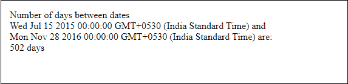
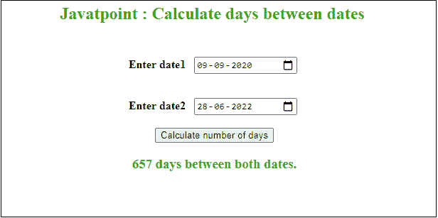
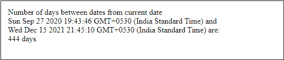
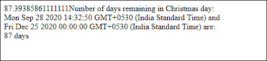

# 用 JavaScript 计算两个日期之间的天数

> 原文：<https://www.javatpoint.com/calculate-days-between-two-dates-in-javascript>

有时我们需要计算两个日期之间的天数。这可以使用 JavaScript 编程语言来完成。JavaScript 提供了一个[数学函数](https://www.javatpoint.com/javascript-math) [Math.floor()方法](https://www.javatpoint.com/javascript-math-floor-method)来计算两个日期之间的天数。在 JavaScript 中，我们必须使用日期对象进行任何计算，以使用**新日期()**来定义日期。

要一步一步详细了解 JavaScript，请遵循我们的 [JavaScript 教程](https://www.javatpoint.com/javascript-tutorial)。

我们将通过两种方式计算天数:

*   通过输入两个日期来计算天数
*   从当前日期开始计算天数

我们将通过例子详细讨论这两种方法。与此同时，我们将计算从今天起圣诞节剩余的天数(日期将从系统中获取)。

*   查找从当前日期到圣诞节的剩余天数

### 方法 1:通过输入两个日期来计算天数

通过在代码中提供两个不同的日期，这种方法将有助于计算两个日期之间的天数。遵循以下步骤:

1.  在 JavaScript 中定义两个日期变量
2.  通过使用**新日期()**创建日期对象来初始化它们
3.  定义日期后，用**date 2 . gettime()-date 1 . gettime()从另一个日期减去一个日期，计算两者之间的时间差；**
4.  现在下一步是计算日期之间的天数。所以，我们将两个日期的时间差除以一天中的毫秒数，即 1000*60*60*24
5.  最后，使用 **document.write()** 方法打印计算结果。

现在，我们将把这些步骤转化为实际的实现。请参见下面的代码:

***复制代码***

```

<html>
   <head>
      <title>Calculate days by entering two dates</title>
   </head>
   <body>
      <script>
         var date1, date2;
         //define two date object variables with dates inside it
         date1 = new Date("07/15/2015");
         date2 = new Date("11/28/2016");

         //calculate time difference
         var time_difference = date2.getTime() - date1.getTime();

         //calculate days difference by dividing total milliseconds in a day
         var days_difference = time_difference / (1000 * 60 * 60 * 24);

         document.write("Number of days between dates <br>" + 
                         date1 + " and <br>" + date2 + " are: <br>" 
                         + days_difference + " days");
      </script>  
</body>
</html>

```

[Test it Now](https://www.javatpoint.com/oprweb/test.jsp?filename=calculate-days-between-two-dates-in-javascript1)

**输出**

```
Number of days between dates 
Mon Jul 20 2015 00:00:00 GMT+0530 (India Standard Time) and 
Tue Sep 20 2016 00:00:00 GMT+0530 (India Standard Time) are: 
502 days

```

**截图**



## 使用动态 HTML 表单计算天数

这是一个动态的 JavaScript 示例，其中用户可以在 web 上自己提供输入，而不是由程序员用代码提供日期输入。用户将从日历中动态选择日期，并在输入栏中输入两个日期，通过点击按钮计算两个日期之间的天数。请参见下面的代码:

***复制代码***

```

<html> 
<head> 
    <title> Calculate days between dates </title> 
      <script>
       function daysDifference() {
         //define two variables and fetch the input from HTML form
         var dateI1 = document.getElementById("dateInput1").value;
         var dateI2 = document.getElementById("dateInput2").value;

        //define two date object variables to store the date values
         var date1 = new Date(dateI1);
         var date2 = new Date(dateI2);

        //calculate time difference
         var time_difference = date2.getTime() - date1.getTime();

         //calculate days difference by dividing total milliseconds in a day
         var result = time_difference / (1000 * 60 * 60 * 24);

         return document.getElementById("result").innerHTML =  
              result + " days between both dates. ";
                    }
      </script>  
</head>  
<body> 

    <h2 style="color: 32A80F" align="Center">  
            Javatpoint : Calculate days between dates 
        <br> <br> </h2> 

        <p align="Center"> <b> Enter date1  </b> 
        <input type="date" id="dateInput1"> 
        <br> <br> 

        <p align="Center"> <b> Enter date2  </b> 
        <input type="date" id="dateInput2"> 
        <br> <br>     

        <button onclick="daysDifference()"> 
          Calculate number of days 
        </button> 
    </p> 

    <h3 style="color:32A80F" id="result" align="center"></h3> 

</body>  
</html>

```

[Test it Now](https://www.javatpoint.com/oprweb/test.jsp?filename=calculate-days-between-two-dates-in-javascript2)

**输出**

看下面的截图，有两个日历输入字段，一个提交按钮执行所有计算，还有一个显示计算结果的字段。



### 方法 2:从当前日期开始计算天数

在这种方法中，我们将使用数学函数 Math.floor()来计算天数。遵循以下步骤:

1.  定义两个日期变量，即日期 1 和日期 2
2.  通过使用**新日期()**创建日期对象来初始化日期 1 变量，默认情况下，新日期将采用系统日期。
3.  通过使用**新日期()**创建日期对象来初始化日期 2 变量，并在其中提供一个日期。
4.  现在使用 Math.abs()方法计算两个日期之间的总秒数。所以，把日期的差除以一秒内的毫秒**math . ABS(date 2-date 1)/1000；**
5.  现在下一步是使用 **Math.floor()** 方法计算天数。因此，将前面步骤的计算结果(两个日期之间的总秒数)除以 60*60*24
6.  最后，使用 **document.write()** 方法打印计算结果。

现在，我们将把这些步骤转化为实际的实现。请参见下面的代码:

***复制代码***

```

<html>
   <head>
      <title>Calculate days between the dates using default system dates</title>
   </head>
   <body>
      <script>
         var date1, date2;
         //define two date object variables with dates inside it
         date1 = new Date();
         date2 = new Date ("Dec 15, 2021, 21:45:10");

         //calculate total number of seconds between two dates
         var total_seconds = Math.abs(date2 - date1) / 1000;

         //calculate days difference by dividing total seconds in a day
         var days_difference = Math.floor (total_seconds / (60 * 60 * 24));

         document.write("Number of days between dates from current date <br>" + 
                         date1 + " and <br>" + date2 + " are: <br>" 
                         + days_difference + " days");
      </script>  
</body>
</html>

```

[Test it Now](https://www.javatpoint.com/oprweb/test.jsp?filename=calculate-days-between-two-dates-in-javascript3)

**输出**

```
Number of days between dates 
Sun Sep 27 2020 19:42:13 GMT+0530 (India Standard Time) and 
Tue Dec 15 2021 21:45:10 GMT+0530 (India Standard Time) are: 
444 days 

```

**截图**



### 示例 3:从当前日期开始计算圣诞节剩余的天数

我们还有一个例子，在这个例子中，我们将计算特定日期到圣诞节的天数。请遵循以下步骤:

1.  通过使用**新日期()**创建日期对象来定义当前日期(系统日期)。
2.  使用新的 date()类方法再定义一个日期，并通过其中的 **date.getFullYear()** 方法获取圣诞节日期。方法将返回年份(在 JavaScript 中为 0-11 个月)。
3.  如果今年圣诞节已经过去，它将从当前日期返回明年圣诞节剩余的天数。
4.  现在，是时候使用 Math.round()函数以毫秒为单位计算结果，然后将该结果转换为天。所以，将**math . round(Christmas()-present _ date . gettime())**除以一天中的总毫秒数，即 1000*60*60*24。
5.  使用 **document.write()** 方法从结果中删除十进制值并将其显示在网页上。

现在，将这些步骤转换成实际的工具来计算圣诞节剩余的天数。实现和步骤一样简单。请参见下面的代码:

***复制代码***

```

<html>
   <head>
      <title>Calculate days remaining in Christmas</title>
   </head>
   <body>
      <script>
         //declare two variables in JavaScript
         var current_date, christmas_day;

         //total milliseconds in one day
         var one_day_ms = 1000 * 60 * 60 * 24;

         //set the current date in the variable 
         current_date = new Date();

         //set the Christmas date in another variable where 0-11 is month in JavaScript
         christmas_day= new Date(current_date.getFullYear(), 11, 25);

         //calculate next year Christmas if this year?s date is already passed away 
         if (current_date.getMonth() == 11 && current_date.getdate() > 25)
         {
              christmas_day.setFullYear(christmas_day.getFullYear() + 1); 
         }

         //calculate result in milliseconds and convert it into days
         var res = Math.round(christmas_day.getTime() - current_date.getTime()) / (one_day_ms);         

         //remove the decimal point from the calculated result
         var FinalResult = res.toFixed (0);

         //display the final result on web
         document.write("Number of days remaining in Christmas day: <br>" + 
                         current_date + " and <br>" + christmas_day + " are: <br>"  +  FinalResult + " days");
      </script>  
</body>
</html>

```

[Test it Now](https://www.javatpoint.com/oprweb/test.jsp?filename=calculate-days-between-two-dates-in-javascript4)

**输出**

```
Number of days remaining in Christmas day: 
Mon Sep 28 2020 14:32:50 GMT+0530 (India Standard Time) and 
Fri Dec 25 2021 00:00:00 GMT+0530 (India Standard Time) are: 
87 days

```

**截图**



因此，这里是 JavaScript 中计算天数差异的所有必要示例(静态和动态)。要一步一步详细了解 JavaScript，请遵循我们的 JavaScript 教程。

* * *