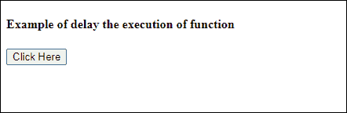

# JavaScript 计时器

> 原文：<https://www.javatpoint.com/javascript-timer>

在 JavaScript 中，创建计时器是为了在特定时间执行任务或任何功能。基本上，定时器是用来延迟程序的执行，或者在一个固定的时间间隔内执行 JavaScript 代码。借助计时器，我们可以延迟代码的执行。因此，代码不会在事件触发或页面加载的同时完成执行。

计时器最好的例子是网站上的广告横幅，每 2-3 秒钟就会改变一次。这些广告横幅在亚马逊等网站上定期更换。我们设置了一个时间间隔来改变它们。在本章中，我们将向您展示如何创建计时器。

[JavaScript](https://www.javatpoint.com/javascript-tutorial) 提供了两个定时器功能 **setInterval()** 和 **setTimeout()** ，这有助于延迟代码的执行，也允许重复执行一个或多个操作。我们将详细讨论定时器功能及其示例。

## 例子

下面是一些使用这些函数的 JavaScript 定时器的例子。

### setTimeout()

setTimeout()函数帮助用户延迟代码的执行。setTimeout()方法接受两个参数，其中一个是用户定义的函数，另一个是延迟执行的时间参数。time 参数以毫秒为单位保存时间(1 秒= 1000 毫秒)，这是可选的。

setTimeout()的基本语法是:

```

setTimeout(function, milliseconds)

```

我们将使用 setTimeout()函数将消息打印延迟 3 秒。该消息将在代码执行 3 秒后显示在 web 上，而不是立即显示。现在，让我们看看下面的代码，看看它是如何工作的:

**延迟后代码的执行**

```

<html>
<body>
<script>
function delayFunction() {
    //display the message on web after 3 seconds on calling delayFunction
    document.write('<h3> Welcome to JavaTpoint <h3>'); 
}
</script>
<h4> Example of delay the execution of function <h4> 

<!?button for calling of user-defined delayFunction having 3 seconds of delay -->
<button onclick = "setTimeout(delayFunction, 3000)"> Click Here </button>

</body>
</html>

```

[Test it Now](https://www.javatpoint.com/oprweb/test.jsp?filename=javascript-timer1)

**输出**

上面的代码将分两部分执行。首先，将执行代码的 HTML 部分，通过点击**点击这里**按钮，剩余的 JavaScript 代码将在 3 秒后执行。请参见下面的输出:



点击**点击此处**按钮，剩余代码将在 3 秒后执行。3 秒(3000 毫秒)后，网页上会显示一条消息**欢迎来到 javaTpoint** 。


### setInterval()

setInterval 方法有点类似于 setTimeout()函数。它在一段时间间隔后重复执行指定的功能。或者我们可以简单地说，在用户在这个函数中提供的特定时间量之后，一个函数被重复执行。**例如-** 每五秒显示更新时间。

setInterval()的基本语法是:

```

setInterval(function, milliseconds)

```

与 setTimeout()方法类似，它也接受两个参数，其中一个是用户定义的函数，另一个是执行函数之前要等待的时间间隔参数。时间间隔参数保存以毫秒为单位的时间量(1 秒= 1000 毫秒)，这是可选的。现在，请看下面的代码，这个函数是如何工作的:

**定期执行代码**

```

<html>
<body>
<script>
function waitAndshow() {
       //define a date and time variable
       var systemdate = new Date();

       //display the updated time after every 4 seconds
       document.getElementById("clock").innerHTML = systemdate.toLocaleTimeString();
}

      //define time interval and call user-defined waitAndshow function
      setInterval(waitAndshow, 4000);
</script>

<h3> Updated time will show in every 4 seconds </h3>
<h3> The current time on your computer is: <br>
<span id="clock"></span> </h3>

</body>
</html>

```

[Test it Now](https://www.javatpoint.com/oprweb/test.jsp?filename=javascript-timer2)

**输出**

在执行上述代码时，响应将是一个简单的 HTML 语句，没有如下输出的任何时间字符串:


4 秒后，JavaScript 函数将调用并开始显示时间。这将每四秒钟重复显示您的系统时间。


### 例子

setInterval()方法的另一个例子是每 4 秒钟连续显示一个消息字符串。

```

<html>
<body>
<script>
function waitAndshow() {
    //display the message on web on calling delayFunction
    document.write('<h3> Welcome to JavaTpoint <h3>'); 
}
</script>
<h3> A string will show in every 4 seconds </h3>
<!-- call user-defined delayFunction after 4 seconds -->
<button onclick = "setInterval(waitAndshow, 4000)"> Click Here </button>

</body>
</html>

```

[Test it Now](https://www.javatpoint.com/oprweb/test.jsp?filename=javascript-timer3)

**输出**

执行上述代码时，浏览器上会显示一条带有按钮的消息。点击此按钮进行更多处理，看看接下来会发生什么。


点击此**点击此处**按钮，waitAndshow()将开始每 4 秒钟在网页上重复打印消息**欢迎来到 Javatpoint** 。


您已经看到了如何创建计时器或设置时间间隔。有时候，我们需要取消这些计时器。JavaScript 提供了清除计时器的内置功能，如下所示:

## 取消或停止计时器

JavaScript 提供了两个功能 **clearTimeout()** 和 **clearInterval()** 来取消或停止计时器并停止代码的执行。setTimeout()和 setInterval()都返回一个唯一的标识。clearTimeout()和 clearInterval()使用这些标识来清除计时器并提前停止代码执行。它们都只取一个参数，即 ID。

**例**

在本例中，我们将使用 clearTimeout()来清除由 setTimeout()函数设置的计时器。看看 clearInterval()如何与 setInterval()一起工作的例子。

### 禁用常规时间间隔

```

<html>
<body>
<script>
function waitAndshow() {
  //define a date and time variable
  var systemdate = new Date();

  //display the updated time after every 4 seconds
  document.getElementById("clock").innerHTML = systemdate.toLocaleTimeString();
}

 //function to disable the time interval
function stopClock() {
    clearInterval(intervalID);
}

//define time interval and call user-defined waitAndshow function
var intervalID = setInterval(waitAndshow, 3000);
</script>

<p>Current system time: <span id="clock"> </span> </p>

<!-- button to stop showing time in a regular interval -->
<button onclick = "stopClock();" > Stop Clock </button>
</body>
</html>

```

[Test it Now](https://www.javatpoint.com/oprweb/test.jsp?filename=javascript-timer4)

**输出**

通过执行上述代码，当前系统时间将以 3 秒的规则间隔开始显示在网络上。这个页面也有一个按钮来禁用这个定时器。


计时器每三秒钟显示一次更新的时间。如果点击此**停止时钟**按钮，计时器将被禁用，并停止显示更新的时间。


* * *