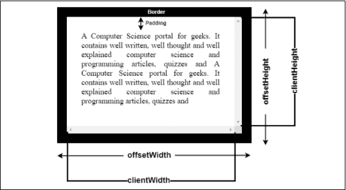
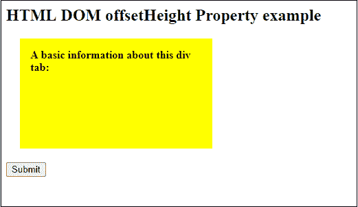
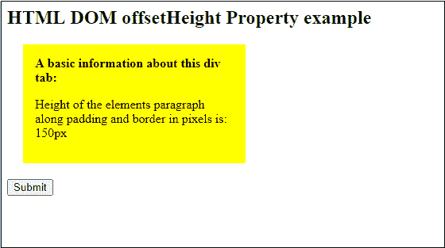
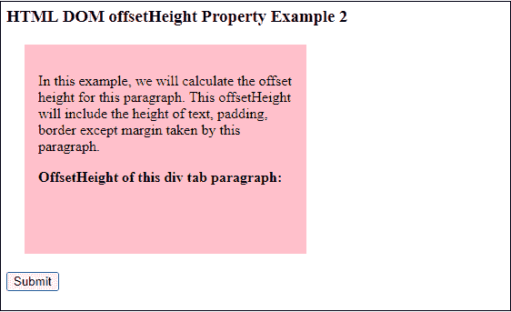
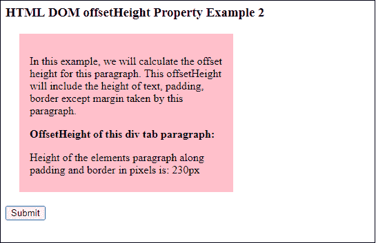
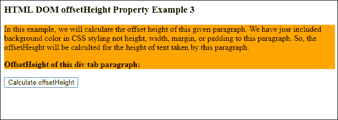
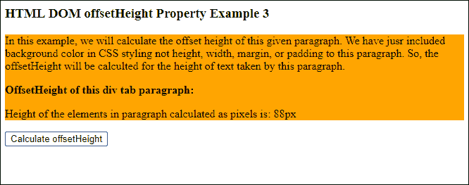
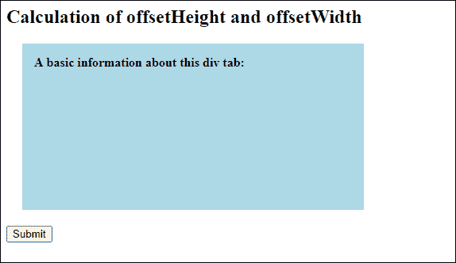
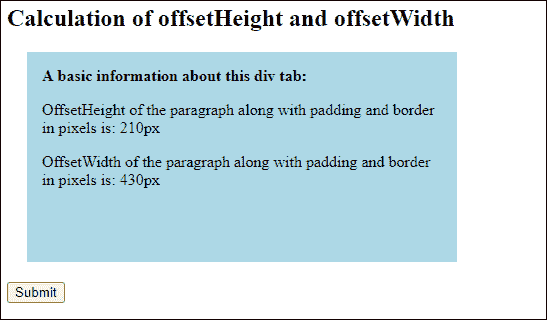

# JavaScript offsetHeight

> 吴奇珍:t0]https://www . javatppoint . com/JavaScript-offset height

**offset theight**是一个 HTML DOM 属性，由 JavaScript 编程语言使用。它以像素为单位返回元素的可见高度，包括可见内容、边框、填充和滚动条(如果有)的高度。offsetHeight 经常与 offsetWidth 属性一起使用。**外景**是 HTML DOM 的又一个属性，和外景差不多。JavaScript 使用这些属性来查找 HTML 元素的可见高度和宽度。

右边是以下 [HTML](https://www.javatpoint.com/html-tutorial) 元素的组合:

```

offsetHeight = height + border + padding + horizontal scrollbar

```

另一方面，偏移包含以下元素:

```

offsetWidth = width + border + padding + vertical scrollbar

```

记住一件事，右边距和中间距不包括边距，上边距和下边距都不包括。这些 DOM 属性被 [JavaScript 编程语言](https://www.javatpoint.com/javascript-tutorial)用来计算 HTML 元素的尺寸，单位为像素。

借助下图，您可以更好地理解偏右和偏中间:



### 浏览器支持

几个 web [浏览器](https://www.javatpoint.com/browsers)支持 offsetHeight DOM 属性，如 [Chrome](https://www.javatpoint.com/google-chrome) 和 [Internet Explorer](https://www.javatpoint.com/internet-explorer) 。以下是一些支持 offsetHeight 和 offsetWidth 属性的浏览器。

| **浏览器** | 铬 | 互联网浏览器 |  Firefox | 歌剧 |  Safari | 边缘 |
| **偏置右侧支架** | 是 | 是 | 是 | 是 | 是 | 是 |

### 句法

下面是 offsetHeight 的简单语法:

```

element.offsetHeight

```

这里，元素是在 JavaScript 中创建的变量，用于保存 [CSS](https://www.javatpoint.com/css-tutorial) 属性值或 HTML 文本段落。

### 返回值

“偏移量”和“偏移量”分别以像素为单位返回计算出的 HTML 元素的高度和宽度。

### 例子

下面是一些例子的列表。在它的帮助下，我们将看到正确的属性是如何使用和工作的。

### 例 1

```

<html>
<head>
<title>
HTML DOM offsetHeight Property example
</title>

<style>
#JTP {
height: 120px;
width: 250px;
margin: 20px;
padding: 15px;
background-color: yellow;
}
</style>
</head>

<script>
function getInfo() {
var eleValue = document.getElementById("JTP");
var txt = "Height of the elements paragraph along with padding and border in pixels is: " + eleValue.offsetHeight + "px";
document.getElementById("sudo").innerHTML = txt;
}
</script>

<body>
<h2> HTML DOM offsetHeight Property example </h2>
<div id= "JTP">
<b> A basic information about this div tab: </b>
<p id= "sudo"> </p>
</div>
<button type="JTP" onclick="getInfo()"> Submit </button>

</body>
</html>

```

**输出**

请参见下面的输出，其中包含一个黄色突出显示的段落和一个提交按钮。点击此**提交**按钮，计算本段的偏移量。

**点击提交按钮前输出**



**点击提交按钮**后输出

计算出的偏移量将显示在这个黄色突出显示的区域内。



### 例 2

在本例中，我们将计算本例中提供的段落的偏移量以及 CSS 样式。请记住，偏移量不包括边距。

```

<html>
<head>
<title>
HTML DOM offsetHeight Property example
</title>
<style>
#PStyle {
height: 220px;
width: 320px;
margin: 20px;
padding: 15px;
background-color: pink;
}
</style>
</head>

<script>
function getInfo() {
var eleValue = document.getElementById("PStyle");
var txt = "Height of the elements paragraph along with padding and border in pixels is: " + eleValue.offsetHeight + "px";
document.getElementById("sudo").innerHTML = txt;
}
</script>

<body>
<h3> HTML DOM offsetHeight Property Example 2 </h3>
<div id= "PStyle">
<p> In this example, we will calculate the offset height for this paragraph. We have also provided CSS styling to this paragraph. This offsetHeight will include the height of text, padding, border except margin taken by this paragraph. </p>

<b> OffsetHeight of this div tab paragraph: </b>
<p id= "sudo"> </p>
</div>
<button type= "button" onclick = "getInfo()"> Calculate offsetHeight </button>

</body>
</html>

```

**输出**

请参见下面的输出，其中包含一个粉色突出显示的段落和一个提交按钮。点击此**计算偏移量**按钮，计算本段的偏移量。

**点击计算偏移量前输出右键**



**点击计算偏移量后输出右键**

计算出的偏移量将显示在这个粉红色突出显示的区域内。在下面的截图中，您可以看到给定段落的偏移量是 230px。



### 没有 CSS 样式的示例 3

参见另一个计算偏移量的例子。我们没有包括任何 CSS 样式，如高度、宽度、边距、填充等。，期待背景色。因此，该段落将是一个没有样式的简单段落。

```

<html>
<head>
<title>
HTML DOM offsetHeight Property example
</title>
<style>
#PStyle {
background-color: orange;
}
</style>
</head>

<script>
function getInfo() {
var eleValue = document.getElementById("PStyle");
var txt = "Height of the elements in paragraph calculated as pixels is: " + eleValue.offsetHeight + "px";
document.getElementById("sudo").innerHTML = txt;
}
</script>

<body>
<h3> HTML DOM offsetHeight Property Example 3 </h3>
<div id= "PStyle">
<p> In this example, we will calculate the offset height of this given paragraph. We have jusr included background color in CSS styling not height, width, margin, or padding to this paragraph. So, the offsetHeight will be calculted for the height of text taken by this paragraph. </p>

<b> OffsetHeight of this div tab paragraph: </b>
<p id= "sudo"> </p>
</div>
<button type= "submit" onclick = "getInfo()"> Calculate offsetHeight </button>

</body>
</html>

```

**输出**

请参见下面的输出，其中包含一个橙色突出显示的段落和一个用于计算偏移量的提交按钮。点击此**计算偏移量**按钮，计算本段的偏移量。

**在点击计算偏移量之前点击**按钮



**点击计算偏移量后点击**按钮

在下面的截图中，您可以看到给定段落的偏移量是 88px。



### 计算偏置高度和偏置高度

在这个例子中，我们将为 div 标签内的一个段落计算**偏移量**和**偏移量**。所以，你可以理解他们的计算方式有多不同。这里，我们将使用 CSS 并传递高度、宽度、边距、填充等。用于本例中的样式。

在您的系统上复制并运行以下代码，以便更好地理解。

```

<html>
<head>
<title>
HTML DOM offsetHeight Property example
</title>

<style>
#PStyle {
height: 180px;
width: 400px;
margin: 20px;
padding: 15px;
background-color: lightblue;
}
</style>
</head>

<script>
function getInfo() {
var eleValue = document.getElementById("PStyle");
var txt1 = "OffsetHeight of the paragraph along with padding and border in pixels is: " + eleValue.offsetHeight + "px";
var txt2 = "OffsetWidth of the paragraph along with padding and border in pixels is: " + eleValue.offsetWidth + "px";

document.getElementById("sudo1").innerHTML = txt1;
document.getElementById("sudo2").innerHTML = txt2;
}
</script>

<body>
<h2> Calculation of offsetHeight and offsetWidth </h2>
<div id= "PStyle">
<b> A basic information about this div tab: </b>
<p id= "sudo1"> </p>
<p id= "sudo2"> </p>
</div>
<button type="button" onclick="getInfo()"> Submit </button>

</body>
</html>

```

**输出**

请参见以下输出，其中包含浅蓝色突出显示的颜色区域中的一个段落和一个提交按钮。点击此**提交**按钮，计算本段的偏移量和偏移量。

**点击提交按钮前输出**



点击**提交**按钮后，计算出的偏移量为 210 像素，偏移量为 430 像素，显示在这个浅蓝色的高亮区域内。请参见下面的输出。

**点击提交按钮**后输出



您已经看到了几个具有不同计算参数的示例。在这些不同的例子中，我们传递了带有或不带有 CSS 样式的文本段落，然后分别计算了偏移量和偏移量。

* * *