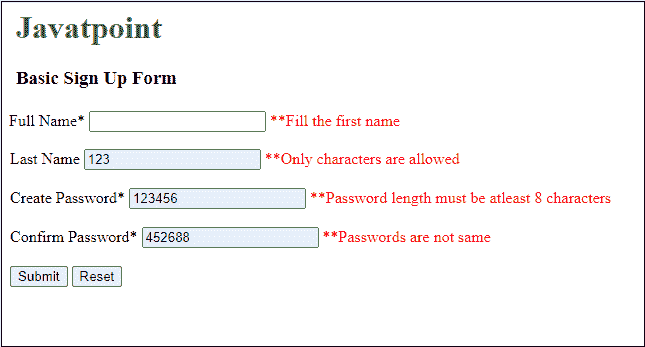

# 在 JavaScript 中确认密码验证

> 原文：<https://www.javatpoint.com/confirm-password-validation-in-javascript>

在本章中，我们将讨论使用 JavaScript 的密码验证。每当用户在任何网站或应用程序上创建帐户时，我们都需要验证密码。所以，我们必须验证一个有效的密码以及把确认密码验证。对于有效的密码，它必须包含以下参数才能有效-

*   密码应该是字母数字。
*   密码的第一个字母应为大写。
*   密码必须包含特殊字符(@、$、！、&等)。
*   密码长度必须大于 8 个字符。
*   最重要的一点是密码字段不应为空。

每当用户创建密码时，总会多一个确认密码字段。它检查用户输入的密码是否与确认密码字段相同。要创建有效的密码，密码和确认密码字段值必须匹配。

首先，我们将检查有效密码，然后确认密码验证检查。

## 有效密码验证

在本例中，我们将检查用户创建的密码是否有效，并与上面讨论的所有参数相匹配。有关密码验证，请参见下面的代码。

***复制代码***

```js

<html>
<head>
<title> Verification of valid Password </title>
</head>
<script>
function verifyPassword() {
  var pw = document.getElementById("pswd").value;
  //check empty password field
  if(pw == "") {
     document.getElementById("message").innerHTML = "**Fill the password please!";
     return false;
  }

 //minimum password length validation
  if(pw.length < 8) {
     document.getElementById("message").innerHTML = "**Password length must be atleast 8 characters";
     return false;
  }

//maximum length of password validation
  if(pw.length > 15) {
     document.getElementById("message").innerHTML = "**Password length must not exceed 15 characters";
     return false;
  } else {
     alert("Password is correct");
  }
}
</script>

<body>
<center>
<h1 style="color:green">Javatpoint</h1>
<h3> Verify valid password Example </h3>

<form onsubmit ="return verifyPassword()">
<!-- Enter Password -->
<td> Enter Password </td>
<input type = "password" id = "pswd" value = ""> 
<span id = "message" style="color:red"> </span> <br><br>

<!-- Click to verify valid password -->
<input type = "submit" value = "Submit">

<!-- Click to reset fields -->
<button type = "reset" value = "Reset" >Reset</button>
</form>
</center>
</body>
</html>

```

[Test it Now](https://www.javatpoint.com/oprweb/test.jsp?filename=confirm-password-validation-in-javascript1)

**输出 1**

将密码字段留空时的输出。


**输出 2**

输入有效密码时的输出。


#### 注意:在上面的截图中，你可能已经注意到密码对每个人都是可见的，因为我们使用了 input type=text。如果您希望密码在输入时不可见，请在您的 [HTML 表单](https://www.javatpoint.com/html-form)中使用输入类型=密码。

## 确认密码验证

在本例中，我们将通过验证用户输入的密码是否相同来验证密码。这个过程将在表单加载之前在客户端使用 [JavaScript](https://www.javatpoint.com/javascript-tutorial) 完成。

***复制代码***

```js

<html>
<head>
<title> Password Matching Validation </title>
</head>
<script>
function matchPassword() {
  var pw1 = document.getElementById("pswd1");
  var pw2 = document.getElementById("pswd2");
  if(pw1 != pw2)
  {	
  	alert("Passwords did not match");
  } else {
  	alert("Password created successfully");
  }
}
</script>

<body>
<center>
<form>
<h1 style="color:green">Javatpoint</h1>
<h3> Confirm password Validation Example </h3>
<!-- Enter Password -->
<td> Enter Password </td>
<input type = "password" name = "pswd1"> <br><br>

<!-- Enter Confirm password -->
<td> Confirm Password </td>
<input type = "password" name = "pswd2"> <br><br>

<!?Click to validate confirm password -->
<button type = "submit" onclick="matchPassword()">Submit</button>

<!-- Click to reset fields -->
<button type = "reset" value = "Reset" >Reset</button>
</form>
</center>
</body>
</html>

```

[Test it Now](https://www.javatpoint.com/oprweb/test.jsp?filename=confirm-password-validation-in-javascript2)

**输出**

首先，我们将在密码和确认密码字段中输入不同的值。将弹出一个警告框，并显示一条消息:**密码与**不匹配。请参见下面的输出:


接下来，我们将在密码和确认密码字段中输入相同的值，以验证验证码是否正常工作。将弹出一个警告框，并显示一条消息:**密码创建成功**。请参见下面的输出:


#### 请注意，我们在此表单中又使用了一个按钮(重置)来清除用户输入的字段数据。

## 带有密码验证的完整表单

在上面的示例中，您已经学习了验证有效密码和确认密码验证。现在，我们将这两个验证保存在一个表单中，以完成密码验证过程。

为此，我们将创建一个简单的基本注册表单，其中包含一些字段，如名字、姓氏、创建密码和确认密码。带星号(*)的字段是必填字段，用户必须在其中提供一些值。我们将在此表单中进行以下验证，以验证密码:

*   空字段验证
*   最小密码长度验证，即> 8
*   最大密码长度验证，即< 15
*   确认密码验证

除此之外，我们还放了一个**重置**按钮来清除表单中的字段数据。当您点击此**重置**按钮时，用户在字段中提供的所有数据将变得清晰。现在，请看下面的代码:

***复制代码***

```js

<html>
<head>
<title> Validate the Password </title>
</head>
<script>
function validateForm() {
    //collect form data in JavaScript variables
    var pw1 = document.getElementById("pswd1").value;
    var pw2 = document.getElementById("pswd2").value;
    var name1 = document.getElementById("fname").value;
	var name2 = document.getElementById("lname").value;

    //check empty first name field
    if(name1 == "") {
      document.getElementById("blankMsg").innerHTML = "**Fill the first name";
      return false;
    }

    //character data validation
    if(!isNaN(name1)){
      document.getElementById("blankMsg").innerHTML = "**Only characters are allowed";
      return false;
    }

   //character data validation
    if(!isNaN(name2)){
      document.getElementById("charMsg").innerHTML = "**Only characters are allowed";
      return false;
    } 

    //check empty password field
    if(pw1 == "") {
      document.getElementById("message1").innerHTML = "**Fill the password please!";
      return false;
    }

    //check empty confirm password field
    if(pw2 == "") {
      document.getElementById("message2").innerHTML = "**Enter the password please!";
      return false;
    } 

    //minimum password length validation
    if(pw1.length < 8) {
      document.getElementById("message1").innerHTML = "**Password length must be atleast 8 characters";
      return false;
    }

    //maximum length of password validation
    if(pw1.length > 15) {
      document.getElementById("message1").innerHTML = "**Password length must not exceed 15 characters";
      return false;
    }

    if(pw1 != pw2) {
      document.getElementById("message2").innerHTML = "**Passwords are not same";
      return false;
    } else {
      alert ("Your password created successfully");
      document.write("JavaScript form has been submitted successfully");
    }
 }
</script>

<body>
<h1 style="color:green">Javatpoint</h1>
<h3> Verify valid password Example </h3>

<form onsubmit ="return validateForm()">

<!-- Enter first name -->
<td> Full Name* </td>
<input type = "text" id = "fname" value = ""> 
<span id = "blankMsg" style="color:red"> </span> <br><br>

<!-- Enter last name -->
<td> Last Name </td>
<input type = "text" id = "lname" value = ""> 
<span id = "charMsg" style="color:red"> </span> <br><br>

<!-- Create a new password -->
<td> Create Password* </td>
<input type = "password" id = "pswd1" value = ""> 
<span id = "message1" style="color:red"> </span> <br><br>

<!?Enter confirm password -->
<td> Confirm Password* </td>
<input type = "password" id = "pswd2" value = ""> 
<span id = "message2" style="color:red"> </span> <br><br>

<!-- Click to verify valid password -->
<input type = "submit" value = "Submit">

<!-- Click to reset fields -->
<button type = "reset" value = "Reset" >Reset</button>
</form>
</body>
</html>

```

[Test it Now](https://www.javatpoint.com/oprweb/test.jsp?filename=confirm-password-validation-in-javascript3)

**输出**

通过执行上述代码，一个 [HTML](https://www.javatpoint.com/html-tutorial) 表单将出现在网络上。在这里，在文本字段中提供数据，然后单击提交按钮进行处理。根据验证，如果数据正确，将弹出一个警告框，并显示一条消息:**您的密码创建成功**。这里当你点击**确定**按钮时，会进入另一个输出。

**截图 1**


当您点击警报框内的**确定**按钮时，它将移动到一个简单的 HTML 输出，在那里它将显示一条消息**表单数据已成功提交**。

**截图 2**


### 关于提供错误条目的输出

如果您输入了错误的值或者将任何必填字段留空，它将在输入框的右侧显示一个错误。每次点击**提交**按钮，这些错误将在验证检查后逐一显示。请参见下面截图中的错误:



要检查所有验证是否正常工作，请复制代码并在 JavaScript 编译器中执行。

* * *