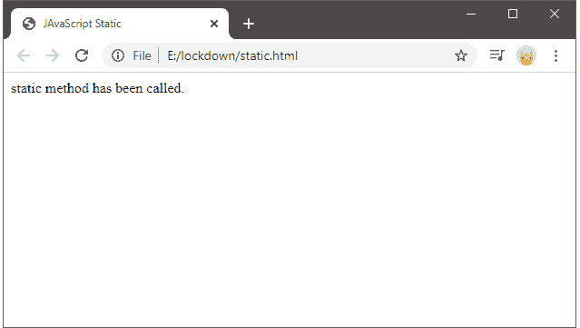
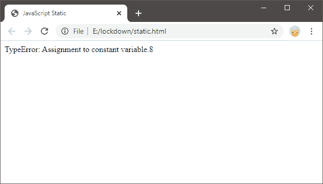

# JavaScript 中静态和常量的区别

> 原文:[https://www.javatpoint.com/static-vs-const-in-javascript](https://www.javatpoint.com/static-vs-const-in-javascript)

我们在不同的语言中使用静态变量和常量变量。在本节中，我们将描述两个变量之间的不同点。我们来讨论一下。

### 什么是 JavaScript 中的静态变量

静态变量是在类中使用而不是在类的实例中使用的类属性。变量存储在内存的数据段区域，并且在类中创建的每个实例之间共享相同的值。要使用静态变量，我们使用 static 关键字。我们可以使用 static 关键字创建一个静态值，一个静态函数，包含类、运算符、属性，并作为应用程序或网站的实用函数。静态变量的值是在运行时设置的，是一种全局值，可用于指定类的实例。

### 什么是 JavaScript 中的常量变量

常量变量是具有固定值并且在整个程序中保持不变的变量。const 变量的一个属性是我们不能在整个程序中改变或修改它的值。这是因为只要我们做了一个常量值，编译器就会得到通知，这个值是固定的，程序员应该阻止它。因此，每当程序员试图修改常量值时，就会显示一个错误，即常量值不能更改。为了使用一个常量变量，我们使用一个' const '关键字和输入值。

## JavaScript 中的静态与常量

有以下不同点可以让我们理解两者之间的区别:

| 静态 | 常数 |
| static 关键字用于定义 javascript 类程序中的静态属性和方法。 | const 关键字用于定义变量的常数值。 |
| 静态关键字只能在类定义上访问。为了访问非静态方法的静态关键字，需要使用类名调用它们。但是，为了在另一个静态方法中调用静态方法，我们可以使用这个关键字。 | 常量值可以全局或本地访问，但全局常量永远不能是窗口对象属性。 |
| 静态方法是用于创建或克隆对象的实用函数。 | const 变量用于声明一个常量或固定值，其值不能更改。 |
| JavaScript static 由一个被称为“static”关键字的关键字来标记。 | JavaScript const 由一个被称为“const”关键字的关键字标记，在这里我们声明一个 const 变量，并用一个常量值初始化它。 |
| JavaScript static 也可以用于类和方法。 | JavaScript const 也可以用于对象和数组。 |
| 静态变量的值可以重新分配。 | 不能重新分配常量变量的值。但是，我们可以在允许的情况下，在不同的块范围内重新声明 const 变量。 |

以上是一些不同点，将使我们理解这两个 JavaScript 关键字的工作原理。除了这些理论上的差异描述之外，让我们看一个两者的例子，通过这个例子我们可以理解静态变量和常量变量的使用和工作。

### 使用静态 JavaScript

下面是在类中使用 JavaScript 静态关键字的一个实际实现:

```

<html>
<head>
    <title> JavaScript Static</title>
</head>
<body>
    <script>
              class A {
                static staticMethod() {
                return "Calling Static method.";
                                   }
              }
  document.write(A.staticMethod());
  </script>
</body>
</html>

```

在上面的程序代码中，我们可以看到一个静态方法是在一个类中创建的，当它被调用时，它会在该类的静态方法中调用该语句。以下输出如下所示:



### 使用 Javascript 常量

下面是一个使用 JavaScript const 关键字的实际实现:

```

<html>
<head>
<title> JavaScript Static</title>
</head>
<body>
     <script>
const value= 8;
 try {
  	     value= 10;
} 
     catch (e) {
  document.write(e); 
} //will display a TypeError 
document.write(value);
    </script>
</body>
</html>

```

在上面的代码中，可以看到 const 变量被赋予了一个值，但是当我们试图重新赋予另一个值时，会抛出一个错误，告诉我们描述为 const 的值不能被更改。因此，上面代码的输出是:



在本节中，我们了解到静态变量和常量变量具有不同的角色，并且用于不同的目的，其中静态变量可用于类方法或属性，常量变量用于初始化数组、变量或对象的常量值。

* * *