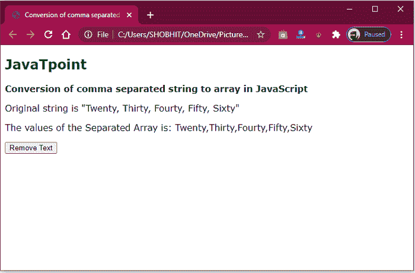
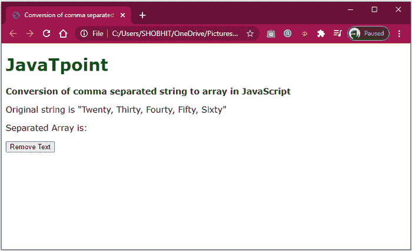

# 如何在 JavaScript 中将逗号分隔的字符串转换成数组

> 原文:[https://www . javatpoint . com/如何将逗号分隔字符串转换为 javascript 数组](https://www.javatpoint.com/how-to-convert-comma-separated-string-into-an-array-in-javascript)

逗号分隔值(CSV)文件是一种使用逗号分隔值的划界文件格式。数据记录由一个或多个字段组成，用逗号分隔。这种文件格式的名称根是逗号分隔的文件格式，是使用逗号作为字段提取器。

您可以使用以下两种方法将逗号分隔的字符串转换为数组。

*   **使用 split()方法**
*   **在列表中添加并跟踪您找到的每个逗号，以生成具有不同字符串的新序列。**

## 使用 split()方法

split()方法用于根据提取器对序列进行分区。如果遇到逗号，可以用逗号来分隔字符串。此过程返回不同字符串的数组。

**语法**

```

string.split(' , ')

```

**例**

下面给出了一个例子。

```

<!DOCTYPE html> 
<html>   
<head> 
<title> 
      Conversion of comma separated  
      string to array in JavaScript 
</title> 
</head> 

<body> 
<h2 style="color: green"> 
      JavaTpoint
</h2> 
<b>Conversion of comma separated string  
      to array in JavaScript</b> 
<p>Original string is 
      "Twenty, Thirty, Fourty, Fifty, Sixty"</p> 
<p> 
      The values of the Separated Array is: <span class="output"></span> 
</p>   
<button onclick="separateString()"> 
      Remove Text 
</button> 
<script type="text/javascript"> 
        function separateString() { 
            originalString = "Twenty, Thirty, Fourty, Fifty, Sixty"; 
            separatedArray = originalString.split(', ');   
            console.log(separatedArray); 
            document.querySelector('.output').textContent =  
              separatedArray; 
} 
</script> 
</body> 
</html>

```

**输出**

成功执行输出后，我们得到了以下输出。



## 在列表中添加并跟踪您找到的每个逗号，以生成具有不同字符串的新序列

此方法帮助您迭代字符串的字符并分析逗号。可以确定 Previous 索引变量，它保存下一个字符串的第一个字符的记录。slice 方法用于移除先前索引和找到的逗号的特定位置之间的字符串部分。这个字符串被驱动到一个新的数组。对整个字符串长度重复此过程。最后一段包括所有独立的字符串。

**语法**

```

originalString = " Twenty, Thirty, Fourty, Fifty, Sixty "; 
separatedArray = []; 
let previousIndex = 0;                       // index of end of the last string 

for(i = 0; i < originalString.length; i++) 
{ 
  if (originalString[i] == ', ') {                                      // check the character for a comma  

       // split the string from the last index to the comma 
        separated = originalString.slice(previousIndex, i); 
        separatedArray.push(separated); 

      previousIndex = i + 1;              // update the index of the last string 
    } 
} 
             // push the last string into the array 
separatedArray.push(originalString.slice(previousIndex, i));  

```

**例**

下面给出了一个例子。

```

<!DOCTYPE html> 
<html>
<head> 
<title>Conversion of comma separated string to array in JavaScript 
</title> 
</head>   
<body> 
<h1 style="color: green"> 
      JavaTpoint	 
</h1> 
<b>Conversion of comma separated string 
      to array in JavaScript</b> 
<p>Original string is 
      "Twenty, Thirty, Fourty, Fifty, Sixty"</p> 
<p> 
      Separated Array is: <span class="output"></span> 
</p> 

<button onclick="separateString()"> 
      Remove Text 
</button> 
<script type="text/javascript"> 

        function separateString() 
{             
            originalString = 
              "Twenty, Thirty, Fourty, Fifty, Sixty"; 
            separatedArray = []; 

            let previousIndex = 0;       // index of end of the last string

            for (i = 0; i < originalString.length; i++) 
{ 

       if (originalString[i] == ', ')     // check the character for a comma 
{                          
separated =        // split the string from the last index to the comma  
originalString.slice(previousIndex, i); 
separatedArray.push(separated); 

previousIndex = i + 1;                 // update the index of the last string   
                } 
            }
        separatedArray.push(          // push the last string into the array 
        originalString.slice(previousIndex, i));   
        console.log(separatedArray); 
        document.querySelector( 
        '.output').textContent = separatedArray; 
        } 
</script> 
</body> 
</html>

```

**输出**

在代码执行之后，您会得到下面的代码片段。



* * *