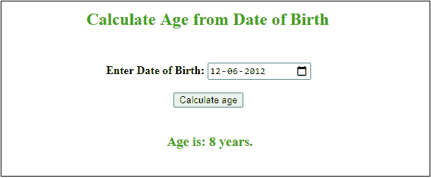

# 使用 JavaScript 计算年龄

> 原文：<https://www.javatpoint.com/calculate-age-using-javascript>

JavaScript 提供了一些内置的日期和时间函数，这有助于从日期(出生日期)开始计算年龄。使用这些 JavaScript 方法，你可以很容易地找到任何人的年龄。为此，我们需要用户输入日期和当前系统日期。在计算它们之间的差异时，我们需要记住以下条件:

*   如果**当前日期**小于用户输入的日期(生日)，则该月不算未完成月份。否则，我们会将月天数(30 或 31)与当前日期相加，以获得它们之间的差异。
*   如果**当月**小于出生月份，则不计算当年。为了得到这个月的差额，我们将减去当前月的总月数(12)。
*   最后，我们只需要在满足以上两个条件后减去日期、月份和年份。

现在，我们将把这个过程转化为实际的实现。

从出生日期计算年龄有各种方法。我们将讨论使用 [JavaScript](https://www.javatpoint.com/javascript-tutorial) 计算年龄的简单易懂的方法。

### 示例 1:预定义的日期输入

在这个例子中，我们用代码提供了一个日期(DOB)，而不是从用户那里获取输入。

```js

<script>
    var dob = new Date("06/24/2008");
    //calculate month difference from current date in time
    var month_diff = Date.now() - dob.getTime();

    //convert the calculated difference in date format
    var age_dt = new Date(month_diff); 

    //extract year from date    
    var year = age_dt.getUTCFullYear();

    //now calculate the age of the user
    var age = Math.abs(year - 1970);

    //display the calculated age
    document.write("Age of the date entered: " + age + " years");
</script>

```

[Test it Now](https://www.javatpoint.com/oprweb/test.jsp?filename=calculate-age-using-javascript1)

**输出**

```js
Age of the date entered: 12 years

```

### 示例 2:动态日期输入

在这个例子中，我们将创建一个 [HTML 表单](https://www.javatpoint.com/html-form)来获取用户输入的日期，然后使用 JavaScript 计算年龄。它将接受来自用户的动态输入。这个 [HTML](https://www.javatpoint.com/html-tutorial) 表单将使用日历来选择日期输入。

**复制代码**

```js

<html>
<head>
<script>
function ageCalculator() {
    var userinput = document.getElementById("DOB").value;
    var dob = new Date(userinput);
    if(userinput==null || userinput=='') {
      document.getElementById("message").innerHTML = "**Choose a date please!";  
      return false; 
    } else {

    //calculate month difference from current date in time
    var month_diff = Date.now() - dob.getTime();

    //convert the calculated difference in date format
    var age_dt = new Date(month_diff); 

    //extract year from date    
    var year = age_dt.getUTCFullYear();

    //now calculate the age of the user
    var age = Math.abs(year - 1970);

    //display the calculated age
    return document.getElementById("result").innerHTML =  
             "Age is: " + age + " years. ";
    }
}
</script>
</head>
<body>
<center>
<h2 style="color: 32A80F" align="center"> Calculate Age from Date of Birth <br> <br> </h2> 

<!-- Choose a date and enter in input field -->
<b> Enter Date of Birth: <input type=date id = DOB> </b>
<span id = "message" style="color:red"> </span> <br><br>  

<!-- Choose a date and enter in input field -->
<button type="submit" onclick = "ageCalculator()"> Calculate age </button> <br><br>
<h3 style="color:32A80F" id="result" align="center"></h3> 
</center>
</body>
</html>

```

[Test it Now](https://www.javatpoint.com/oprweb/test.jsp?filename=calculate-age-using-javascript2)

**输出**

通过执行上述代码，将出现一个 HTML 表单。在这里，从日历中选择一个日期(出生日期)，点击**计算年龄**按钮，从提供的出生日期开始计算年龄。


如果您在选择日期时点击计算年龄，它将显示一个错误。

#### 注意:在测试这个程序时，请记住日期应该小于当前系统日期。



在这个截图中，可以看到我们在输入栏中提供了日期“ **12-06-2012** ”，计算年龄后得到结果 **8 年**。

#### 重要提示:
注意，我们只计算了 8 年 9 年这样的年份，没有计算 8 年 5 个月 23 天这样的年份。所以，我们现在就详细计算一下。

### 示例 2:以年、月和日计算年龄

本示例将以年、月和日为单位计算和显示年龄，而不是仅以年为单位。**例如，**对于 2015 年 12 月 27 日的出生日期，该人将是 4 岁 9 个月零 23 天。

**复制代码**

```js

<html>
<head>
<script>

function ageCalculator() {
    //collect input from HTML form and convert into date format
    var userinput = document.getElementById("DOB").value;
    var dob = new Date(userinput);

    //check user provide input or not
    if(userinput==null || userinput==''){
      document.getElementById("message").innerHTML = "**Choose a date please!";  
      return false; 
    } 

    //execute if the user entered a date 
    else {
    //extract the year, month, and date from user date input
    var dobYear = dob.getYear();
    var dobMonth = dob.getMonth();
    var dobDate = dob.getDate();

    //get the current date from the system
    var now = new Date();
    //extract the year, month, and date from current date
    var currentYear = now.getYear();
    var currentMonth = now.getMonth();
    var currentDate = now.getDate();

    //declare a variable to collect the age in year, month, and days
    var age = {};
    var ageString = "";

    //get years
    yearAge = currentYear - dobYear;

    //get months
    if (currentMonth >= dobMonth)
      //get months when current month is greater
      var monthAge = currentMonth - dobMonth;
    else {
      yearAge--;
      var monthAge = 12 + currentMonth - dobMonth;
    }

    //get days
    if (currentDate >= dobDate)
      //get days when the current date is greater
      var dateAge = currentDate - dobDate;
    else {
      monthAge--;
      var dateAge = 31 + currentDate - dobDate;

      if (monthAge < 0) {
        monthAge = 11;
        yearAge--;
      }
    }
    //group the age in a single variable
    age = {
    years: yearAge,
    months: monthAge,
    days: dateAge
    };

    if ( (age.years > 0) && (age.months > 0) && (age.days > 0) )
       ageString = age.years + " years, " + age.months + " months, and " + age.days + " days old.";
    else if ( (age.years == 0) && (age.months == 0) && (age.days > 0) )
       ageString = "Only " + age.days + " days old!";
    //when current month and date is same as birth date and month
    else if ( (age.years > 0) && (age.months == 0) && (age.days == 0) )
       ageString = age.years +  " years old. Happy Birthday!!";
    else if ( (age.years > 0) && (age.months > 0) && (age.days == 0) )
       ageString = age.years + " years and " + age.months + " months old.";
    else if ( (age.years == 0) && (age.months > 0) && (age.days > 0) )
       ageString = age.months + " months and " + age.days + " days old.";
    else if ( (age.years > 0) && (age.months == 0) && (age.days > 0) )
       ageString = age.years + " years, and" + age.days + " days old.";
    else if ( (age.years == 0) && (age.months > 0) && (age.days == 0) )
       ageString = age.months + " months old.";
    //when current date is same as dob(date of birth)
    else ageString = "Welcome to Earth! <br> It's first day on Earth!"; 

    //display the calculated age
    return document.getElementById("result").innerHTML = ageString; 

  }
}
</script>
</head>
<body>
<center>
<h2 style="color: 32A80F" align="center"> Calculate Age from Date of Birth <br> <br> </h2> 

<b> Enter Date of Birth: <input type=date id = DOB>  </b>
<span id = "message" style="color:red"> </span> <br><br>  
<button type="submit" onclick = "ageCalculator()"> Calculate age </button> <br><br>
<h3 style="color:32A80F" id="result" align="center"></h3> 
</center>
</body>
</html>

```

[Test it Now](https://www.javatpoint.com/oprweb/test.jsp?filename=calculate-age-using-javascript3)

**输出**

通过执行上述代码，将出现一个 HTML 表单。在这里，从日历中选择一个日期(出生日期)，点击**计算年龄**按钮，从提供的出生日期开始计算年龄。


如果您在选择日期时点击计算年龄，它将显示一个错误。

我们将向您展示不同日期输入值的不同输出。您将看到响应将以**年、月、日**的形式返回。逐一查看输出:

**输入随机日期时输出**


**输入出生月份和日期相同的日期时输出**


**输入今天日期(当前日期)时输出**


计算年龄有各种方法。这是以年、月和日格式计算年龄的又一个例子。

### 例 4

在这个例子中，我们通过转换以毫秒为单位的日期差来计算年龄。这也是一种计算年龄的简单方法。

**复制代码**

```js

<html>
<head>
<script>

function ageCalculator() {
    //collect input from HTML form and convert into date format
    var userinput = document.getElementById("DOB").value;
    var dob = new Date(userinput);

    //check user provide input or not
    if(userinput==null || userinput==''){
      document.getElementById("message").innerHTML = "**Choose a date please!";  
      return false; 
    } 

    //execute if user entered a date 
    else {
    //extract and collect only date from date-time string
    var mdate = userinput.toString();
    var dobYear = parseInt(mdate.substring(0,4), 10);
    var dobMonth = parseInt(mdate.substring(5,7), 10);
    var dobDate = parseInt(mdate.substring(8,10), 10);

    //get the current date from system
    var today = new Date();
    //date string after broking
    var birthday = new Date(dobYear, dobMonth-1, dobDate);

    //calculate the difference of dates
    var diffInMillisecond = today.valueOf() - birthday.valueOf();

    //convert the difference in milliseconds and store in day and year variable        
    var year_age = Math.floor(diffInMillisecond / 31536000000);
    var day_age = Math.floor((diffInMillisecond % 31536000000) / 86400000);

    //when birth date and month is same as today's date      
    if ((today.getMonth() == birthday.getMonth()) && (today.getDate() == birthday.getDate())) {
            alert("Happy Birthday!");
        }

     var month_age = Math.floor(day_age/30);        
     day_age = day_age % 30;

     var tMnt= (month_age + (year_age*12));
     var tDays =(tMnt*30) + day_age;

    //DOB is greater than today's date, generate an error: Invalid date  
     if (dob>today) {
        document.getElementById("result").innerHTML = ("Invalid date input - Please try again!");
      }
      else {
        document.getElementById("result").innerHTML = year_age + " years " + month_age + " months " + day_age + " days"
      }
   }
}
</script>
</head>
<body>
<center>
<h2 style="color: #008CBA" align="center"> Calculate Age from Date of Birth <br> <br> </h2> 

<b> Enter Date of Birth: <input type=date id = DOB>  </b>
<span id = "message" style="color:red"> </span> <br><br>  
<button type="submit" onclick = "ageCalculator()"> Calculate age </button> <br><br>
<h3 style="color:#008CBA" id="result" align="center"></h3> 
</center>
</body>
</html>

```

[Test it Now](https://www.javatpoint.com/oprweb/test.jsp?filename=calculate-age-using-javascript4)

**输出**

见下图输出，给定出生日期 **15-05-1986** 的年龄为 **34 岁 5 个月 17 天**。


输入大于今天的出生日期，会显示错误**无效日期输入**。请参见下面的输出:


* * *