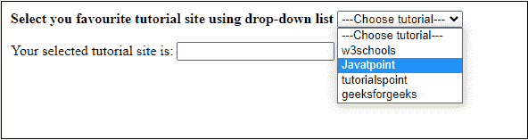
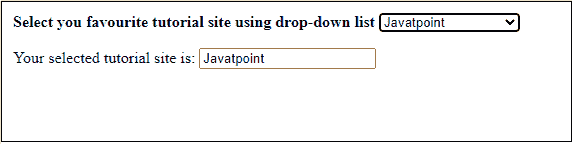
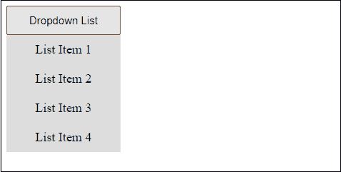
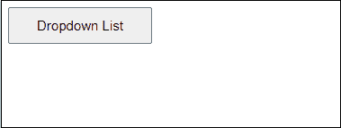
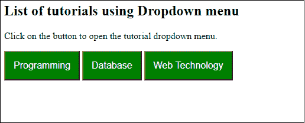
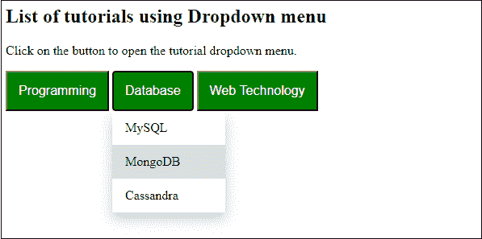
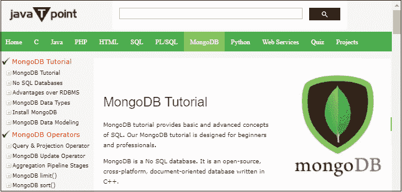

# 如何用 JavaScript 创建下拉列表？

> 原文：<https://www.javatpoint.com/how-to-create-dropdown-list-using-javascript>

在开始创建下拉列表之前，了解什么是下拉列表非常重要。下拉列表是一个可切换的菜单，允许用户从多个选项中选择一个。此列表中的选项是在编码中定义的，它与一个函数相关联。当您单击或选择此选项时，该函数将触发并开始执行。

大多数情况下，您都在登记表上看到下拉列表，以便从下拉菜单中选择州或城市。下拉列表允许我们从项目列表中只选择一个。请看下面的截图，下拉列表是什么样子的-

### 创建下拉列表的要点

*   <select>选项卡与<option>选项卡一起使用，在 HTML 中创建简单的下拉列表。之后，JavaScript 帮助执行这个列表的操作。</option></select>
*   除此之外，您可以使用容器选项卡创建下拉列表。在其中添加下拉项目和链接。我们将在本章中用一个例子讨论每种方法。
*   您可以使用任何元素如<button>、</button> 

请参见下面的示例，使用不同的方法创建下拉列表。

### 例子

### 使用<select>标签的简单下拉列表</select>

这是一个简单的例子，无需使用任何复杂的 [JavaScript](https://www.javatpoint.com/javascript-tutorial) 代码和 [CSS](https://www.javatpoint.com/css-tutorial) 样式表就可以创建一个简单易行的下拉列表。

**复制代码**

```js

<html>
<head>
<title>dropdown menu using select tab</title>
</head>
<script>
function favTutorial() {
var mylist = document.getElementById("myList");
document.getElementById("favourite").value = mylist.options[mylist.selectedIndex].text;
}
</script>

<body>
<form>
<b> Select you favourite tutorial site using dropdown list </b>
<select id = "myList" onchange = "favTutorial()" >
<option> ---Choose tutorial--- </option>
<option> w3schools </option>
<option> Javatpoint </option>
<option> tutorialspoint </option>
<option> geeksforgeeks </option>
</select>
<p> Your selected tutorial site is: 
<input type = "text" id = "favourite" size = "20" </p>
</form>
</body>
</html>

```

[Test it Now](https://www.javatpoint.com/oprweb/test.jsp?filename=how-to-create-dropdown-list-using-javascript1)

**输出**

通过运行上述代码，您将获得与给定截图相同的响应。它将包含一个下拉菜单，其中有一个教程网站的列表。

通过单击从下拉列表中选择一个项目。



请参见下面的屏幕截图，所选项目已显示在输出字段中。



下拉列表可以通过其他方式创建；请看下面的例子。

### 使用按钮和 div 选项卡的下拉列表

在这个例子中，我们将创建一个下拉列表，其中一个按钮有一个项目列表作为下拉菜单。

**复制代码**

```js

<html>
<head>
<title>dropdown menu using button</title>
</head>
<style>
/* set the position of dropdown */
.dropdown {
     position: relative;
     display: inline-block;
}
/* set the size and position of button on web */
.button {
     padding: 10px 30px;
     font-size: 15px;
}
/* provide css to background of list items */ 
#list-items {
    display: none;
    position: absolute;
    background-color: white;
    min-width: 185px;
}
/* provide css to list items */ 
#list-items a {
     display: block;
     font-size: 18px;
     background-color: #ddd;
     color: black;
     text-decoration: none;
     padding: 10px;
}
</style>

<script>
      //show and hide dropdown list item on button click
      function show_hide() {
         var click = document.getElementById("list-items");
         if(click.style.display ==="none") {
            click.style.display ="block";
         } else {
            click.style.display ="none";
         } 
      }
   </script>

<body>
<div class="dropdown">
  <button onclick="show_hide()" class="button">Choose Language</button>
   <center>
      <!-- dropdown list items will show when we click the drop button --> 
      <div id="list-items">
         <a href="#"> Hindi </a>
         <a href="#"> English </a>
         <a href="#"> Spanish </a>
         <a href="#"> Chinese </a>
         <a href="#"> Japanese </a>
      </div>
   </center>

</body>
</html>

```

[Test it Now](https://www.javatpoint.com/oprweb/test.jsp?filename=how-to-create-dropdown-list-using-javascript2)

**输出**

通过点击这个下拉按钮，你会得到一个项目列表，你必须从列表中选择一个项目。请看下面的截图:



点击**下拉列表**按钮，隐藏列表。



### 多个下拉列表示例

在上面的例子中，我们创建了一个下拉列表。我们现在将创建一个包含多个下拉菜单的表单，其中包含各种在线技术主题教程列表，如 [C](https://www.javatpoint.com/c-programming-language-tutorial) 、 [C++](https://www.javatpoint.com/cpp-tutorial) 、 [PHP](https://www.javatpoint.com/php-tutorial) 、 [MySQL](https://www.javatpoint.com/mysql-tutorial) 和 [Java](https://www.javatpoint.com/java-tutorial) ，分为几类。当用户点击一个特定的下拉按钮时，他们各自的下拉列表将向您打开。

请参见下面的示例:

```js

<html>
<head>
<style>
.dropbtn {
  background-color: green;
  color: white;
  padding: 14px;
  font-size: 16px;
  cursor: pointer;
}

.dropbtn:hover {
  background-color: brown;
}

.dropdown {
  position: relative;
  display: inline-block;
}

.dropdown-content {
  display: none;
  position: absolute;
  background-color: white;
  min-width: 140px;
  overflow: auto;
  box-shadow: 0px 8px 16px 0px rgba(0,0,0,0.2);
}

.dropdown-content a {
  color: black;
  padding: 12px 16px;
  text-decoration: none;
  display: block;
}

.dropdown a:hover {
   background-color: #ddd;
 }

.show {
  display: block;
}
</style>
</head>
<body>

<h2>List of tutorials using Dropdown menu</h2>
<p>Click on the button to open the tutorial dropdown menu.</p>

<div class="dropdown">
  <button onclick="programmingList()" class="dropbtn">Programming</button>
  <div id="myDropdown1" class="dropdown-content">
    <a href="#java" onclick="java()">Java</a>
    <a href="#python" onclick="python()">Python</a>
    <a href="#c++" onclick="cpp()">C++</a>
    <a href="#c" onclick="c()">C</a>
  </div>
</div>

<div class="dropdown">
  <button onclick="databaseList()" class="dropbtn">Database</button>
  <div id="myDropdown2" class="dropdown-content">
    <a href="#mysql" onclick="mysql()">MySQL</a>
    <a href="#mdb" onclick="mDB()">MongoDB</a>
    <a href="#cass" onclick="cassandra()">Cassandra</a>
  </div>
</div>

<div class="dropdown">
  <button onclick="WebTechList()" class="dropbtn">Web Technology</button>
  <div id="myDropdown3" class="dropdown-content">
    <a href="#php" onclick="php()">PHP</a>
    <a href="#css" onclick="css()">CSS</a>
    <a href="#js" onclick="js()">JavaScript</a>
  </div>
</div>
<script>
/* methods to hide and show the dropdown content */
function programmingList() {
  document.getElementById("myDropdown1").classList.toggle("show");
}

function databaseList() {
  document.getElementById("myDropdown2").classList.toggle("show");
}

function WebTechList() {
  document.getElementById("myDropdown3").classList.toggle("show");
}

/* methods to redirect to tutorial page that user will select from dropdown list */
function java() {
   window.location.replace("https://www.javatpoint.com/java-tutorial");
}
function python() {
   window.location.replace("https://www.javatpoint.com/python-tutorial");
}
function cpp() {
   window.location.replace("https://www.javatpoint.com/cpp-tutorial");
}
function c() {
   window.location.replace("https://www.javatpoint.com/c-programming-language-tutorial");
}
function mysql() {
   window.location.replace("https://www.javatpoint.com/mysql-tutorial");
}
function mDB() {
   window.location.replace("https://www.javatpoint.com/mongodb-tutorial");
}
function cassandra() {
   window.location.replace("https://www.javatpoint.com/cassandra-tutorial");
}
function php() {
   window.location.replace("https://www.javatpoint.com/php-tutorial");
}
function css() {
   window.location.replace("https://www.javatpoint.com/css-tutorial");
}
function js() {
   window.location.replace("https://www.javatpoint.com/javascript-tutorial");
}

// Close the dropdown menu if the user clicks outside of it
window.onclick = function(event) {
  if (!event.target.matches('.dropbtn')) {
    var dropdowns = document.getElementsByClassName("dropdown-content");
    var i;
    for (i = 0; i < dropdowns.length; i++) {
      var openDropdown = dropdowns[i];
      if (openDropdown.classList.contains('show')) {
        openDropdown.classList.remove('show');
      }
    }
  }
}
</script>

</body>
</html>

```

[Test it Now](https://www.javatpoint.com/oprweb/test.jsp?filename=how-to-create-dropdown-list-using-javascript3)

**输出**

执行上述代码时，将出现一个带有三个下拉按钮的表单。每个下拉按钮都有一个项目列表。



单击任何下拉按钮查看项目列表。



让你点击数据库教程下的 MongoDB，它会把你重定向到我们的 javatpoint [MongoDB 教程](https://www.javatpoint.com/mongodb-tutorial)。请参见下面的输出:



#### 注意:如果您在下拉窗口外单击，下拉列表将消失。

通常，创建一个下拉菜单来分类相同类型的项目。指相似类型项目的列表。它与教程网站非常相似，该网站有几个 javatpoint 主题教程列表。

* * *