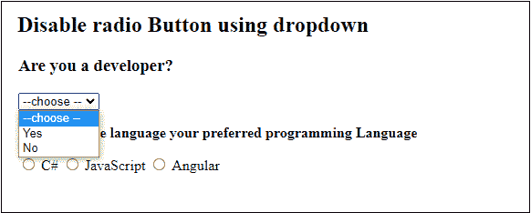
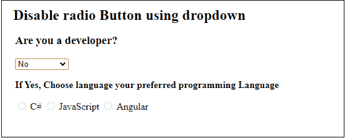
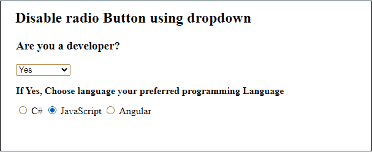
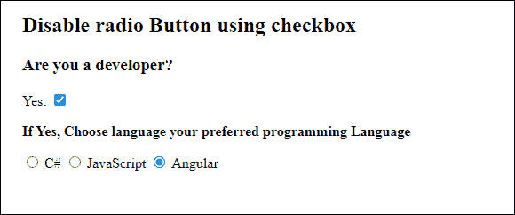
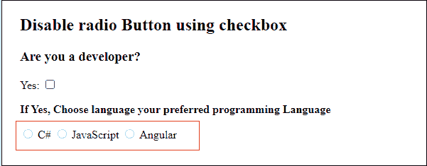
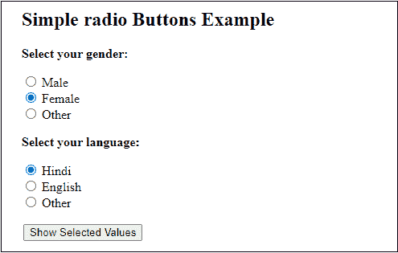
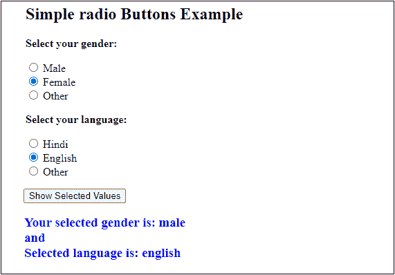

# 如何使用 JavaScript 禁用单选按钮？

> 原文：<https://www.javatpoint.com/how-to-disable-radio-button-using-javascript>

单选按钮是一种输入类型，用于通过从多个选项中选择一个值来获得用户的输入。你已经看到了在男性和女性之间选择性别的单选按钮。我们只选择一个条目，男的或女的，其他条目不选。

在某些情况下，我们可能需要根据某些条件禁用其他条目。您可以使用 [HTML](https://www.javatpoint.com/html-tutorial) DOM 的**禁用的**属性来启用和禁用单选按钮。将该属性设置为真(**禁用=真**)以禁用 [JavaScript](https://www.javatpoint.com/javascript-tutorial) 中的单选按钮。

### 禁用单选按钮

有时，我们需要针对特定情况禁用单选按钮。当我们禁用单选按钮时，这些是特殊情况。当单选按钮被禁用时，它们的颜色变为**灰色**。

在以下示例中，我们将学习如何禁用单选按钮:

### 使用下拉菜单禁用单选按钮

这里，我们将使用一个下拉列表，将**是**和**否**作为启用或禁用单选按钮的值。如果选择“否”，所有单选按钮都将被禁用。另一方面，如果选择“是”，所有单选按钮都将启用。

#### 请注意，您也可以使用复选框，而不是下拉列表。

**复制代码**

```

<html>
<script>
function verifyAnswer() {
//get the selected value from the dropdown list
var mylist = document.getElementById("myAns");
var result = mylist.options[mylist.selectedIndex].text;
  if (result == 'No') {
  	//disable all the radio button 
	document.getElementById("csharp").disabled = true;
  	document.getElementById("js").disabled = true;
  	document.getElementById("angular").disabled = true;
  } else {
  	//enable all the radio button
  	document.getElementById("csharp").disabled = false;
  	document.getElementById("js").disabled = false;
  	document.getElementById("angular").disabled = false;
  }
}
</script>

<body>
<h2> Disable radio Button using dropdown </h2>
<form>
<!-- create a dropdown list -->
<h3> Are you a developer? </h3>
<select id = "myAns" onchange = "verifyAnswer()" >
<option value="choose"> --choose -- </option>
<option value="yes"> Yes </option>
<option value="no"> No </option>
</select>
</form>

<p> <b> If Yes, Choose language your preferred programming Language</b> </p>
<!-- create a set of radio buttons -->
<label> <input type="radio" name="programming" id="csharp" value= "csharp"> C# </label>
<label> <input type="radio" name="programming" id="js" value= "js"> JavaScript </label>
<label> <input type="radio" name="programming" id="angular" value= "angular"> Angular </label>
</body>
</html>

```

[Test it Now](https://www.javatpoint.com/oprweb/test.jsp?filename=how-to-disable-radio-button-using-javascript1)

**输出 1**

通过运行上面的代码，您将获得与下面相同的输出。在这里，首先从下拉列表中选择是或否。



**输出 2**

从下拉列表中选择**否**，所有单选按钮都将被禁用，并且不允许您选择任何编程语言。请看下面的截图:



**输出 2**

从下拉列表中选择**是**，所有单选按钮将再次启用。所以，你可以选择一种编程语言。请看下面的截图:



### 使用复选框禁用单选按钮

现在我们将使用复选框来禁用单选按钮。

**复制代码**

```

<html>
<script>
function verifyAnswer() {
    //disable all the radio button 
	document.getElementById("csharp").disabled = true;
  	document.getElementById("js").disabled = true;
  	document.getElementById("angular").disabled = true;

    //get the value if checkbox is checked
    var dev = document.getElementById("myCheck").checked;
    if (dev == true) {
	//enable all the radio button
  	  document.getElementById("csharp").disabled = false;
  	  document.getElementById("js").disabled = false;
  	  document.getElementById("angular").disabled = false;
   }
}
</script>

<body>
<h2> Disable radio Button using checkbox </h2>
<form>
<!-- create a dropdown list -->
<h3> Are you a developer? </h3>
Yes: 
<input type="checkbox" id="myCheck" onchange="verifyAnswer()" checked>
</form>

<p> <b> If Yes, Choose language your preferred programming Language</b> </p>
<!-- create a set of radio buttons -->
<label> <input type="radio" name="programming" id="csharp" value= "csharp"> C# </label>
<label> <input type="radio" name="programming" id="js" value= "js"> JavaScript </label>
<label> <input type="radio" name="programming" id="angular" value= "angular"> Angular </label>
</body>
</html>

```

[Test it Now](https://www.javatpoint.com/oprweb/test.jsp?filename=how-to-disable-radio-button-using-javascript2)

**输出**

通过运行上面的代码，您将获得与下面相同的输出。这里，复选框已经被选中，你只需要点击单选按钮选择一种编程语言。



如果您不是开发人员，请取消选中该复选框。取消选中复选框将禁用单选按钮。



所以，这些是禁用单选按钮的不同方法。

### 一个简单的单选按钮示例

这是一个创建单选按钮的简单示例。在这个例子中，我们将为性别和语言选择创建一组单选按钮。输入将使用 HTML 表单，并通过 JavaScript 进行计算。请参见下面的代码:

**复制代码**

```

<html>
<script>
function calValue() {
//fetch all gender radio button data
var male = document.getElementById('g1');
var female = document.getElementById('g2');
var otherg = document.getElementById('g3');

//fetch all language radio button data
var hindi = document.getElementById('l1');
var english = document.getElementById('l2');
var otherl = document.getElementById('l3');

var gender;
var language;
//check which gender is selected using radio button
if(male.checked == true) {
  gender = male; 
} else if(female.checked == true) {
  gender = female; 
} else if(otherg.checked == true) {
  gender = otherg 
}

//check which language is selected using radio button
if(hindi.checked == true) {
  language = hindi; 
} else if(english.checked == true) {
  language = english; 
} else if(otherl.checked == true) {
  language = otherl 
}
//return data to HTML form
return document.getElementById("result").innerHTML = "Your selected gender is: " + gender.value + "</br> and </br> Selected language is: " + language.value;
}
</script>

<body>
<h2> Simple radio Buttons Example </h2>
  <!-- create radio button for gender selection -->
  <p> <b> Select your gender: </b> </p>
  <input type="radio" id="g1" name="gender" value="male">
  <label for="male"> Male </label> <br>
  <input type="radio" id="g2" name="gender" value="female">
  <label for="female"> Female </label> <br>
  <input type="radio" id="g3" name="gender" value="other">
  <label for="other"> Other </label>

  <br>  
  <!-- create radio button for language selection -->
  <p> <b> Select your language: </b> </p>
  <input type ="radio" id="l1" name="language" value="hindi">
  <label for ="male"> Hindi </label> <br>
  <input type="radio" id="l2" name="language" value="english">
  <label for="female"> English </label> <br>
  <input type="radio" id="l3" name="language" value="other">
  <label for="other"> Other </label> <br> <br>

  <input type="submit" value="Submit" onclick="calValue()">
  <h3 id="result" style="color:blue"> </h3>
</body>
</html>

```

[Test it Now](https://www.javatpoint.com/oprweb/test.jsp?filename=how-to-disable-radio-button-using-javascript3)

**输出**

单选按钮见下图。这里，从每组单选按钮中选择一个值。我们选择了**性别=女性**和**语言=印地语**。



选择单选按钮值后，点击**显示选定值**按钮，您将获得已显示在网页上的选定值。



* * *