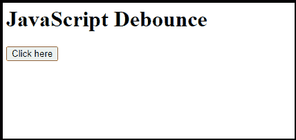
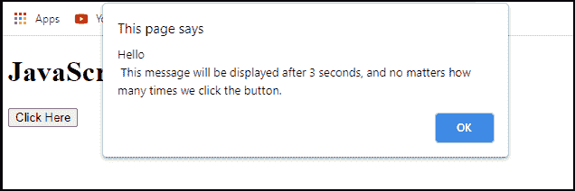
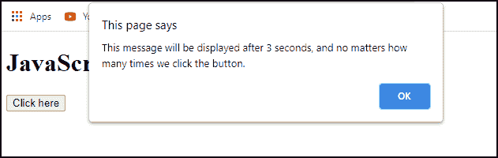

# JavaScript 去抖

> 原文:[https://www.javatpoint.com/javascript-debouncing](https://www.javatpoint.com/javascript-debouncing)

在本文中，我们将讨论 **JavaScript 去抖()**方法及其实现。

## 什么是去抖？

去抖是 JavaScript 中用来提高浏览器性能的一种方法。网页上可能有一些功能需要耗时的计算。如果频繁应用这类方法，可能会极大影响浏览器的性能，因为 [Javascript](https://www.javatpoint.com/javascript-tutorial) 是**单线程语言**。去抖是一种编程技术，可以确保耗时的活动不会导致网页性能下降。换句话说，去抖方法在被调用时不会运行。相反，它们会等待一段预定的时间，直到执行。当我们再次调用同一个进程时，前一个进程被取消，计时器被重置。

去抖是节流的表亲，它们都有助于提高 web 应用程序的性能。虽然，他们在不同的情况下被看到。当我们只考虑最终状态时，使用去抖。**例如**，他们正在等待，直到用户完成键入，以检索 typeahead 搜索结果。如果我们想以一种有规律的速度管理所有中间状态，节流是最好的工具。

## 去抖的实现

让我们举个例子来看看去抖方法在程序中的实现。

```

const debounce = (func, wait) => {
  let timeout;
  return function mainFunction(...args) {
    const later = () => {
      clearTimeout(timeout);
      func(...args);
    };
    clearTimeout(timeout);
    timeout = setTimeout(delay, wait);
  };
};

```

返回另一个函数的高阶函数称为去抖函数。它用于围绕**功能**和**等待**功能参数和**超时变量**创建一个闭包，以保持它们的值。以下变量的定义如下:

1.  **功能:**是去抖时间后我们要执行的**功能**功能。
2.  **等待:**在最后一次接收到动作之后，去抖功能可以等待直到执行该功能的时间。
3.  **超时:**超时功能是用于指示正在运行的去抖的值。

### 示例:

我们举个例子来理解 JavaScript 中的**去抖()**方法。一个按钮连接到一个事件侦听器，该事件侦听器在下面的示例中调用一个去反跳函数。去抖功能有**两个参数**:一个**功能**，另一个是**号(时间)**。一个**定时器**声明，顾名思义，一定时间后调用去抖功能。

```

<!DOCTYPE html>
<html> 
<body>
<h1>JavaScript Debounce</h1>
<input type = "button" id="debounce" value = "Click Here">
<script>
var button = document.getElementById("debounce");
const debounce = (func, wait) => {
    let debounceTimer
    return function() {
        const context = this
        const args = arguments
            clearTimeout(debounceTimer)
                debounceTimer
            = setTimeout(() => func.apply(context, args), wait)
    }
} 
button.addEventListener('click', debounce(function() {
        alert("Hello\n This message will be displayed after 3 seconds, and no matters how many times we click the button.")
}, 4000));
</script>
</body>
</html>

```

**输出:**执行上述代码后，我们会得到如下所示的输出:



正如我们在上面的截图中看到的，有一个**“点击这里”**按钮。当按下**点击此处**按钮时，出现一个警告框并显示一条警告信息。该功能每次都会更新，这意味着如果在延迟时间(4 秒)之前按下按钮，初始计时器将被清除，并启动新的计时器。 **clearTimeOut()** 功能用来完成这个任务。



## 具有立即功能的去抖功能的实现

下面的去抖实现返回一个函数，只要它被调用，就不会被调用。在 **N 毫秒**不活动后，将再次调用该功能。当以初始函数作为参数调用该函数时，它会立即调用该函数，并在再次调用之前等待该时间间隔。

```

function debounce(func, wait, immediate) {
  var timeout;
  return function mainFunction() {
    var cont = this;
    var args = arguments;    
    var later = function() {
      timeout = null;
      if (!immediate) func.apply(cont, args);
    };
    var callNow = immediate && !timeout;	
    clearTimeout(timeout);
    timeout = setTimeout(delay, wait);	
    if (callNow) func.apply(cont, args);
  };
};

```

去抖返回一个函数，当函数和时间间隔被传递时，该函数可能会被传递给函数的事件侦听器。

```

var returnedFunction = debounce(function() {
}, 3000);
window.addEventListener('resize', returnedFunction);

```

### 示例:

让我们举个例子来理解去抖功能和立即功能的用法。

```

<!DOCTYPE html>
<html>
<body>
<h1>JavaScript Debounce</h1>
    <button id="debounce"> 
        Click here
    </button>     
    <script> 
    var button = document.getElementById("debounce");  
    const debounce = (func, wait, immediate)=> {
    var timeout;
    return function executedFunction() {
        var cont = this;
        var args = arguments;         
        var later = function() {
        timeout = null;
        if (!immediate) func.apply(cont, args);
        };
        var callNow = immediate && !timeout;        
        clearTimeout(timeout);
        timeout = setTimeout(later, wait);
        if (callNow) func.apply(cont, args);
        };
    };
    button.addEventListener('click', debounce(function() { 
            alert("This message will be displayed after 3 seconds, and no matters how many times we click the button.") 
                            }, 3000)); 
    </script> 
 </body>
</html>

```

**输出:**执行完上面的代码后，我们会得到如下截图所示的输出。


正如我们在上面的截图中看到的，有一个**“去抖”**按钮。当我们点击**“去抖”**按钮时，它会显示一条警告信息。如果我们点击**“确定”**按钮，提醒信息将消失。



## 应用用途

去抖可以用来实现提示性文本，我们等待几秒钟让用户停止输入，然后再提出文本。因此，我们会在每次按键后等待几秒钟，然后再提出建议。去抖通常用于内容加载网站，如**脸书**和**推特**，用户继续滚动。因为视频和照片太多，滚动事件触发太频繁会有性能影响。因此，在滚动情况下必须使用去抖。

* * *