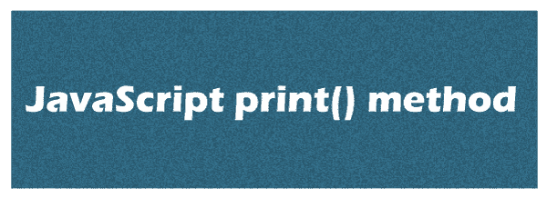
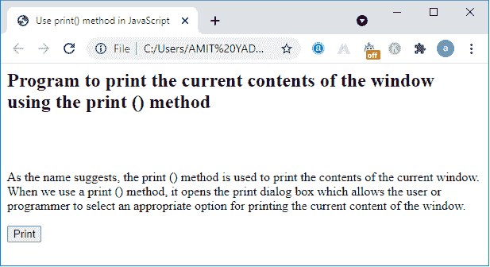
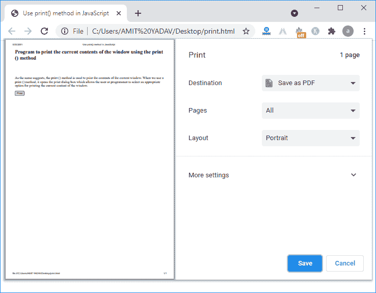
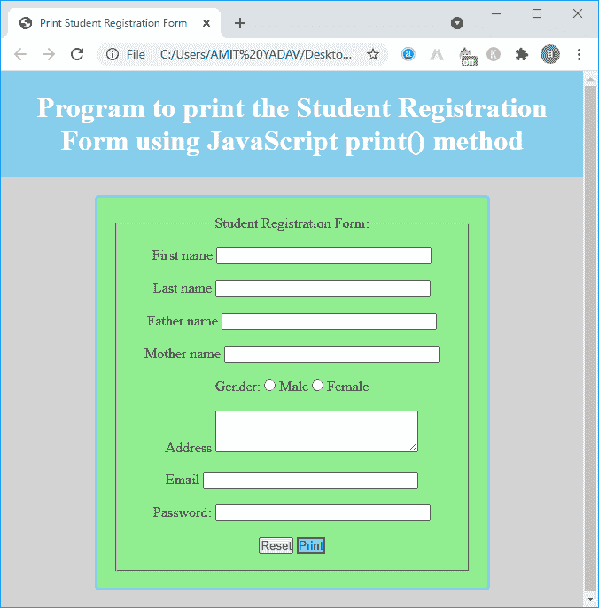
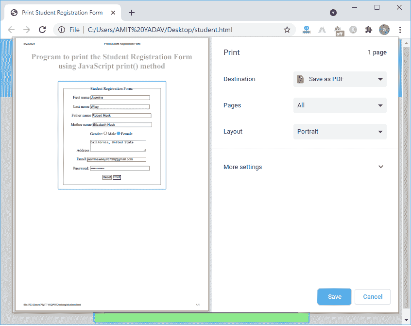

# JavaScript print()方法

> 原文:[https://www.javatpoint.com/javascript-print-method](https://www.javatpoint.com/javascript-print-method)

在本节中，我们将讨论 JavaScript 语言中的 print()方法。A **print()** 方法用于打印当前可见的内容，如网页、文本、图像等。，在电脑屏幕上。当我们在 [JavaScript](https://www.javatpoint.com/javascript-tutorial) 中使用 **print()** 方法并执行代码时，它会打开一个打印对话框，允许用户或程序员选择一个合适的选项来打印窗口的当前内容。



### 句法

以下语法用于打印窗口的当前内容:

```

window.print()

```

在上面的语法中，我们使用 window.print()方法打印窗口屏幕当前可见的内容。

**参数**:不包含任何参数。

**返回**:window . print()方法不返回任何内容。

### 打印()方法支持的浏览器

以下是支持 window.print()方法的浏览器。

1.  谷歌 Chrome
2.  微软公司出品的 web 浏览器
3.  燃烧室
4.  歌剧
5.  旅行队

### 示例 1:使用 print()方法打印网页的程序

在这个程序中，我们使用了 window.print()方法，在窗口屏幕中打印当前可见的内容。

**print.html**

```

<html>
<head>
<title>
Use print() method in JavaScript
</title>
<script type = "text/ javascript">

<!--

// -->
</script>
</head>
<body>
<h2> Program to print the Current Content of the window using print() method </h2>
<br> <br>
<p>
As the name suggests, the print () method is used to print the contents of the current window. When we use a print () method, it opens the print dialog box, which allows the user or programmer to select an appropriate option for printing the current content of the window. </p>
<form>

<!-- When a user click on the print button, the onclick function calls the window.print() method to print the currently visible content in the window screen. --> 
<input type = "button" value = "Print" onclick = "window.print()" />
</form>
</body>

</html>

```

当我们在任何浏览器上执行上述编程代码时，它会显示如下图像:



在上图中，有一个**打印**按钮。现在我们点击打印按钮，它会打开一个带有当前窗口屏幕可视内容的打印对话框，如下图所示。



### 示例 2:使用 print()方法打印学生登记表的程序

在这个程序中，我们创建一个学生登记表，然后使用 window，print()方法打印它。

**Student.html**

```

<!-- Create a web page to print the Student registration Form in JavaScript using print() method. -->
<html>
<head>
<title>
Print Student Registration Form
</title>
<script type = "text/javascript">
function printFun()
{
window.print();
}

</script>
<!-- Start the coding for CSS -->
<style>
/* Create the Outer layout of the Calculator. */
.formstyle
{
width: 400px;
height: 400px;
margin: 20px auto;
border: 3px solid skyblue;
border-radius: 5px;
padding: 20px;
text-align: center;
background-color: lightgreen;
}

/* Display top horizontal bar that contain some information. */
h1 {
	text-align: center;
	padding: 23px;
	background-color: skyblue;
	color: white;
	}

*{
margin: 0;
padding: 0;
}

</style>

</head>

<body bgcolor = "lightgrey">
<h1> Program to print the Student Registration Form using JavaScript print() method </h1>

<div class = "formstyle"

<form name = "form1">
<fieldset>
<br>
<legend> Student Registration Form: </legend>
<label> First name </label>
<input type = "text" name = "fname" size = "30" /> <br>
<br>

<label> Last name </label>
<input type = "text" name = "lname" size = "30" /> <br>
<br>

<label> Father name </label>
<input type = "text" name = "f_name" size = "30" /> <br>
<br>

<label> Mother name </label>
<input type = "text" name = "m_name" size = "30" /> <br>
<br>

<label> Gender:
</label>
<input type = "radio" name = "gender" /> Male 
<input type = "radio" name = "gender" /> Female <br>
<br>

<label>
Address
</label>
<textarea cols = "30" rows = "3" value = "address">
</textarea>
<br>
<br>

<label>
Email
</label>
<input type = "email" id = "email" name = "email" size ="30" /> </br>
<br>

<label>
Password:
</label>
<input type = "password" id = "pass" name = "pwd" size = "30"> <br>
<br>
<input type = "reset"  value = "Reset"/>
<input style = "background-color:skyblue;" width = 30px height = 20px type = "button" value = "Print" onclick = "printFun()"/>
<br> <br>
</fieldset>
<br>
</form>
</div>

</body>
</html>

```

当我们在任何浏览器上执行上述编程代码时，它会显示如下图像:



现在我们填写学生登记表的所有细节，并点击打印按钮，如下图所示。



点击打印按钮后，显示**窗口的不同操作，打印**方法。完成“打印”对话框中的所有设置后，单击“保存”按钮将文件或页面保存到您的系统中。

**代码说明:**在上面的程序中，我们创建了一个学生登记表，这个表格有两个按钮 Reset 和 Print 按钮。重置按钮用于重置内容，打印按钮用于打印显示的内容。当我们点击打印按钮时，一个 onclick 函数将激活并调用 PrintFun()函数。现在执行 PrintFun()函数，该函数包含 window.print()方法来打印窗口屏幕上显示的内容。

### 结论:

我们已经学习了 JavaScript 中打印窗口屏幕内容的 print()方法。其中窗口屏幕的内容可以是文本、图像、广告等。此外，当在 JavaScript 中调用 print()方法时，它会打开打印对话框。因此，用户或程序员可以选择适当的选项来打印窗口屏幕上显示的内容。

* * *