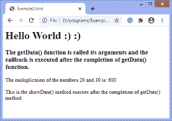
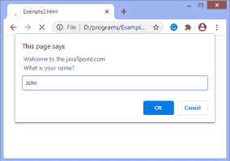
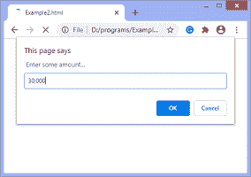
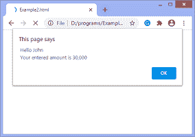

# JavaScript 回调

> 原文:[https://www.javatpoint.com/javascript-callback](https://www.javatpoint.com/javascript-callback)

回调函数可以定义为作为参数传递给另一个函数的函数。不要将回调与关键字相关联，因为回调只是传递给函数的参数的名称。

换句话说，我们可以说作为参数传递给另一个函数的函数称为回调函数。回调函数在外部函数完成后运行。开发异步 JavaScript 代码很有用。

在 [JavaScript](https://www.javatpoint.com/javascript-tutorial) 中，回调更容易创建。也就是说，我们只需将回调函数作为参数传递给另一个函数，并在任务完成后立即调用它。回调主要用于处理异步操作，如注册事件侦听器、从文件中获取或插入一些数据等。

现在，让我们看看如何通过使用一些插图来创建回调。

这是一个异步回调的例子。异步性可以定义为如果 JavaScript 必须等待完成操作，并在等待期间执行程序的剩余部分。

### 示例 1

在这个例子中，有两个函数 **getData( x，y，callback)** 和 **showData()** 。在这里，我们用 **showData()调用**getData()**；**也就是说，我们将它作为 **getData()** 函数的第三个参数和两个参数一起传递。因此， **getData()** 用指定的参数调用，包括回调。

**getData()** 函数显示两个数字的相乘，一旦完成，回调函数将被执行。在输出中，我们可以看到 **showData()** 函数的数据在 **getData()** 函数输出后得到打印。

```

<html>
<head>
<style>
</style>
</head>
<body>
<h1> Hello World :) :) </h1>
<h3> The getData() function is called its arguments and the callback is executed after the completion of getData() function. </h3>
<script>
function getData(x, y, callback){
document.write(" The multiplication of the numbers " + x + " and " + y + " is: " + (x*y) + "<br><br>" );
callback();
}
function showData(){
document.write(' This is the showData() method execute after the completion of getData() method.');
}
getData(20, 30, showData);

</script>
</body>

</html>

```

[Test it Now](https://www.javatpoint.com/oprweb/test.jsp?filename=javascript-callback1)

**输出**



回调通常用于在完成异步操作后继续执行——这被称为**异步回调**。

现在，在下一个例子中，我们将看到一个立即执行的回调。

### 示例 2

这是使用回调的另一个例子。这是一个立即执行的同步回调的例子。

这里有两个功能**获取数据(回调)**使用提示框接受用户输入，功能**显示数据(名称，AMT)**显示用户使用提醒对话框输入的数据。

```

<html>
<head>

</head>
<body>
<h1> Hello World :) :) </h1>
<h2> This is the javaTpoint.com </h2>
<script>
function showData(name, amt) {
alert(' Hello ' + name + '\n Your entered amount is ' + amt);
}

function getData(callback) {
var name = prompt(" Welcome to the javaTpoint.com \n What is your name?");
var amt = prompt(" Enter some amount...");
callback(name, amt);
}

getData(showData);
</script>
</body>

</html>

```

[Test it Now](https://www.javatpoint.com/oprweb/test.jsp?filename=javascript-callback2)

**输出**

执行上述代码后，将显示一个提示框，询问用户的姓名-



输入姓名后，当用户点击确定后，会显示另一个提示框，要求输入金额-



当用户点击确定输入金额后，将显示一个警告框。它显示输入的用户名和金额。



* * *