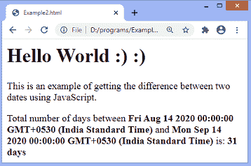
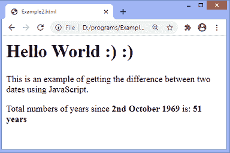

# JavaScript 日期差异

> 原文：<https://www.javatpoint.com/javascript-date-difference>

在本文中，我们将看到如何使用 JavaScript 计算两个日期之间的差异。如果我们使用正确的方法，那么计算差异的技术就很简单了。

需要 date 对象来计算 JavaScript 中日期之间的差异。JavaScript date 对象可以用来获取年、月和日。日期之间的差异可以用天数、年数或毫秒数来计算。

现在我们看到一些用天、年或毫秒计算两个日期之间差异的例子。

在第一个例子中，我们将看到如何使用 [JavaScript](https://www.javatpoint.com/javascript-tutorial) 计算天数中两个日期之间的差异。

### 示例 1

这是获取指定的两个日期之间的天数差异的示例。在这个例子中，我们应用了一种方法来计算差异。

这里，首先，我们使用**新日期()**定义两个日期，然后使用内置的 **getTime()** 计算两个指定日期之间的时间差。然后我们通过将两个日期的时间差除以一天中的毫秒数来计算天数，即 **(1000*60*60*24)** 。

这里变量 **d1** 存储第一个日期，变量 **d2** 存储第二个日期。变量 **diff** 存储时间之间的差异，变量 **daydiff** 存储日期之间的差异。

```js

<html>   
<head>

</head>   
<body>   
        <h1> Hello World :) :) </h1>   
		<p> This is an example of getting the difference between two dates using JavaScript. </p>
<script>
var d1 = new Date("08/14/2020"); 
var d2 = new Date("09/14/2020"); 

var diff = d2.getTime() - d1.getTime(); 

var daydiff = diff / (1000 * 60 * 60 * 24); 
document.write(" Total number of days between <b> " + d1 + " </b> and <b> " + d2 + " </b> is: <b> " + daydiff + " days </b>" ); 
</script>
</body>   

</html>  

```

[Test it Now](https://www.javatpoint.com/oprweb/test.jsp?filename=javascript-date-difference1)

**输出**



### 示例 2

这是一个计算若干年中两个日期之间差异的例子。本示例计算从**“10/02/1869”**至今的年数。

这里变量 **d1** 存储第一个日期，变量 **d2** 存储当前日期。变量 **diff** 存储两个日期之间的时间差异，变量 **daydiff** 存储日期之间的差异。利用这种方法，我们还可以找到一个人的年龄。

```js

<html>   
<head>

</head>   
<body>   
        <h1> Hello World :) :) </h1>   
		<p> This is an example of getting the difference between two dates using JavaScript. </p>
<script>

var d1 = new Date("10/02/1969"); 
var d2 = new Date(); 
var diff = d2.getTime() - d1.getTime(); 

var daydiff = (diff / 31536000000).toFixed(0);   
document.write(" Total numbers of years since <b> 2nd October 1969 </b> is: <b> " + daydiff + " years </b>" ); 
</script>
</body>   

</html>  

```

[Test it Now](https://www.javatpoint.com/oprweb/test.jsp?filename=javascript-date-difference2)

**输出**



* * *