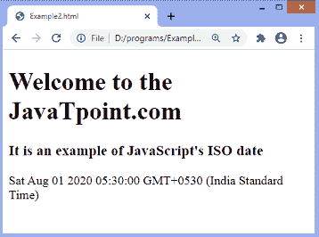
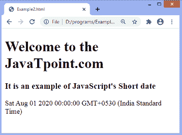

# JavaScript 日期格式

> 原文：<https://www.javatpoint.com/javascript-date-format>

JavaScript date 对象可以用来获取年、月和日。我们可以在 JavaScript 日期对象的帮助下在网页上显示一个计时器。

JavaScript 中有多种类型的日期格式: **ISO 日期、短日期、**和**长日期**。JavaScript 日期的格式定义如下:

**ISO 日期**

```

"2020-08-01" (The International Standard)

```

**短日期**

```

"01/08/2020"

```

**长日期**

```

"Aug 01 2020" or "01 Aug 2020"

```

国际标准化组织的日期格式遵循严格的 JavaScript 标准，而其他格式(短日期和长日期)依赖于浏览器，定义不太好。

现在，让我们分别理解这些日期格式。

## ISO 日期

ISO 8601 是时间和日期的国际标准，该标准的语法(YYYY-MM-DD)是 [JavaScript](https://www.javatpoint.com/javascript-tutorial) 中首选的日期格式。

下面给出了使用国际标准化组织日期的例子。

### 例子

下面代码的输出将显示相对于当前时区的完整日期。

```

<!DOCTYPE html>
<html>
<head>
</head>
<body>
<div>
<h1> Welcome to the JavaTpoint.com </h1>
<h3> It is an example of JavaScript's ISO date </h3>
<p id = "para"> </p>
</div>
<script>
let val = new Date("2020-08-01");
document.getElementById("para").innerHTML = val;
</script>
</body>
</html>

```

[Test it Now](https://www.javatpoint.com/oprweb/test.jsp?filename=javascript-date-format1)

**输出**



现在，我们正在讨论国际标准化组织日期的一些其他格式。这里，我们编写输入日期，并显示使用相应语法时出现的结果。

我们可以使用以下语法来编写 ISO 日期。

**1。**这是一个使用 ISO 日期的完整日期格式。

**让 val =新日期(“2020-08-01”)；**

```

Sat Aug 01 2020 05:30:00 GMT+0530 (India Standard Time)

```

2.在这种格式中，我们只指定年和月(YYYY-MM)，不指定日。

**让 val =新日期(“2020-08”)；**

```

Sat Aug 01 2020 05:30:00 GMT+0530 (India Standard Time)

```

**3。**在第三个语法中，我们只指定年(YYYY)，没有月和日。

**让 val =新日期(“2020”)；**

```

Wed Jan 01 2020 05:30:00 GMT+0530 (India Standard Time)

```

**4。**现在，在第四个语法中，我们用添加的小时、分钟和秒来指定日期。(年-月-日:月:SSZ)。在这种格式中，日期和时间用字母**‘T’**和字母**‘Z’**分开。如果我们去掉这些字符，在不同的浏览器中会得到不同的结果。

如果我们在没有指定时区的情况下设置日期，JavaScript 会使用浏览器的时区。

**让 val =新日期(“2020-08-01 t07:05:00 z”)；**

```

Sat Aug 01 2020 12:35:00 GMT+0530 (India Standard Time)

```

现在，我们讨论短日期格式和一个例子。

## JavaScript 短日期

“月/日/年”是用来写短日期的格式。现在，我们通过一个例子来理解短日期。

### 例子

这里我们指定的是短日期格式，即“月/日/年”。

```

<!DOCTYPE html>
<html>
<head>
</head>
<body>
<div>
<h1> Welcome to the JavaTpoint.com </h1>
<h3> It is an example of JavaScript's Short date </h3>
</div>
<script>
let val = new Date("08/01/2020");
document.write(val);
</script>
</body>
</html>

```

[Test it Now](https://www.javatpoint.com/oprweb/test.jsp?filename=javascript-date-format2)

**输出**

执行上述代码后，输出将是-



## 长日期

“MMM DD YYYY”是用来写长日期的格式。月份和日期可以任意顺序写，允许简写(八月)或全写(八月)一个月。

现在，我们用一个例子来理解龙日期。

### 例子

这里，我们使用长日期格式，即“MMM DD YYYY”，并以缩写形式指定月份。

```

<!DOCTYPE html>
<html>
<head>
</head>
<body>
<div>
<h1> Welcome to the JavaTpoint.com </h1>
<h3> It is an example of JavaScript's Long date </h3>
</div>
<script>
let val = new Date("Aug 01 2020");
document.write(val);
</script>
</body>
</html>

```

[Test it Now](https://www.javatpoint.com/oprweb/test.jsp?filename=javascript-date-format3)

**输出**


* * *