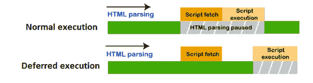
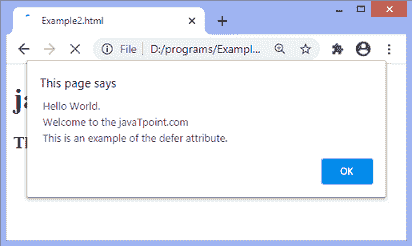

# JavaScript 延期

> 原文:[https://www.javatpoint.com/javascript-defer](https://www.javatpoint.com/javascript-defer)

**delay**是一个布尔值，用于指示在文档被解析后执行脚本。它仅适用于外部脚本(即，仅当我们在<脚本>标签中指定 **src** 属性时才适用)。它声明脚本不会创建任何内容。因此，浏览器可以继续解析页面的其余部分。带有**延迟**属性的<脚本>不会阻止页面。

我们可以理解下图中**延迟**属性的使用:



该属性告诉浏览器在整个 HTML 文档被完全解析时执行

有时，脚本需要比预期更多的加载时间，并显示空白页而不是内容。在移动设备中，由于小设备内存低，情况会更糟。因此，通过使用**延迟**属性，我们可以提高加载性能。

在较旧的浏览器中不允许**延迟**属性，所以对于较旧的浏览器，我们必须使用**延迟**属性的替代选项。另一种解决方案是，我们必须在 [HTML](https://www.javatpoint.com/html-tutorial) 文件的[</正文>标记](https://www.javatpoint.com/html-body-tag)之前指定 **<脚本>** 部分。可以通过以下方式完成:

```

<body>
<script src = " "> </script>
</body>

```

### 句法

```

<script defer>

```

### 例子

这里，我们使用的是一个外部 [javascript](https://www.javatpoint.com/javascript-tutorial) 文件，即 ***myscript.js*** 。

```

<!DOCTYPE html>
<html>
<head>
<script src = "myscript.js" defer>
</script>

</head>
<body>
<div>
<h1> javaTpoint.com </h1>
<h3> This is an example of defer attribute.  </h3>
</div>
</body>
</html>

```

**myscript.js**

```

alert(" Hello World. \n Welcome to the javaTpoint.com \n This is an example of the defer attribute. ");

```

[Test it Now](https://www.javatpoint.com/oprweb/test.jsp?filename=javascript-defer1)

**输出**

执行上述代码后，输出将是-



* * *