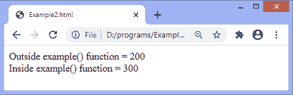
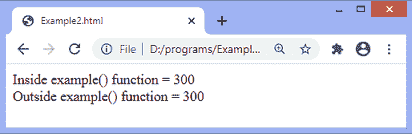

# JavaScript 范围

> 原文：<https://www.javatpoint.com/javascript-scope>

范围可以定义为执行区域，即表达式和值可以被引用的区域。

JavaScript 中有两个作用域，它们是全局的和局部的:

**全局范围:**在全局范围内，可以从 [JavaScript](https://www.javatpoint.com/javascript-tutorial) 代码的任何部分访问变量。

**局部作用域:**在局部作用域中，变量可以在声明它的函数内访问。

在函数体中，局部变量的优先级高于同名的全局变量。如果函数的局部变量的名称与全局变量的名称相同，则局部变量隐藏全局变量。

### 示例 1

在这个例子中，我们声明了两个变量，一个变量有全局作用域，第二个变量有局部作用域。这两个变量用相同的名称声明。

在输出中，我们可以看到局部变量覆盖了全局变量的值。

```

<!DOCTYPE html> 
<html>
<head> 
</head>
<body>
<script>
var $var12 = 200;   

function example() {    
    var $var12 = 300;   
    document.write("Inside example() function = " + $var12);   
}   
document.write("Outside example() function = "  + $var12);  
document.write("<br>");
example(); 
</script>

</body>
</html>

```

[Test it Now](https://www.javatpoint.com/oprweb/test.jsp?filename=javascript-scope1)

**输出**



当我们在函数内部声明一个变量而不使用 **var** 关键字时，它就充当了一个全局变量。让我们看一个同样的例子。

### 示例 2

在本例中，我们在函数内部声明了一个变量，而没有使用任何变量声明关键字。然后我们访问函数外部的相应变量。

在输出中，我们可以看到没有错误正在生成与**相关的未定义变量。**代码成功执行，没有产生任何错误。

```

<!DOCTYPE html> 
<html>
<head> 
</head>
<body>
<script>
function example() {    
    $var12 = 300;   
    document.write("Inside example() function = " + $var12);   
}   
example(); 
document.write("<br>");
document.write("Outside example() function = "  + $var12);  
</script>

</body>
</html>

```

[Test it Now](https://www.javatpoint.com/oprweb/test.jsp?filename=javascript-scope2)

**输出**



在上面的代码中，如果我们在没有调用函数的情况下使用变量，那么变量是未定义的，并且不会生成任何输出。在这种情况下，错误将生成与未定义变量相关的。

* * *