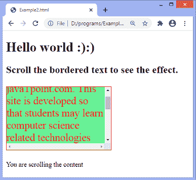

# JavaScript 滚动

> 原文:[https://www.javatpoint.com/javascript-scroll](https://www.javatpoint.com/javascript-scroll)

当滚动条用于元素时，JavaScript 中的 **onscroll** 事件发生。当用户向上或向下移动滚动条时，会触发事件。我们可以使用 CSS **溢出**属性来创建滚动条。

在 [HTML](https://www.javatpoint.com/html-tutorial) 中，我们可以使用 **onscroll** 属性，并为其分配一个 JavaScript 函数。我们也可以使用 [JavaScript 的 **addEventListener()** 方法](https://www.javatpoint.com/javascript-addeventlistener)并将**滚动**事件传递给它，以获得更大的灵活性。

### 句法

现在，我们看到了在 HTML 和 JavaScript 中使用 **onscroll** 事件的语法(没有使用 **addEventListener()** 方法或使用 **addEventListener()** 方法)。

**在 HTML 中**

```

<element onscroll = "fun()">

```

**在 JavaScript 中**

```

object.onscroll = function() { myScript };

```

**在 JavaScript 中通过使用 addEventListener()方法**

```

object.addEventListener("scroll", myScript);

```

让我们看一些插图来理解滚动事件。

### 示例-在 HTML 中使用 onscroll 属性

在这个例子中，我们使用的是 HTML **onscroll** 属性。有一个带有 **id = "para"** 的段落元素，我们正在对其应用 **onscroll** 属性。当用户滚动段落时，段落的颜色和背景颜色将会改变。

```

<!DOCTYPE html>
<html>
<head>
<style>
#para{
width: 250px;
height: 150px;
overflow: scroll;
border: 1px solid red;
font-size: 25px;
}
</style>
</head>

<body>
<h1> Hello world :):) </h1>
<h2> Scroll the bordered text to see the effect. </h2>
<p> This is an example of using the <b> onscroll </b> attribute. </p>
<p id = "para" onscroll = "fun()"> Hi, Welcome to the javaTpoint.com. This site is developed so that students may learn computer science related technologies easily. The javaTpoint.com is always providing an easy and in-depth tutorial on various technologies. No one is perfect in this world, and nothing is eternally best. But we can try to be better. </p>
<script>
function fun() {
document.getElementById("para").style.color = "red";
document.getElementById("para").style.background = "lightgreen";
}
</script>
</body>
</html>

```

[Test it Now](https://www.javatpoint.com/oprweb/test.jsp?filename=javascript-scroll1)

**输出**


在屏幕上滚动带边框的文本后，我们将获得以下输出-


现在，我们将看到如何使用 JavaScript 在所有事件上使用**。**

### 示例-使用 JavaScript

```

<!DOCTYPE html>
<html>
<head>
<style>
#para{
width: 250px;
height: 150px;
overflow: scroll;
border: 1px solid red;
font-size: 25px;
}
</style>
</head>

<body>
<h1> Hello world :):) </h1>
<h2> Scroll the bordered text to see the effect. </h2>
<p> This is an example of using JavaScript's <b> onscroll </b> event. </p>
<p id = "para"> Hi, Welcome to the javaTpoint.com. This site is developed so that students may learn computer science related technologies easily. The javaTpoint.com is always providing an easy and in-depth tutorial on various technologies. No one is perfect in this world, and nothing is eternally best. But we can try to be better. </p>
<p id = "para1"></p>

<script>
document.getElementById("para").onscroll = function() {fun()};
function fun() {
document.getElementById("para").style.color = "red";
document.getElementById("para").style.background = "lightgreen";
document.getElementById("para1").innerHTML = "You are scrolling the content";

}
</script>
</body>
</html>

```

[Test it Now](https://www.javatpoint.com/oprweb/test.jsp?filename=javascript-scroll2)

**输出**


在屏幕上滚动带边框的文本后，我们将获得以下输出-


### 示例-使用添加事件侦听器()

```

<!DOCTYPE html>
<html>
<head>
<style>
#para{
width: 250px;
height: 150px;
overflow: scroll;
border: 1px solid red;
font-size: 25px;
}
</style>
</head>

<body>
<h1> Hello world :):) </h1>
<h2> Scroll the bordered text to see the effect. </h2>
<p id = "para"> Hi, Welcome to the javaTpoint.com. This site is developed so that students may learn computer science related technologies easily. The javaTpoint.com is always providing an easy and in-depth tutorial on various technologies. No one is perfect in this world, and nothing is eternally best. But we can try to be better. </p>
<p id = "para1"></p>

<script>
document.getElementById("para").addEventListener("scroll", fun);
function fun() {
document.getElementById("para").style.color = "red";
document.getElementById("para").style.background = "lightgreen";
document.getElementById("para1").innerHTML = "You are scrolling the content";

}
</script>
</body>
</html>

```

[Test it Now](https://www.javatpoint.com/oprweb/test.jsp?filename=javascript-scroll3)

**输出**


在屏幕上滚动带边框的文本后，我们将获得以下输出-



* * *