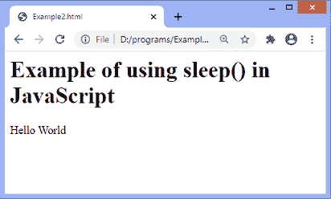
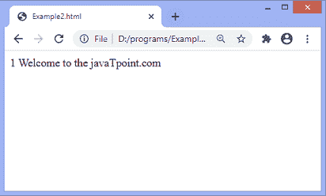
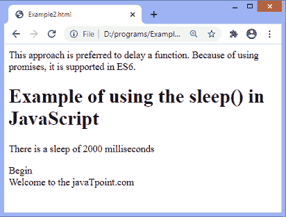
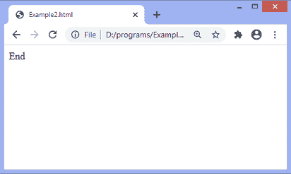

# JavaScript 睡眠/等待

> 原文：<https://www.javatpoint.com/javascript-sleep>

像 PHP 和 C 这样的编程语言有一个**睡眠(秒)**功能来暂停执行一段固定的时间。Java 有 **thread.sleep()** ，python 有 **time.sleep()** ，GO 有**time . sleep(2 * time . second)**。

与其他语言不同，JavaScript 没有任何 **sleep()** 功能。我们可以使用一些方法来模拟 JavaScript 中的 **sleep()** 函数。JavaScript 中的**承诺**和**异步/等待**功能等特性帮助我们以更简单的方式使用**睡眠()**功能。

**等待**用于等待承诺，只能在**异步**功能中使用。JavaScript 的行为是异步的，因此有一个承诺的概念来处理这种异步行为。由于这种异步行为，它继续工作，在执行过程中不等待任何东西。 **Async/await** 函数帮助我们以同步方式编写代码。

## 如何在 JavaScript 中使用睡眠功能？

在 JavaScript 中实现 sleep [函数之前，了解](https://www.javatpoint.com/javascript-function) [JavaScript](https://www.javatpoint.com/javascript-tutorial) 代码的执行非常重要。

### JavaScript 中 sleep()的语法

```

sleep(delayTime in milliseconds).then(() => {
// code to be executed
})

```

sleep()函数可以与 async/await 一起使用，以获得执行之间的暂停。其语法如下:

### 句法

```

const func = async () => { await sleep(delayTime in milliseconds)
//code to be executed
}
fun()

```

以上语法是在 JavaScript 中实现睡眠功能的方式。现在，我们将看到在 JavaScript 中使用 sleep()函数的例子。

### 示例 1

在本例中，我们将 **sleep()** 功能与**异步/等待**功能结合使用。有一个函数 **fun()** 是用一些语句定义的。最初，一旦功能启动，屏幕上会显示文本**“Hello World”**。然后，由于睡眠功能，**乐趣()**暂停 2 秒。给定时间段结束后，文本**“欢迎来到 JavaPoint . com”**将在屏幕上显示并重复，直到循环结束。文本将在屏幕上重复 10 次，循环的每次迭代暂停两秒钟。

```

<html>
<head>
</head>
<body>
<h1> Example of using sleep() in JavaScript </h1>
<script>
   function sleep(milliseconds) {
      return new Promise(resolve => setTimeout(resolve, milliseconds));
   }
   async function fun() {
      document.write('Hello World');
      for (let i = 1; i <=10 ; i++) {        
         await sleep(2000);
         document.write( i + " " + "Welcome to the javaTpoint.com" + " " + "</br>");
      }
   }
   fun();
</script>

</body>
</html>

```

[Test it Now](https://www.javatpoint.com/oprweb/test.jsp?filename=javascript-sleep1)

**输出**

执行上述代码后，输出将是-



两秒钟后，输出会改变-



循环将迭代 10 次，每次迭代暂停 2 秒。

### 示例 2

这里，我们用 **setTimeout()** 函数创建一个承诺。 **setTimeout()** 函数在指定的时间后执行代码。我们也在使用 **then()** 方法，在完成承诺后执行所需的功能。

最初，一些语句显示在屏幕上。然后，延时 2 秒后，屏幕上会显示文字**“结束”**。

这种方法是延迟函数的首选方法。因为使用承诺，所以在 [ES6](https://www.javatpoint.com/es6) 支持。

```

<!DOCTYPE html>
<html>
<head>
</head>
<body>
<h1> Example of using the sleep() in JavaScript</h1>
<p>
There is a sleep of 2000 milliseconds
</p>
<script>
let sleep = ms => {
return new Promise(resolve => setTimeout(resolve, ms));
};

document.write("Begin" + "<br>");
document.write("Welcome to the javaTpoint.com" + "<br>");

sleep(2000).then(() => {
document.write("End");
});
</script>
</body>

</html>

```

[Test it Now](https://www.javatpoint.com/oprweb/test.jsp?filename=javascript-sleep2)

**输出**

执行上述代码后，输出将是-



延迟 2 秒后，输出将为-



* * *