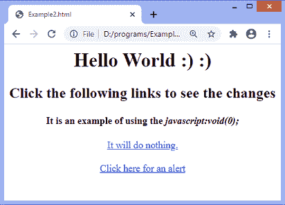
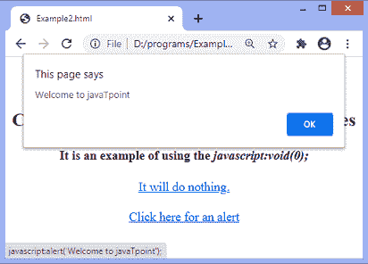
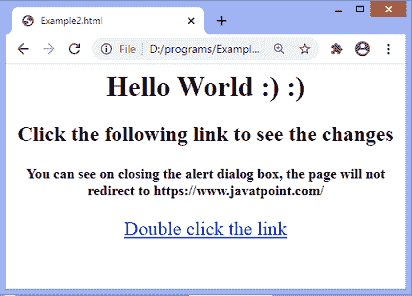
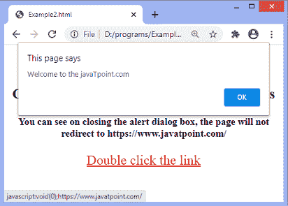

# JavaScript:void(0)

> 原文:[https://www.javatpoint.com/javascript-void](https://www.javatpoint.com/javascript-void)

void 运算符用于计算表达式并返回**未定义的**。通常，该运算符用于获取未定义的基元值。它经常与超链接一起使用。通常情况下，浏览器会刷新页面或通过单击链接加载新页面。当我们不想在浏览器中点击超链接刷新或加载新页面时，可以使用 **javascript:void(0)** 。

我们可以通过两种方式使用操作数 **0** ，即 **void(0)** 或 **void 0** 。这两种方法都一样。***[JavaScript](https://www.javatpoint.com/javascript-tutorial):void(0)***告诉浏览器“什么都不做”，即阻止浏览器重新加载或刷新页面。当我们在网页上插入具有重要作用的链接时，这是非常有用的，而不需要重新加载。因此，在这些链接上使用 **void(0)** 可以防止页面的重新加载，但允许执行有用的功能，例如更新网页上的值。

它还用于防止不必要的页面重定向。

### 句法

```

void expression;

```

我们来了解一下 ***javascript 的用法:void(0)；*** 用一些例子。

### 示例 1

在下面的示例中，我们定义了两个链接。在第一个链接中，我们使用了 void 关键字。当相应的链接被点击时，由于**无效(0)** ，它将什么也不做。

当我们点击第二个链接时，它会显示一个警告对话框。

```

<html>
<head>
</head>
<body>
<center>
<h1> Hello World :) :) </h1>
<h2> Click the following links to see the changes </h2>
<h4> It is an example of using the <i> javascript:void(0); </i> </h4>
<a href = "javascript:void(0);">
It will do nothing.
</a>
<br/><br/>
<a href = "javascript:alert('Welcome to javaTpoint');"> Click here for an alert </a>
</center>
</body>

</html>

```

[Test it Now](https://www.javatpoint.com/oprweb/test.jsp?filename=javascript-void1)

**输出**



点击第一个链接，什么都不会发生。当用户点击第二个链接时，输出将是-



现在，在下一个例子中，我们将看到如何防止网页重定向。

### 示例 2

在这个例子中，我们传递的是***JavaScript:void(0)；*** 和网站链接到 **href** 属性。这里，我们还使用了 **ondblclick** 属性，双击超链接时会显示一个警告框。关闭警报对话框后，页面将不会重定向到网站的指定链接。

```

<html>
<head>
<style>
a{
font-size: 22px;
}
</style>
</head>
<body>
<center>
<h1> Hello World :) :) </h1>
<h2> Click the following link to see the changes </h2>
<h4> You can see on closing the alert dialog box, the page will not redirect to https://www.javatpoint.com/ </h4>
<a href = "javascript:void(0);https://www.javatpoint.com/" ondblclick = "alert('Welcome to the javaTpoint.com')">
Double click the link
</a>
</center>
</body>

</html>

```

[Test it Now](https://www.javatpoint.com/oprweb/test.jsp?filename=javascript-void2)

**输出**



双击指定的链接，输出将是-



* * *