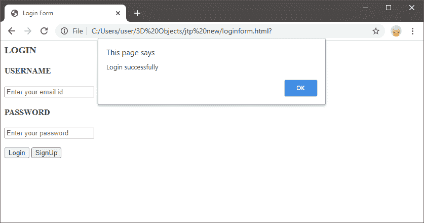
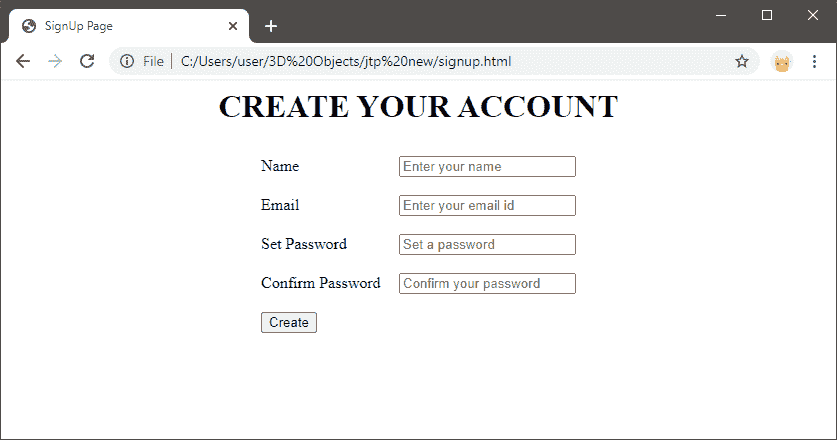

# JavaScript 表单

> 原文:[https://www.javatpoint.com/javascript-form](https://www.javatpoint.com/javascript-form)

在本教程中，我们将学习、讨论和理解 JavaScript 表单。我们还将看到针对不同目的的 JavaScript 表单的实现。

在这里，我们将学习访问表单的方法，获取元素作为 JavaScript 表单的值，并提交表单。

## 表格介绍

表单是 [HTML](https://www.javatpoint.com/html-tutorial) 的基础。我们使用 [HTML 表单元素](https://www.javatpoint.com/html-form)来创建 [JavaScript](https://www.javatpoint.com/javascript-tutorial) 表单。为了创建表单，我们可以使用以下示例代码:

```

<html>
<head>
<title> Login Form</title>
</head>
<body>
<h3> LOGIN </h3>
<form ="Login_form" onsubmit="submit_form()">
<h4> USERNAME</h4>
<input type="text" placeholder="Enter your email id"/>
<h4> PASSWORD</h4>
<input type="password" placeholder="Enter your password"/></br></br>
<input type="submit" value="Login"/>
<input type="button" value="SignUp" onClick="create()"/>
</form>
</html>

```

在代码中:

*   表单名称标签用于定义表单的名称。这里的表单名称是“登录 _ 表单”。这个名称将在 JavaScript 表单中引用。
*   动作标签定义了动作，当表单被提交时，浏览器将处理它。在这里，我们没有采取任何行动。
*   采取行动的方法可以是**发布**或**获取**，在表单提交给服务器时使用。这两种类型的方法都有自己的属性和规则。
*   输入类型标签定义了我们想要在表单中创建的输入类型。这里，我们使用输入类型作为“文本”，这意味着我们将在文本框中以文本形式输入值。
*   Net 中，我们将输入类型作为“密码”,输入值将是密码。
*   接下来，我们将输入类型作为“按钮”,点击后，我们得到表单的值并显示出来。

除了动作和方法，HTML 表单元素还提供了以下有用的方法

*   **提交():**该方法用于提交表单。
*   **reset ():** 该方法用于重置表单值。

## 引用表单

现在，我们已经使用 HTML 创建了表单元素，但是我们还需要使它与 JavaScript 连接。为此，我们使用**getElementById()**方法，该方法将 html 表单元素引用到 JavaScript 代码中。

使用 [**getElementById()** 方法](https://www.javatpoint.com/document-getElementById()-method)的语法如下:

```

let form = document.getElementById('subscribe');

```

使用 Id，我们可以进行引用。

### 提交表单

接下来，我们需要通过提交表单的值来提交表单，对此我们使用 **onSubmit()** 方法。通常，要提交，我们使用提交按钮提交表单中输入的值。

submit()方法的语法如下:

```

<input type="submit" value="Subscribe">

```

当我们提交表单时，就在请求被发送到服务器之前采取行动。它允许我们添加一个事件侦听器，使我们能够在表单上进行各种验证。最后，表单准备好了 HTML 和 JavaScript 代码的组合。

让我们收集并使用所有这些来创建一个 **[登录表单](https://www.javatpoint.com/html-login-form)** 和**注册表单**并同时使用它们。

### 登录表单

```

<html>
<head>
<title> Login Form</title>
</head>
<body>
<h3> LOGIN </h3>
<form ="Login_form" onsubmit="submit_form()">
<h4> USERNAME</h4>
<input type="text" placeholder="Enter your email id"/>
<h4> PASSWORD</h4>
<input type="password" placeholder="Enter your password"/></br></br>
<input type="submit" value="Login"/>
<input type="button" value="SignUp" onClick="create()"/>
</form>
<script type="text/javascript">
function submit_form(){
alert("Login successfully");
}
function create(){
window.location="signup.html";
}
</script>
</body>
</html>

```

点击登录按钮后，上述代码的输出如下所示:



### 注册表格

```

<html>
<head>
<title> SignUp Page</title>
</head>
<body align="center" >
<h1> CREATE YOUR ACCOUNT</h1>
<table cellspacing="2" align="center" cellpadding="8" border="0">
<tr><td> Name</td> 
<td><input type="text" placeholder="Enter your name" id="n1"></td></tr>
<tr><td>Email </td>
<td><input type="text" placeholder="Enter your email id" id="e1"></td></tr>
<tr><td> Set Password</td>
<td><input type="password" placeholder="Set a password" id="p1"></td></tr>
<tr><td>Confirm Password</td>
<td><input type="password" placeholder="Confirm your password" id="p2"></td></tr>
<tr><td>
<input type="submit" value="Create" onClick="create_account()"/>
</table>
<script type="text/javascript">
function create_account(){
var n=document.getElementById("n1").value;
var e=document.getElementById("e1").value;
var p=document.getElementById("p1").value;
var cp=document.getElementById("p2").value;
//Code for password validation
		var letters = /^[A-Za-z]+$/;
		var email_val = /^([a-zA-Z0-9_\.\-])+\@(([a-zA-Z0-9\-])+\.)+([a-zA-Z0-9]{2,4})+$/;
//other validations required code
if(n==''||e==''||p==''||cp==''){
alert("Enter each details correctly");
}
else if(!letters.test(n))
		{
			alert('Name is incorrect must contain alphabets only');
		}
else if (!email_val.test(e))
		{
			alert('Invalid email format please enter valid email id');
		}
else if(p!=cp)
{
alert("Passwords not matching");
}
else if(document.getElementById("p1").value.length > 12)
{
alert("Password maximum length is 12");
}
else if(document.getElementById("p1").value.length < 6)
{
alert("Password minimum length is 6");
}
else{
alert("Your account has been created successfully... Redirecting to JavaTpoint.com");
window.location="https://www.javatpoint.com/";
}
}
</script>
</body>
</html>

```

上述代码的输出如下所示:



通过这种方式，我们可以用适当的验证在 JavaScript 中创建表单。

* * *