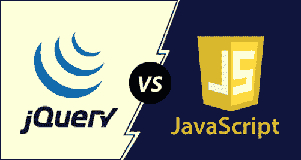

# jQuery 与 JavaScript

> 原文：<https://www.javatpoint.com/jquery-vs-javascript>

## 什么是 jQuery

一个免费的开源 javascript 库，主要用于设计、遍历和操作 HTML DOM。DOM 是一种树状结构，用于表示网页的元素。jQuery 帮助设计者轻松地为他们的网站使用 javascript 代码。jQuery 的高级方法能够创建强大的动态网页和 web 应用程序。jQuery 的语法旨在使事情变得简单，例如:

*   文档导航
*   DOM 元素的选择
*   创建动画
*   处理事件
*   开发 Ajax 应用程序。

jQuery 是所有其他库中广泛使用的 [javascript](https://www.javatpoint.com/javascript-tutorial) 库之一，拥有以下核心特性:

1.  DOM 元素选择
2.  由 Sizzle(选择器引擎)启用的遍历和操作
3.  创建新的编程风格
4.  融合 DOM 数据结构和算法

另一方面， [jQuery](https://www.javatpoint.com/jquery-tutorial) 允许开发人员在 JavaScript 库的基础上创建插件。开发人员甚至可以为低级交互和动画创建抽象。

## jQuery 与 JavaScript

尽管 jQuery 是 JavaScript 的一部分，但它们之间可能存在以下某些差异:

| 框架 | Java Script 语言 |
| 这是一个 javascript 库。 | 这是一种动态的和解释的网络开发编程语言。 |
| 用户只需要编写所需的 jQuery 代码 | 用户需要编写完整的 js 代码 |
| 耗时更少。 | 整个剧本写起来比较费时间。 |
| 不需要处理多浏览器兼容性问题。 | 开发人员开发自己的代码来处理多浏览器兼容性。 |
| 需要在页面的标题中包含 jQuery 库的 URL。 | 每个浏览器都支持 JavaScript。不需要包含任何额外的插件。 |
| 它依赖于 JavaScript，因为它是一个 js 库。 | jQuery 是 javascript 的一部分。因此，js 代码可能依赖也可能不依赖 jQuery。 |
| 它只包含几行代码。 | 代码可能很复杂，也可能很长。 |
| 这是一种相当简单、简单和快速的方法。 | 这是一种弱类型的编程方法。 |
| jQuery 是一种优化的网页设计技术。 | 对于引入 jQuery 的开发人员来说，JavaScript 是一种流行的网页设计编程语言。 |
| jQuery 创建 DOM 的速度更快。 | JavaScript 创建 DOM 的速度很慢。 |

* * *