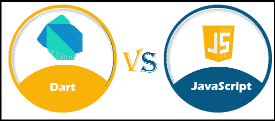

# Dart 与 JavaScript

> 原文:[https://www.javatpoint.com/dart-vs-javascript](https://www.javatpoint.com/dart-vs-javascript)

JavaScript 和 Dart 是跨平台移动应用开发的最佳选择。与 JavaScript 相比，Dart 是一种相对较新的语言，但它有一些非常有用的功能和出色的谷歌支持。JavaScript 在跨平台移动应用程序和服务器端应用程序开发方面达到了顶峰。

在本文中，我们将讨论 Dart 和 JavaScript 之间的区别。但是在讨论差异之前，我们将了解 Dart 和 JavaScript。

## 什么是 Dart？

[Dart](https://www.javatpoint.com/dart-programming) 是由 **Google** 在 **2011** 中开发的**客户端优化编程**语言，用于为任何平台创建快速应用。**谷歌**首次将其作为内部编程语言，用于创建 web、服务器和移动应用程序。Dart 编译源代码的方式与其他[编程语言](https://www.javatpoint.com/programming-language)相同，如 [C](https://www.javatpoint.com/c-programming-language-tutorial) 、 [JavaScript](https://www.javatpoint.com/javascript-tutorial) 、 [Java](https://www.javatpoint.com/java-tutorial) 、 [C#](https://www.javatpoint.com/c-sharp-tutorial) 。它还自带名为 **Dart VM** 的**虚拟机(VM)** ，用于运行原生应用程序。它也有自己的包管理器，被称为 **Pub** 。在谷歌宣布 [Flutter](https://www.javatpoint.com/flutter) 跨平台开发移动应用后，它变得更加流行。这背后的主要原因是 Flutter 完全专注于 Dart。另一方面，对 OOPS 语言有经验的开发人员可以快速学习 Dart。

### 飞镖的优缺点

Dart 的各种优缺点如下:

**优势**

*   这是一种开源和客户端优化的编程语言。
*   它在项目之间是非常可扩展的。
*   它由谷歌开发，在谷歌云平台上轻松运行。
*   如果我们已经知道 JavaScript，那么学习起来很容易，因为它和 JavaScript 很相似。
*   它比 JavaScript 更快。
*   它主要用于开发移动应用程序。

**缺点**

*   它只有一个对象类。
*   这是一种新的编程语言，在市场上使用不多。
*   在 Dart 中，我们不能在不编写新赋值语句的情况下重命名函数。
*   它的在线资源数量有限，因此很难找到问题的解决方案。

## 什么是 JavaScript？

JavaScript 是一种**轻量级、面向对象的脚本语言**，用于在网页上构建具有交互效果的**动态[HTML](https://www.javatpoint.com/html-tutorial)T5】页面。JavaScript 也常用于**游戏开发**和**手机 app** 开发。它是一种解释的脚本语言，其代码只在网络浏览器中执行。我们可以使用 [Node.js](https://www.javatpoint.com/nodejs-tutorial) 在[浏览器](https://www.javatpoint.com/browsers)之外运行代码。它也被称为浏览器语言，可以用于客户端和服务器端开发。**网景**的 Brendan Eich** 创作的，最早发表于 **1995** 。在被重新命名为 JavaScript 之前，这种语言最初被称为 **LiveScript** 。JavaScript 的语法受编程语言 c 的影响很大，JavaScript 文件名的扩展名为**。js** 。****

### JavaScript 的优缺点

JavaScript 的各种优缺点如下:

**优势**

*   这是一个开源、灵活、快速、轻量级的框架。
*   它允许交叉编译。
*   支持**接口、模块**、**类**。
*   它用于前端和后端开发，因此可以在不同的设备上运行。
*   它允许我们构建当用户将鼠标悬停在界面上时做出反应的界面。
*   与其他语言友好；因此，许多其他应用程序可能会使用 JavaScript。
*   我们可以扩展 JavaScript 来编写大型应用程序。

**缺点**

*   它利用有限的图书馆。
*   客户端 JavaScript 不支持写入或读取文件。它一直只是为了安全目的而保留。
*   一个错误就可能摧毁整个网站。
*   它是一种动态语言，所以开发人员很容易犯大错误。
*   它只支持单一继承，不支持多重继承。某些程序可能需要这种面向对象的语言功能。

## Dart 和 JavaScript 的主要区别

在这里，我们将讨论 Dart 和 JavaScript 之间的主要区别:

### 易用性

JavaScript 在业界已经存在了很长时间，是一种成熟且健壮的语言。JavaScript 使用起来很简单。它有各种在线的框架和库。这些框架允许开发人员重用现有代码来更快地创建应用程序。

另一方面，对于谷歌之外的大多数开发人员来说，Dart 是一种相对较新的语言。尽管谷歌努力记录 Dart 编程语言，但开发人员仍然很难找到特定问题的解决方案。它具有类似于 Java 的编码风格和语法，因此具有 OOPS 经验的开发人员一旦学习了基础知识，就能够轻松地学习和使用 Dart。

### 速度

JavaScript 是一种解释语言，因此它比其他编程语言感觉更轻、更快。它比 Java 和其他编译语言更快。

另一方面，与 JavaScript 相比，Dart 要快得多。Dart 可以通过 **JIT** 和 **AOT** 两种方式进行编译，以多种方式帮助 app 开发。例如，JIT 编译可以加快开发速度，而 AOT 编译可以用来优化发布过程。

### 安全类型

JavaScript，作为一种支持动态和 Duck 类型的解释语言。JavaScript 不是一种类型安全的语言，因为它可以键入任何代码。编程错误只能在运行时发现。

另一方面，Dart 允许松散和严格的原型制作。由于 Dart 是一种编译语言，大多数编程错误都是在编译过程中发现的。它比 JavaScript 更具有类型安全性。

### 流行

JavaScript 随处可见。几乎没有电脑不支持 JavaScript。JavaScript 目前用于创建在线、移动和服务器端代码。栈溢出上，关于 JavaScript 的问题大概有**250 多万**个。JavaScript 生态系统因其受欢迎而变得巨大，随着云组件中心的出现，它现在也主导了可重用组件的**“市场”**。前端开发人员希望看到不同的选择。

另一方面，Dart 越来越受欢迎，但它不是 JavaScript 的对手。在谷歌宣布 Flutter 之前，Dart 无处可寻。Dart 吸引了以前反对 JavaScript 的开发人员。Dart 目前在堆栈溢出上标记了大约 **45K** 个问题。

### 学习曲线

对于初学者来说，JavaScript 并不是一门容易学习的语言，但是了解编程的基础知识会让 JavaScript 变得简单。有各种在线课程和教程可供想要学习 JavaScript 的开发人员使用。

另一方面，对于初学者来说，Dart 编程语言可能是一项具有挑战性的活动，因为它不是一种广泛使用的编程语言。网上很少有 Dart 编程课程或书籍。

### 网络与移动

JavaScript 以各种框架主导了网络和移动应用程序的开发。随着脸书 React Native 的推出，JavaScript 成为了为小型企业创建移动和网络应用程序的不二之选。市场上仍有各种各样的 JavaScript 框架可用于创建网络应用程序、渐进式网络应用程序和混合移动应用程序，如 Agular、Vue.js 等。

另一方面，Dart 可以用于开发移动和网络应用程序。Dart 和 Flutter 系统因创建跨平台移动应用程序而闻名。

### 前端与后端

JavaScript 用于前端开发，有**HTML**[T3】CSST5。然而，随着 Node.js 平台的兴起，它现在被普遍用于后端和服务器端开发。](https://www.javatpoint.com/css-tutorial)

另一方面，Dart 目前正与 Flutter 一起用于开发跨平台移动应用的前端。Dart 也可以用于网页创建，但是没有提到它被用于后端开发。

### 商业用途

JavaScript 用于工业领域，包括大型项目。它用于网络和跨平台应用程序的开发。JavaScript 用于脸书的网络和跨平台应用程序“反应”和“原生反应”。其他使用 JavaScript 的企业包括易贝、Airbnb、Slack 等。

另一方面，谷歌是 Dart 的发源地。因此，它首先在内部使用。然后，在 Flutter 宣布之后，像阿里巴巴这样的大牌开始使用 Flutter 和 Dart 来创建跨平台应用。

## Dart 和 JavaScript 之间的面对面比较

下面的比较图解释了 Dart 和 JavaScript 之间的面对面比较:

| 特征 | 镖 | Java Script 语言 |
| 易用性 | Dart 具有类似 Java 的语法和编码风格，因此具有 OOPS 体验的开发人员可以轻松使用它。 | JavaScript 使用简单，它有各种在线可用的框架和库，允许开发人员重用现有代码来更快地创建应用程序。 |
| 编辑器和 IDE 支持 | Dart 代码可能是用轻量级编辑器编写的，比如 Sublime 或 VIM。Dart 应用程序开发最常用的 ide 是 IntelliJ IDEA 和 Android Studio，它们都附带了 Dart 插件。 | 它为应用开发提供了一些优秀的编辑器和 ides。并不总是需要使用成熟的集成开发环境；相反，开发人员可能会使用轻量级编辑器，如 VIM、崇高文本、Emacs 或 Atom。一些 ide，比如 WebStorm 和 Visual Studio Code，对于 JavaScript 应用程序的创建非常有用。 |
| 生产力 | Dart 和 Flutter 有一个较小的社区以及几个在线社区。尽管有优秀的文档，许多有经验的开发人员仍然对理解 Dart 感到困惑。 | 新开发人员更容易学习，因为它是一种更简单、轻量级、动态的编程语言。它通过提供各种 JavaScript 框架和成千上万个容易获得的网络包来提高开发人员的工作效率。 |
| 类型安全 | 它比 JavaScript 更具类型安全性，因为它既允许松散的原型，也允许强大的原型。 | 它不是一种类型安全的语言，因为它同时支持鸭式和动态。 |
| 学习曲线 | 对于初学者来说，Dart 编程语言可能具有挑战性，因为它不是一种广泛使用的编程语言。网上很少有 Dart 编程课程或书籍。 | 对于初学者来说，JavaScript 并不是一门容易学习的语言，但是了解编程的基础知识会让 JavaScript 变得简单。 |
| 商业用途 | Dart 得到了谷歌的支持，也有大品牌使用，如 Blossom、WorkTrails、Whale、Mobile 等。 | JavaScript 广泛应用于大型公司，如 Instagram、Slack、Reddit、易贝和 Airbnb，用于构建 web 和跨平台移动应用程序。 |
| 速度 | Dart 可能是 JIT 和 AOT 编译的，这允许以不同的方式创建应用程序。Dart 比 JavaScript 快得多。 | JavaScript 是一种解释语言，因此它比其他编程语言感觉更轻、更快。它比 Java 和其他编译语言更快。 |
| 网络和移动 | Dart 可以用于开发网络和移动应用程序。 | JavaScript 可以用在 web 和移动应用程序开发中，有几种框架。 |

## 结论

JavaScript 和 Dart 是创建跨平台移动应用程序的绝佳选择，因为它们用在 React Native 和 Dart 中。与 JavaScript 相比，Dart 是一种相对较新的语言。它有一些有趣的功能和出色的谷歌支持。我们无法想象未来哪个会占据主导地位，但 Dart 已经起飞得非常快了。Dart 和 JavaScript 都是 Dart 和 JavaScript 之争的赢家，因为出于多种原因，它们是开发人员的可靠选择。在杰克森特民意调查中，达特获得了 223 张选票，他已经将这种语言列为 2019 年 T2 第一语言。在一项 Stack Overflow 民意调查中，Dart ( **66.3%** )排在第二位，JavaScript ( **66.8%** )是 **2019** 中使用最多的编程语言。

* * *