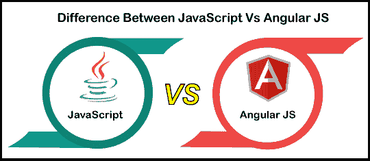

# JavaScript 与 Angular Js

> 原文:[https://www.javatpoint.com/javascript-vs-angularjs](https://www.javatpoint.com/javascript-vs-angularjs)

JavaScript 是一种轻量级的、面向对象的脚本语言，用于在客户端网络浏览器中运行的网页上构建具有交互效果的动态 HTML 页面。这是一种客户端脚本语言，为网页提供交互效果，使其更具动态性。另一方面，Angular JS 是一个基于 JavaScript 的框架，它用新的特性扩展了 HTML。主要设计开发**动态**和**单页 web 应用(SPAs)** 。在本文中，我们将讨论 JavaScript 和 [Angular JS](https://www.javatpoint.com/angularjs-tutorial) 的区别。但是在讨论差异之前，我们将了解 JavaScript 和 Angular JS。

## 什么是 JavaScript？

[JavaScript](https://www.javatpoint.com/javascript-tutorial) 是一种**轻量级、面向对象的**脚本语言，用于在网页上构建具有交互效果的**动态 HTML 页面**。JavaScript 也常用于游戏开发和移动应用开发。它是一种解释的脚本语言，其代码只在网络浏览器中执行。我们可以使用 [Node.js](https://www.javatpoint.com/nodejs-tutorial) 在浏览器外运行代码。它也被称为浏览器的语言。它可以用于客户端和服务器端开发。**网景**的 **Brendan Eich** 创作，最早发表于 **1995** 。这种语言在改名为 JavaScript 之前，最初被称为 **LiveScript** 。JavaScript 的语法深受[编程语言 **C**](https://www.javatpoint.com/c-programming-language-tutorial) 的影响。JavaScript 文件名的扩展名为**。js** 。

### JavaScript 特性

JavaScript 有各种各样的特性。其中一些如下:

*   JavaScript 最初是为 DOM 操作而设计的。早期，大多数网站都是静态的，但是通过 JS，可以开发一个交互式的网站。
*   函数是 JavaScript 中的对象。它们可能具有与其他对象相同的属性和方法，并作为参数传递给其他函数。
*   JavaScript 不需要编译器。
*   JavaScript 可以处理日期和时间。

## 什么是 Angular Js？

它是一个开源的前端 web 开发框架，具有很好的特性或支持。**谷歌 Angular** 团队在 **2010** 首次推出。它是一个不断发展和扩展的框架，包括创建 web 应用程序的更好方法。它主要使用**模型视图控制器(MVC)** 概念开发应用程序，并支持数据绑定功能和依赖注入。

由于 AngularJS 主要基于 [HTML](https://www.javatpoint.com/html-tutorial) 和 JavaScript，所以不需要学习另一种语法或语言。它把静态的 HTML 转换成动态的 HTML。它通过添加内置属性和组件以及使用简单的 JavaScript 创建自定义属性来扩展 HTML 的功能。

### 角度 JS 特征

棱角分明的 JS 有各种各样的特点。其中一些如下:

*   **省时:** AngularJS 允许我们使用帮助我们重用它们的模块，节省了时间和代码。
*   **易于工作:**使用 Angular JS 很容易，因为它使用了 JavaScript、HTML 和 CSS 语言。
*   **准备使用一个模板:** AngularJS 大部分都是纯 HTML，大部分都是使用纯 HTML 模板，传递给 DOM，再传递给 AngularJS 编译器。它通过模板，然后就可以使用了。

## JavaScript 和 Angular JS 的主要区别

JavaScript 和 Angular JS 有各种主要区别。其中一些如下:

*   JavaScript 是构建 web 应用程序的服务器端和客户端脚本语言。另一方面，AngularJS 从一开始就使 web 应用程序变得快速和简单。
*   JavaScript 在大范围内修补 bug 和缺陷所需的时间更少。与 JavaScript 相比，AngularJS 需要更多的时间来做同样的事情。
*   JavaScript 是用于创建 web 应用程序的最有效的 web 开发技术之一。另一方面，AngularJS 主要用作开发 web 应用程序的 JS 框架。
*   JavaScript 是一种编程语言，用于操作 **DOM** ( **文档对象模型)。**另一方面，AngularJS 用不同的技术扩展了自己的能力。
*   JavaScript 不支持依赖注入。而 AngularJS 同时支持数据绑定和依赖注入。
*   JavaScript 代码又快又快。另一方面，Angular JS 应用程序通常会变得很慢。
*   几年来，JavaScript 一直在使用相同的策略。另一方面，AngularJS 已被增强为 typescript，使应用程序更轻、更具交互性。
*   JavaScript 有一个广泛的用户界面，包括滑块和其他功能。另一方面，AngularJS 是一个数据驱动的框架，用于创建网络应用程序。
*   JavaScript 是一种强大而复杂的编程语言。另一方面，AngularJS 是一个简单有效的框架。

## JavaScript 和 Angular JS 的面对面比较

在这里，我们将讨论 JavaScript 和 Angular JS 之间的面对面比较:

| 特征 | Java Script 语言 | 角度 JS |
| 定义 | 它是一种面向对象的脚本语言，用于开发移动和动态 web 应用程序。 | 它是一个开源框架，用于开发动态 web 和大型单页 web 应用程序。 |
| 发达的 | 网景通信在 1995 年开发了它。 | 谷歌主要是在 2010 年开发的。 |
| 句法 | 它的语法比 Angular JS 复杂得多。 | 它的语法简单易行。 |
| 编程序 | 它的解释器是用 C 和 C++语言编写的。 | 它是用 JavaScript 语言编写的。 |
| 过滤 | 它不支持过滤器。 | 它确实支持过滤器。 |
| 可学性 | 这不是很容易学的。 | 如果有人知道 JavaScript 的基础知识，那就很容易学会。 |
| 概念 | 它基于动态类型概念。 | Angular JS 基于模型视图控制器的概念来构建应用程序。 |
| 依赖注入 | 它不支持依赖注入。 | 它支持数据绑定和依赖注入。 |

## 结论

这两种网络技术都用于创建网络应用程序。JavaScript 是一种开源的面向对象的编程语言，而 AngularJS 是基于 **MVC** 模型的开源框架。JavaScript 是一种用于网页创建的编程语言，可以增强网站的交互性。它有助于操纵网站上的内容，以验证浏览器端的用户反馈，从而通过包含动态内容(如拖放元素、滑块和许多其他内容)来影响用户操作。它是万维网的三大核心技术之一，也是所有 JavaScript 技术的基础。

另一方面，Angular JS 是一个开源框架，专门开发大规模的单页应用程序，并且是用 JavaScript 编写的。它基于 MVC 架构。这是一种数据驱动的方法，使网络应用程序能够有一个更大的 HTML 库。它是一个未来的框架，可以满足大数据需求，而不必刷新模型。

* * *