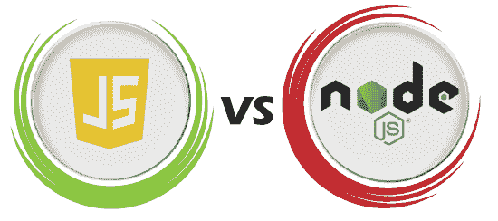

# JavaScript vs. Node.js

> 哎哎哎:# t0]https://www . javatppoint . com/JavaScript-vs-nodejs

JavaScript 是一种轻量级的面向对象脚本语言，用于在网页上构建具有交互效果的动态 HTML 页面。另一方面，当在 **V8 引擎**中运行或通过节点解释器运行时，Node.js 通常表示 JavaScript 代码可访问的对象和方法的列表。

在本文中，我们将讨论 **JavaScript** 和 **Node.js** 的区别。但是在讨论差异之前，我们先了解一下 **JavaScript** 和 **Node.js** 。

## **什么是 JavaScript？**

[Javascript](https://www.javatpoint.com/javascript-tutorial) 是一种**轻量级、面向对象的脚本语言**，用于在网页上构建具有交互效果的**动态 HTML 页面**。JavaScript 也常用于**游戏开发**和**手机 app 开发**。它是一种解释的脚本语言，代码只能在网络浏览器中执行和运行。我们可以使用 Node.js 在浏览器之外执行和运行代码。它也被称为一种**浏览器的语言**，可以用于**客户端**和**服务器端**的开发。**网景**的布兰登·艾奇**创作的，最早发表于 **1995** 。这种语言在改名为 JavaScript 之前，最初被称为 **LiveScript** 。JavaScript 的语法深受[编程语言 **C**](https://www.javatpoint.com/c-programming-language-tutorial) 的影响。JavaScript 文件名的扩展名为**。js** 。**

### JavaScript 的优缺点

JavaScript 的各种优缺点如下:

**优势**

*   这是一个开源、灵活、快速、轻量级的框架。
*   它允许交叉编译。
*   它支持接口、模块和类。
*   它用于前端和后端开发，因此可以在不同的设备上运行。
*   它允许我们构建当用户将鼠标悬停在界面上时做出反应的界面。
*   与其他语言友好；因此，许多其他应用程序可能会使用 JavaScript。
*   我们可以扩展 JavaScript 来编写大型应用程序。

**缺点**

*   它利用有限的图书馆。
*   客户端 JavaScript 不支持写入或读取文件。它一直只是为了安全目的而保留。
*   一个错误就可能摧毁整个网站。
*   它是一种动态语言，因此开发人员很容易犯大错误。
*   它只支持单一继承，不支持多重继承。某些程序可能需要这种面向对象的语言功能。

## 什么是 Node.js？

[Node.js](https://www.javatpoint.com/nodejs-tutorial) 是一个**跨平台、开源的** JavaScript 运行时环境，支持 JavaScript 在服务器上运行。Node.js 使 JavaScript 代码能够在浏览器之外运行。Node.js 附带了大量模块，主要用于 web 创建。它可以在各种平台上运行，包括**视窗、Linux、苹果操作系统**等。它提供了一个跨平台运行时环境，具有**事件驱动的非阻塞(异步)I/O** ，用于创建高度可扩展的**服务器端** JavaScript 应用程序。

Node.js 是由**瑞恩达尔**在 **2009** 开发**推出**的。Node.js 可以用来创建各种各样的应用程序，包括**网络应用程序、实时聊天应用程序、命令行应用程序**，以及 REST **应用程序接口服务器**等等。然而，它主要用于构建网络程序，如网络服务器。Node.js 的标准文件扩展名是**。js** 。

### Node.js 的优缺点

Node.js 的各种优缺点如下:

**优势**

*   js 是麻省理工学院授权的开源框架。
*   这是一个包含最少模块的轻量级框架。根据应用的要求，可以包括其他模块。
*   这是一个跨平台的框架，适用于 Windows、MAC 和 Linux。
*   它使用 JavaScript 语言来开发服务器端应用程序。
*   js 应用程序从不在应用程序中缓冲任何类型的数据。Node.js 应用程序只是以块的形式输出数据。
*   Node.js 库的 API 都是异步或非阻塞的。这仅仅意味着基于 Node.js 的服务器从不等待从 API 返回数据。在调用了一个应用编程接口之后，服务器传递到下一个应用编程接口，Node.js 通知机制帮助服务器接收来自前一个应用编程接口调用的响应。
*   js 是一个快速编程执行库，构建在 Google Chrome 中的 V8 JavaScript Engine 之上。

**缺点**

*   Node.js 的一大缺点是缺乏一致性。该应用编程接口定期变化，这增加了开发人员的问题，因为他们必须对当前的代码库进行更改以保持兼容性。
*   它不支持多线程编程，也不支持重计算应用的开发。
*   与其他编程语言相比，JavaScript 缺乏一个设备完善的函数库框架。因此，用户被迫需要一个公共库来执行各种任务，包括图片的处理、 **XML 解析、**对象关系映射(ORM)以及**处理数据库操作**等。这使得开发人员很难用 Node.js 实现基本的编程任务

## JavaScript 和 Node.js 的主要区别

在这里，我们将讨论 JavaScript 和 Node.js 之间的主要区别:

1.  JavaScript 是一种轻量级、跨平台、解释的脚本编程语言，主要用于客户端脚本。它内置于 Java 和 HTML 中。另一方面，Node.js 是基于**谷歌 Chrome V8 引擎**的服务器端脚本语言。因此，它被用来构建以网络为中心的应用程序。这是一个分布式系统，用于数据密集型实时应用。
2.  JavaScript 是一种简单的编程语言，可以在任何支持 JavaScript 引擎的浏览器中运行。另一方面，Node.js 是 JavaScript 编程语言的运行环境或解释器。它需要可以从 JavaScript 编程中轻松访问的库，以使其更加有用。
3.  JavaScript 可以在任何引擎上运行，包括**火狐的蜘蛛猴，Safari 的 JavaScript Core** ，以及 **V8(谷歌 Chrome)** 。因此，JavaScript 编程创建起来非常简单，任何运行环境都相当于一个合适的浏览器。另一方面，Node.js 只支持 V8 引擎，这是谷歌 Chrome 独有的。但是，编写的 JavaScript 代码可以在任何环境中运行，无论它是否支持 V8 引擎。
4.  访问任何操作系统都需要特定的非阻塞任务。JavaScript 中有一些基本对象，但它们都是特定于操作系统的。**例如，ActiveX 控件**是一个仅限 Windows 的应用程序。然而，Node.js 被授予了运行非阻塞任务的能力，这些任务是任何 JavaScript 编程中操作系统所独有的。其中没有特定于操作系统的常量。Node.js 非常擅长创建与文件系统的明确绑定，允许开发人员读写磁盘。
5.  对于单个 web 应用程序，JavaScript 通常用于任何客户端操作。一个操作可能是处理业务验证、以设定的时间间隔显示动态页面，或者一个简单的 Ajax 调用。对于任何 web 应用程序，这些都是最长时间使用的。另一方面，Node.js 通常用于任何操作系统的非阻塞访问或执行。在操作系统上，非阻塞操作包括生成或执行 shell 脚本、在一次调用中检索唯一的硬件相关信息、获取系统中已安装的证书详细信息或执行大量指定任务。
6.  JavaScript 的主要优势包括广泛的界面和交互性，以及恰到好处的服务器联系和对访问者的直接输入。另一方面，Node.js 有一个包含 500 多个模块的节点包管理器，能够处理并发请求。它还具有支持微服务架构和物联网的特殊能力。

## JavaScript 和 Node JS 的面对面比较

在这里，我们将讨论 JavaScript 和 Node JS 之间的直接比较:

| 特征 | Java Script 语言 | 节点 JS |
| **定义** | 它是一种开源的、跨平台的、可解释的、轻量级的脚本编程语言，用于开发动态和 web 应用程序。 | 这是一个跨平台、开源的 JavaScript 运行时环境，允许 JavaScript 在服务器上运行。 |
| **类型** | 它是一种编程语言。它可以在任何有合适的浏览器引擎的浏览器中工作。 | 这是一个带有一些有价值的库的 JavaScript 解释器和环境，JavaScript 编程可以单独使用。 |
| **专用服务器** | 它通常用于客户端服务器。 | 它通常用于服务器端。 |
| **社区** | 所有的 JavaScript 对节点社区来说并不重要。 | 所有节点项目都代表了 JavaScript 社区。 |
| **运行发动机** | JavaScript 可以在任何引擎上运行，包括 Spider Monkey、V8 和 JavaScript Core。 | Node JS 只受 V8 引擎支持，谷歌 Chrome 大多使用 V8 引擎。任何用 Node JS 编写的 JavaScript 程序都将始终在 V8 引擎中运行。 |
| **用于** | 它旨在构建以网络为中心的应用程序。 | 它是为运行在多个平台上的数据密集型实时应用程序而设计的。 |
| **语言** | 这是在 Chrome 的 V8 引擎上运行的 ECMA 脚本的更新版本，它是用 C++编写的。 | 它使用 C、C++和 JavaScript。 |
| **模块** | 很少有 JavaScript 框架是 **TypedJS、RamdaJS** 等。 | Lodash、express 都是 Nodejs 模块的例子。所有这些模块都将从 **npm** 导入。 |
| **公司使用** | 各种公司都用 JavaScript，像**谷歌、Shopify、Udacity、Sendgrid、Groupon、Okta、Instacart** 等。 | 各种公司都使用 Node Js，如**网飞、哈比神、沃尔玛、Paypal、Linkedin、Trello、Medium、易贝**等。 |

## 结论

JavaScript 是一种广泛使用的编程语言，几乎每个 web 应用程序开发人员都使用它。找到一个关于这个主题的资源来处理 JavaScript 并进行一些基本的开发是非常简单的。Node JS 是一个 JavaScript 库扩展，但它包括某些未定义的实用程序，例如非阻塞操作系统操作，这对于实现公司目标通常至关重要。出于安全目的，它也可以显示给从不同系统登录的用户。

* * *