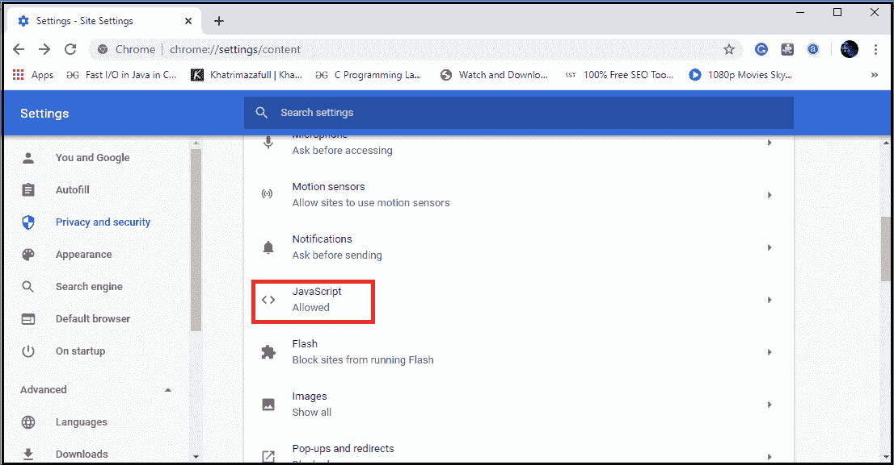

# 如何在我的浏览器中启用 JavaScript

> 原文:[https://www . javatpoint . com/如何在我的浏览器中启用 JavaScript](https://www.javatpoint.com/how-to-enable-javascript-in-my-browser)

如今，几乎所有的网络开发者都在他们的网页中使用 JavaScript。JavaScript 是一种运行在客户端机器(如网络浏览器)上的客户端脚本语言。它帮助网络开发者创建现代网页，允许用户直接与网页交互，而无需重新加载。如果网页浏览器中禁用了 [JavaScript](https://www.javatpoint.com/javascript-tutorial) ，网页可能无法正常运行，或者其功能可能会减少或不可用。

**按照给定的说明，让我们看看如何在最常用的五种网络浏览器中启用 JavaScript:**

### 1.浏览器:

是 [GOOGLE](https://www.javatpoint.com/full-form-of-google) 拥有的免费软件。Chrome 的几乎所有更新和新源代码都来自另一个谷歌项目“Chrome”，该项目可以免费下载，也是一个开源项目。

**在 Chrome 浏览器中启用 JavaScript 的步骤如下:**

一、首先双击打开 chrome 浏览器，然后点击位于 chrome 浏览器右上方的三个点号，如下图截图所示。

二.现在寻找**“设置”**选项，点击如下图所示:

三.当[浏览器](https://www.javatpoint.com/google-chrome)的控制面板/设置打开时，点击位于设置标签左侧的**“高级”**选项，如下图所示。

四.现在点击**“隐私与安全”**选项。

动词 （verb 的缩写）现在点击**“站点设置”**选项。

不及物动词现在从如下所示的下列选项中搜索“JavaScript”:

七.现在点击“JavaScript”选项，然后点击“阻止”选项右侧给出的切换按钮，如给定截图所示。

八.单击切换按钮后，“允许(推荐)”选项将出现在“阻止”的位置，这确认浏览器中的 JavaScript 已成功启用，如下所示:

九.现在，您可以在关闭“设置”选项卡后使用浏览器浏览网页。

### 2.Opera 浏览器

Opera Software 于 1994 年在挪威最大的电信公司之一“Telenor”公司创建。Opera 于 1995 年底成立了自己的公司“Opera 软件 ASA”。1996 年首次以 2.0 版本向公众发布，这个版本的 Opera 只能在[微软 Windows](https://www.javatpoint.com/windows) 上运行。

**在 Opera 浏览器中启用 JavaScript 的步骤如下:**

一、双击图标打开歌剧浏览器，搜索“设置”选项，如下图所示:

二.单击“设置”选项，当设置选项卡打开时，搜索“高级”选项并单击它:

三.单击位于“高级”选项下方的“隐私和安全”选项，见下图。

四.现在点击高亮按钮打开“站点设置”选项，见下图。

动词 （verb 的缩写）现在通过向下滚动在“站点设置”中搜索“JavaScript”选项。

不及物动词找到“JavaScript”选项后，点击打开它，然后点击“允许(推荐)”选项右侧的切换按钮，如下图所示。

七.单击切换按钮后，“允许”选项将出现在“阻止”的位置，这确认 JavaScript 在浏览器中成功启用，如下所示:

八.现在，您可以在关闭“设置”选项卡后使用浏览器浏览网页。

### 3.野生浏览器:-

Safari 网络浏览器是由“苹果”公司开发的。这是一个基于 WebKit 引擎的图形化网络浏览器。Safari 浏览器于 2003 年首次发布，用于“Mac”操作系统。

**在 Opera 浏览器中启用 JavaScript 的步骤如下:**

一、首先，双击 Safari 浏览器图标打开浏览器，搜索位于浏览器右侧的“设置”选项:

二.点击“设置”选项，在给定选项中搜索“首选项”选项，如下图所示。

三.现在点击首选项选项，将打开一个控制面板，如下所示。

四.现在点击“安全”选项，点击“启用 JavaScript”选项，如给定截图所示。

动词 （verb 的缩写）JavaScript 现在已经在浏览器中成功启用。现在，您可以在关闭设置后开始使用网络浏览器。

### 4.互联网浏览器:-

它由微软公司开发。您可以使用此浏览器收听和观看流媒体内容、在线支付等。[互联网浏览器](https://www.javatpoint.com/internet-explorer)最新版本是 10。

**在浏览器中启用 JavaScript 的步骤如下:**

一、双击图标打开浏览器，点击“设置”选项，见下图:

二.点击设置选项后，在给定选项中搜索“互联网”选项，如下所示

三.现在点击“互联网选项”，一个设置面板将打开，如下所示。面板打开后，点击“安全”选项。

四.单击上图中突出显示的标有“自定义级别”的框。点击“自定义级别”框后，将打开另一个“安全设置”面板。现在通过向下滚动给定选项来搜索“脚本”选项。

动词 （verb 的缩写）现在点击“活动脚本”下面的“启用”选项来启用 JavaScript，然后点击“确定”

不及物动词 JavaScript 现在已经在浏览器中成功启用。现在，您可以在关闭设置后开始使用网络浏览器。

### 5.火狐浏览器:-

它是由 Mozilla 基金会开发的流行开源浏览器之一。它使用“壁虎”布局引擎来显示网页。

**按照给定的说明在火狐浏览器中启用“JavaScript”:**

一、双击火狐浏览器图标，打开[火狐浏览器](https://www.javatpoint.com/mozilla-firefox)，在搜索中输入“关于:配置”，按回车键，如下图:

二.按下回车键后，将打开一个带有警告的网页。要打开“首选项”，请单击“接受风险并继续”按钮，如下所示:

三.现在，在点击“接受风险并继续”后出现的搜索框(搜索首选项名称)中键入“JavaScript”，并在出现的几个选项中查找**“JavaScript . enabled”**选项，见下图

四.要启用 JavaScript，请单击“javascript.enabled”选项右侧的按钮，该选项在上图中突出显示，之后“false”将变为“true”，如下图所示。

动词 （verb 的缩写）JavaScript 现已在[浏览器](https://www.javatpoint.com/browsers)中成功启用。现在，您可以在关闭设置后开始使用网络浏览器。

* * *