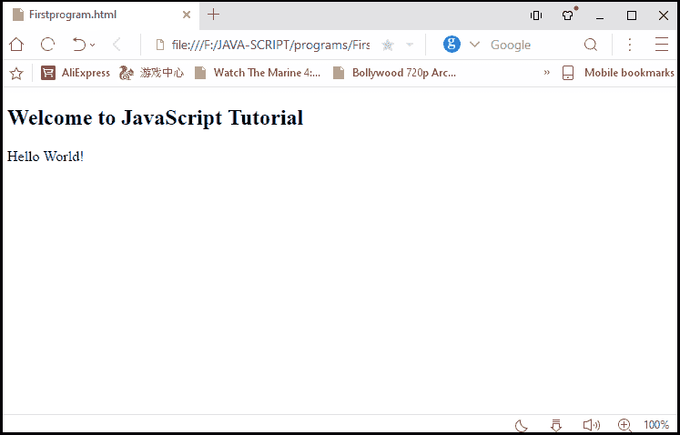

# Java 和 JavaScript 有什么区别

> 原文：<https://www.javatpoint.com/difference-between-java-and-javascript>

许多用户认为 Java 和 java-script 是相似的语言，或者说它们是同一种语言的两个不同名称。但是用户必须澄清他的疑问，java-script 和 java 语言不是相似的语言，java-script 与 java 编程语言无关。将脚本语言作为 javaScript 引入的主要原因是当时处于鼎盛时期的 Java 编程语言的流行。为了利用术语“java”在 [java 编程语言](https://www.javatpoint.com/java-tutorial)中的流行，它被引入作为 [JavaScript](https://www.javatpoint.com/javascript-tutorial) 。

**为了理解 Java 和 JavaScript 语言的区别，让我们来看看它们之间的一些关键区别:**

| Java 语言 | JavaScript 语言 |
| **1。** | 它是一种编程语言。 | 它是一种脚本语言。 |
| **2。** | Java 是一种纯面向对象的编程语言。 | JavaScript 是基于对象的语言。 |
| **3。** | Java 是一种独立的语言。 | JavaScript 不是一种独立的语言，因为它需要集成到一个 HTML 程序中来执行。 |
| **4。** | Java 是一种强类型语言，这意味着用户必须在声明和使用变量之前决定变量的数据类型。
例“int a”，变量“a”只能存储整型的值。 | JavaScript 是一种松散类型的语言，这意味着用户不必担心声明前后变量的数据类型。
例如“var a”，变量“a”可以存储任何数据类型的值。 |
| **5。** | Java 程序应该在执行之前编译。 | JavaScript 需要集成到 HTML 程序中才能执行。 |
| **6。** | 运行 java 程序不需要网络浏览器。 | 网络浏览器对于运行 JavaScript 程序至关重要。 |
| **7。** | 它是学习的复杂语言之一。 | 这是最容易学习的语言之一。 |
| **8。** | 在 Java 中，通过使用多线程，用户可以执行复杂的任务。 | 在 JavaScript 中，用户不能执行复杂的任务。 |
| **9。** | 它需要大量的内存。 | 它不需要那么大的内存。 |
| **10。** | Java 编程语言是由“太阳微系统公司”开发的 | JavaScript 编程语言是由“网景”开发的 |
| **11 时。** | 在 Java 编程语言中，程序是用“”保存的。java "扩展。 | 另一方面，JavaScript 中的程序是用“.”保存的。js "扩展。 |
| **12 时。** | Java 作为“字节”代码存储在主机上。 | JavaScript 作为“源”文本存储在主机(客户端机器)上。 |

**让我们看看程序是如何用这两种语言编写的:**

**用 Java 打印“Hello World”的程序**

```js

class A
 { 
public static void main(String args[]){ 
    System.out.println("Hello World"); 
 } 
}

```

**输出**

你好世界

**用 JavaScript 打印“Hello World”的程序**

```js

<!DOCTYPE html>
<html>
<body>
<h2> Welcome to JavaScript Tutorial</h2>
<script type= "text/javascript">
document.write("Hello World!");  
</script>
</body>
</html>

```

**输出**



* * *