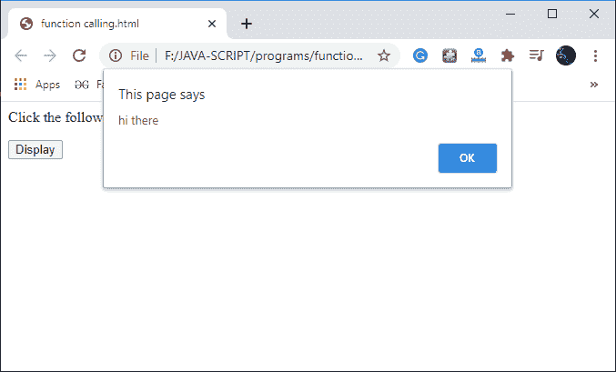
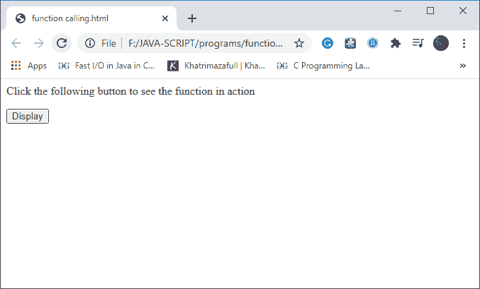

# 如何在 html 中调用 JavaScript 函数？

> 原文：<https://www.javatpoint.com/how-to-call-javascript-function-in-html>

在 HTML 文档中调用 JavaScript 函数的方法有很多，也不是什么难事。首先，我们使用了一种最简单的方法来调用 HTML 文档中的 [JavaScript](https://www.javatpoint.com/javascript-tutorial) 函数:

在这个方法中，我们将在 [HTML](https://www.javatpoint.com/html-tutorial) 文档的头部创建并定义一个函数。要在 html 文档中调用这个函数，我们必须创建一个简单的按钮，并使用 **onclick** 事件属性(它是一个事件处理程序)，我们可以通过单击按钮来调用这个函数。

**为了更清楚的理解，我们来看看给定的程序:**

程序

```js

<html>
<head>
<script type = "text/javascript">
functionmyfunction() { 
alert("how are you");
         }
</script>
</head>
<body>
<p>Click the following button to see the function in action</p>
<input type = "button" onclick = "myfunction()" value = "Display">
</body>
</html>

```

**程序说明**

在上面给出的程序中，我们创建了一个简单的 HTML 文档。在 HTML 文档的头部，我们定义了一个函数(**如 my function()；)**里面的剧本标签**T4】剧本>...</脚本>** 。

```js

<html>
<head>
<script type = "text/javascript">
function myfunction() { 
alert("how are you");
         }
</script>

```

另一方面，在正文部分，我们显示了一些文本并创建了一个按钮。为了调用我们的函数，我们在按钮上使用了 **onclick** 属性，当用户点击该按钮时，我们的函数执行并显示一条警告消息，正如您在输出中看到的。

```js

<body>
<p>Click the following button to see the function in action</p>
<input type = "button" onclick = "myfunction()" value = "Display">
</body>

```

**输出**



### 使用外部 JavaScript 文件调用函数

我们还可以使用附加到我们的 HTML 文档的外部 JavaScript 文件来调用 JavaScript 函数。为此，首先我们必须创建一个 JavaScript 文件，并在其中定义我们的函数，然后用()保存它。Js)扩展。

一旦创建了 JavaScript 文件，我们就需要创建一个简单的 HTML 文档。为了在 HTML 文档中包含我们的 JavaScript 文件，我们必须使用脚本标签

**我们借助一个程序来了解一下:**

程序

```js

<html>
<head>
<script type = "text/javascript" src="function.js"></script>
</head>
<body>
<p>Click the following button to see the function in action</p>
<input type = "button" onclick = "myfunction()" value = "Display">
</body>
</html>

```

**程序说明**

在上面的程序中，我们首先创建了一个 JavaScript 文件，并在其中定义了我们的函数，然后用。 **js** 分机。

Function.js

```js

functionmyfunction() 
 { 
document.write("welcome to Javatpoint");
         }

```

创建完 JavaScript 文件后，我们已经创建了一个 HTML 文档，并使用链接了我们的 JavaScript 文件。因为我们已经将我们的 HTML 文档和 JavaScript 文件存储在同一个文件夹中，所以我们只是在“scr”属性中命名了我们的 JavaScript 文件，而不是在标题部分提供完整的路径。

```js

<head>
<script type = "text/javascript" src="function.js"></script>
</head>

```

在正文部分，我们显示了一些文本并创建了一个按钮。为了调用我们的函数，我们在按钮上使用了 **onclick** 属性，当用户点击该按钮时，我们的函数执行并显示一条警告消息，正如您在输出中看到的。

```js

<body>
<p>Click the following button to see the function in action</p>
<input type = "button" onclick = "myfunction()" value = "Display">
</body>

```

**输出**



现在点击给定的按钮:


* * *