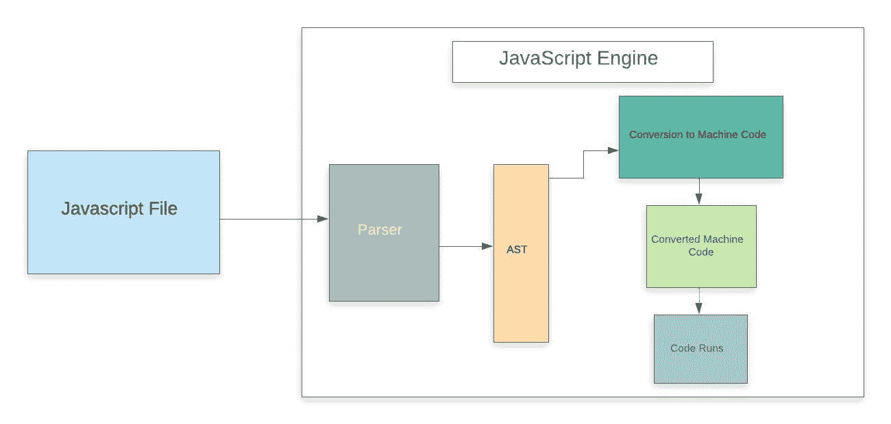

# JavaScript 是如何工作的？

> 原文：<https://www.javatpoint.com/how-does-javascript-work>

JavaScript 是客户端脚本语言，也是最高效、最常用的脚本语言之一。这个术语。**客户端脚本语言的意思是**它运行在网络浏览器内部的客户端(或者客户端机器上)，但是需要记住的一点是，客户端的网络浏览器也需要支持 JavaScript，或者必须启用 JavaScript。如今，大多数现代[网络浏览器](https://www.javatpoint.com/browsers)都支持 JavaScript，并有自己的 JavaScript 引擎。比如谷歌 Chrome 有自己的 [JavaScript](https://www.javatpoint.com/javascript-tutorial) 引擎，叫做 V8。

**其他一些带有 JavaScript 引擎的网络浏览器**

|  | 网络浏览器 | JavaScript 引擎 |
| 1. | 边缘 | 人体精神力量的中心 |
| 2. | 旅行队 | JavaScript 核心 |
| 3. | 火狐浏览器 | 蜘蛛猴 |

这完全取决于网络开发人员如何使用 JavaScript 以及使用的目的，因为它可以用于网络开发的许多方面。JavaScript 最常见的用途之一是验证用户在表单字段中给出的数据。

**借助下面的例子，我们可以了解 JavaScript 是如何工作的:**

在这个例子中，我们创建了一个简单的 [HTML](https://www.javatpoint.com/browsers) 文档，并在其中添加了我们的 JavaScript 代码。

程序

```js

<!DOCTYPE html>
<html lang="en">
<head>
<meta charset="utf-8">
<title>JavaScript Working Process</title>
</head>
<body>
<h1>This how javascript works</h1>
<script>
   alert("Hi,Their");
   console.log("JavaScript");

</script>
</body>
</html>

```

在上面的程序中，我们只是通过使用“alert()”方法向用户显示了一条警报消息，这是一种预定义的 JavaScript 方法。我们还使用了“console . log()；”方法，并将“JavaScript”作为 String 传递，在 inspect 模式下，我们可以在控制台中看到“JavaScript”，如下图输出所示。

**输出**


正如我们在输出中看到的，程序在我们的网络浏览器上运行良好。

**这里又出现了一个问题“浏览器如何理解 JavaScript 代码并运行它。”**

正如我们上面所讨论的，现在大多数网络浏览器都有自己的 JavaScript 引擎。所以，是 JavaScript 引擎理解代码并运行它。

现在让我们看看 JavaScript 引擎是如何处理和运行的。js 代码。

在这种情况下，我们使用了一个 [chrome 浏览器](https://www.javatpoint.com/google-chrome)来运行我们的程序，该程序具有“V8”JavaScript 引擎，该引擎也用于创建 [Node.js](https://www.javatpoint.com/nodejs-tutorial) 。我们已经知道，JavaScript 是一种解释语言，这意味着它以逐行的方式执行(或者这意味着 JavaScript 引擎逐行转换 Js 代码，并以相同的方式运行，而不是一次转换整个程序)。

借助图表，我们可以理解典型的 JavaScript 引擎是如何工作的:



每当我们在网络浏览器中运行一个 JavaScript 程序时，浏览器的引擎都会接收到 JavaScript 代码，然后引擎运行源代码来获取输出。

在一个标准的 JavaScript 引擎中，源代码会经历几个步骤并被执行，如上面给出的图表所示。

让我们更详细地了解这些步骤。

**第一步:解析器**

这是引擎的第一阶段，每次我们运行一个 JavaScript 程序，我们的代码首先被 JS 引擎内部的“解析器”接收。解析器的工作是逐行检查 JavaScript 代码的语法错误，因为 JavaScript 是一种解释性脚本语言，所以每当解析器检测到错误时，它都会抛出一种错误并停止代码的执行。

简而言之，我们可以说它解析了 JavaScript 代码。

**第二步:AST**

一旦解析器检查了所有的 JavaScript 代码，并确信代码中没有错误，它就会创建一个名为 AST 的数据结构(它代表抽象语法树)。

借助下面的例子，我们可以很容易地理解什么是 AST。

**例**

假设我们有一个如下所示的 JavaScript 程序:

**程序**

```js

function fun(x) {
if (x > 15) {
var a = 4;
return a * x;
    }

return x + 10;
}

```

一旦解析器检查了上面的 JavaScript 代码，它将创建一个名为 **AST** 的数据结构，我们已经在上面讨论过了。创建的抽象语法树看起来像给定的图像。


#### 注意:它不是精确的抽象语法树，但它是抽象语法树的图形表示。

**第三步:转换为机器码**

解析器创建抽象语法树后，JavaScript 引擎会将 JavaScript 代码转换为机器代码(或机器能够理解的语言)。

**第四步:机器码**

当用 JavaScript 编写的程序被转换成机器语言(或字节码)时，转换后的代码被发送到系统执行，最后，该字节码由系统/引擎运行，就像我们在第一个例子中观察到的那样。

* * *