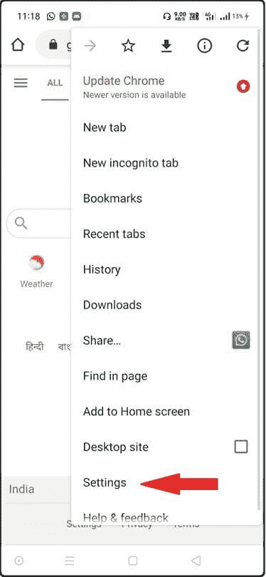

# 如何在 Android 上启用 JavaScript？

> 原文：<https://www.javatpoint.com/how-to-enable-javascript-on-android>

如果你是智能手机用户，你的智能手机很有可能在安卓操作系统上工作。

但是，如果您的手机浏览器被配置为禁用 JavaScript，您肯定会遇到不满意的网页浏览。因此，有必要使用支持 JavaScript 的网络浏览器，因为 JavaScript 兼容性对于通过[互联网](https://www.javatpoint.com/internet)查看网站的规模至关重要。如今，几乎所有搭载安卓操作系统的智能手机都预装了 [Chrome 浏览器](https://www.javatpoint.com/google-chrome)。

让我们看看**如何在 Chrome 浏览器中启用 [JavaScript](https://www.javatpoint.com/javascript-tutorial) ，这是安装在由[安卓操作系统](https://www.javatpoint.com/android-tutorial)驱动的智能手机上的**:

**在安卓 Chrome 浏览器中启用 JavaScript 的步骤**

**第一步**

首先，打开 chrome 浏览器，进入“App”，点击谷歌 Chrome App，如下图所示:

**第二步**

打开 Chrome 应用后，触摸/点击 Chrome 应用左上角的三个圆点符号，如下图所示:

**第三步**

当侧面菜单打开时，从以下选项中搜索“设置”，并在上面触摸/录音。

**第四步**

当“设置”选项打开时，寻找“高级”选项下面给出的“站点设置”选项并触摸它。

**第五步**

现在在以下选项中搜索“JavaScript”选项，并触摸它，如下图所示:

**第 6 步**

现在触摸“JavaScript”选项右侧的切换按钮，如下图所示:

**第 7 步**

一旦你按下切换按钮，JavaScript“允许”将出现在 JavaScript“阻止”的地方。现在[浏览器](https://www.javatpoint.com/browsers)中启用了 JavaScript，关闭设置后，点击“后退”按钮大约三次，即可开始浏览互联网。

#### 注意:要在安卓系统上禁用谷歌浏览器中的 JavaScript，你可以使用同样的过程，只需稍加改变，如最后一步所示，再次点击切换按钮，但这次是在浏览器中禁用 JavaScript。

* * *