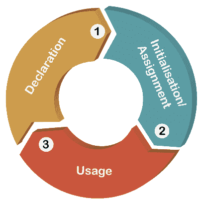
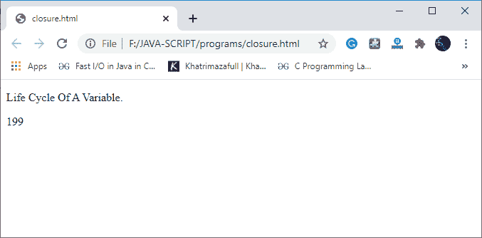
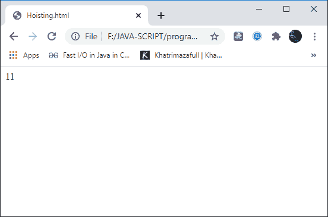

# JavaScript 中什么是吊装？

> 原文：<https://www.javatpoint.com/what-is-hoisting-in-javascript>

众所周知，变量声明是任何编程语言的基本和本质方面之一，如 [C 语言](https://www.javatpoint.com/c-programming-language-tutorial)、 [C++](https://www.javatpoint.com/cpp-tutorial) 等。然而，JavaScript 有一个小古怪，叫做提升，它可以把一个看起来完美无瑕的声明变成一个微妙的 bug。

## 提升

在 [JavaScript](https://www.javatpoint.com/javascript-tutorial) 中，提升是一种默认行为，在这种行为中，所有的声明，无论是变量声明还是函数声明，都会在执行程序代码之前被移动到作用域的顶部。然而，这可以被认为是一个优势，因为所有函数和变量声明都被放在它们的作用域的顶部，不管它们在整个程序的任何地方被声明在哪里，甚至不管它们是被声明为全局的还是局部的。

由于 JavaScript 中[提升的概念，我们甚至可以在程序代码中定义函数定义之前就调用函数。](https://www.javatpoint.com/javascript-hoisting)

简而言之，我们可以说，我们可以在声明变量和函数之前使用 JavaScript 中的变量和函数，因为正如我们在上面讨论的，JavaScript 编译器会将所有变量和函数的声明移动到它们的作用域顶部，这样就不会出现任何类型的错误。JavaScript 的概念是在执行代码之前，由编译器将变量和函数的所有声明移动到它们的作用域的顶部，这就是所谓的提升。

#### 注意:需要记住的重要一点是，在 JavaScript 中，函数声明和变量声明只是被挂起，而不是初始化。

**让我们准确理解这是什么:**

以下是变量声明和初始化的主要顺序。

**1。申报->2.Initialisation/Assignment->3。用法**



**例**

```js

<!DOCTYPE html>
<html>
<head><p>Life Cycle Of A Variable.</p>
</head>
<body>
<script>
let a;          // Declaration
a = 199;      // Assignment
document.write(a);  // Usage
</script>
</body>
</html>

```

但是我们都知道，JavaScript 允许我们同时声明和初始化变量。这是最常用的模式之一:

**输出**



#### 注意:另一件需要记住的重要事情是，在后端，JavaScript 首先声明变量、函数，然后初始化它们。然而，未声明的变量并不存在于 JavaScript 中，直到分配它们的代码被执行。因此，当给任何未声明的变量赋值时，在执行被赋值的代码时，它们被转换为全局变量。因此我们可以说所有未声明的变量都是全局变量。

**例**

```js

<!DOCTYPE html>
<html>
</head>
<body>
<script>

// hoisting 
functioncodeHoist(){ 
    a = 11; 
let b = 50; 
} 
codeHoist(); 
function fun(){
document.write(a); // 11
document.write(b); // ReferenceError : b is not defined
}
</script>
</body>
</html>

```

**程序说明**

在上面的程序中，我们创建了两个名为“code 提升机()”的函数和“fun()”；使用 function 关键字。在“code 提升机()”的定义中，我们使用 let Keyword 声明了变量“b”，并将该值赋值为 50。我们还有另一个变量“a”，我们没有声明它，并给它赋值 11。

```js

functioncodeHoist(){ 
    a = 10; 
let b = 50; 
} 

```

在“fun()”函数的定义中，我们简单地打印了两个变量的值。

```js

function fun(){
	document.write(a);
	document.write(b);
}

```

在函数调用函数“fun()”时将打印变量“a”的值，我们在函数“code 提升机()”的定义中没有声明该值但是它不会打印我们使用 let 关键字声明的变量值。发生这种情况是因为变量“a”的范围被 JavaScript 本身更改为全局变量(或者我们可以说变量 a 被转换为全局变量)，这就是函数“fun()”的原因可以打印变量值。但是函数“fun()；”无法打印变量 b 的值，因为它是使用“let”关键字声明的，因此它的作用域被限制在函数定义中，并且对任何外部函数都不可用。

**输出**



* * *