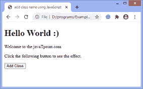
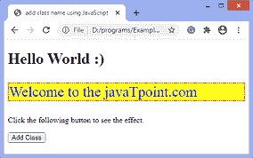
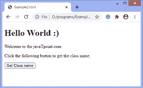
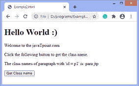

# 如何使用 JavaScript 向元素添加类？

> 原文：<https://www.javatpoint.com/how-to-add-a-class-to-an-element-using-javascript>

类属性可以在 CSS 中使用，为具有相应类名的元素执行一些任务。在本文中，我们将讨论如何使用 JavaScript 向元素中添加一个类。在 [JavaScript](https://www.javatpoint.com/javascript-tutorial) 中，有一些方法可以将类添加到元素中。我们可以使用**T3。类别名称 T5 属性或**T7 属性。add()** 方法向特定元素添加类名。**

现在，让我们讨论向元素添加类的方法。

## 使用。类名属性

*。className* 属性设置元素的类名。此属性可用于返回元素的类属性的值。我们可以使用这个属性向一个 [HTML](https://www.javatpoint.com/html-tutorial) 元素添加一个类，而不用替换它现有的类。

要添加多个类，我们必须用空格分隔它们的名称，如 ***【类 1 类 2】***。

如果已经为一个元素声明了一个类，并且我们需要给同一个元素添加一个新的类名，那么应该在写入新的类名之前插入一个空格来声明它，否则，它将覆盖现有的类名。可以这样写:

```

<div id = "div1" class = "oldClass"> </div>
document.getElementById("div1").className = " newClass";

```

在上面的代码中，我们在 **newClass** 之前插入了一个空格。

### 句法

下面给出了该属性设置或返回类名的常用语法。

**设置类名**

```

element.className = class

```

**返回类名**

```

element.className

```

使用 ***的例子。*类名**属性给出如下。

### 示例-添加类名

在这个例子中，我们使用的是 ***。类名称*** 属性用于将 ***【段落】*** 类添加到 id 为***【P1】***的段落元素中。我们使用类名 ***【段落】*** 将 [CSS](https://www.javatpoint.com/css-tutorial) 应用于相应的段落。

我们要点击给定的 [HTML 按钮](https://www.javatpoint.com/html-button-tag) **【添加类】**才能看到效果。

```

<!DOCTYPE html>
<html>

<head>
<title>
add class name using JavaScript
</title>

<style>
.para {
font-size: 30px;
background-color: yellow;
color: blue;
border: 2px dotted red;
}
</style>
</head>

<body>

<h1>
Hello World :)
</h1>

<p id = "p1">
Welcome to the javaTpoint.com
</p>
<p> Click the following button to see the effect. </p>
<button onclick = "fun()">
Add Class
</button>
<script>
function fun() {
var a = document.getElementById("p1");
a.className = "para";
}
</script>
</body>

</html>

```

[Test it Now](https://www.javatpoint.com/oprweb/test.jsp?filename=how-to-add-a-class-to-an-element-using-javascript)

**输出**



点击给定按钮后，输出将是-



在下一个例子中，我们通过使用**来获得类的名称。类名**属性。

### 示例-获取类名

在这个例子中，我们使用的是 ***。className*** 属性获取具有 **id = "p1"** 的段落元素的类名。

我们要点击给定的 HTML 按钮**“获取类名”**才能看到效果。

```

<!DOCTYPE html>
<html>

<head>
</head>

<body>

<h1>
Hello World :)
</h1>

<p id = "p1" class = "para jtp">
Welcome to the javaTpoint.com
</p>
<p> Click the following button to get the class name. </p>
<p id = "p2"> </p>
<button onclick = "fun()">
Get Class name
</button>
<script>
function fun() {
var a = document.getElementById("p1").className;
document.getElementById('p2').innerHTML = "The class names of paragraph with 'id = p1' is: " + a;
}
</script>
</body>

</html>

```

[Test it Now](https://www.javatpoint.com/oprweb/test.jsp?filename=how-to-add-a-class-to-an-element-using-javascript2)

**输出**



点击给定按钮后，输出将是-



## 使用 add()方法

现在，让我们看看使用 JavaScript 添加类名的第二种方法。我们可以使用 **add()** 方法向特定元素添加类名。

### 句法

```

element.classList.add("class name");

```

### 例子

在本例中，我们使用 **add()** 方法向具有 **id = "p1"** 的段落元素添加类名。我们要点击给定的 HTML 按钮**“添加类”**才能看到效果。

```

<!DOCTYPE html>
<html>

<head>
<title>
add class name using JavaScript
</title>

<style>
.para {
font-size: 30px;
background-color: yellow;
color: blue;
border: 2px dotted red;
}
</style>
</head>

<body>

<h1>
Hello World :)
</h1>

<p id = "p1">
Welcome to the javaTpoint.com
</p>
<p> Click the following button to see the effect. </p>
<button onclick = "fun()">
Add Class
</button>
<script>
function fun() {
var a = document.getElementById("p1");
a.classList.add("para");
}
</script>
</body>

</html>

```

[Test it Now](https://www.javatpoint.com/oprweb/test.jsp?filename=how-to-add-a-class-to-an-element-using-javascript3)

**输出**


点击给定按钮后，输出将是-


* * *