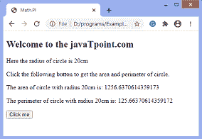

# 如何用 JavaScript 计算圆的周长和面积？

> 原文:[https://www . javatpoint . com/如何使用 javascript 计算周长和面积](https://www.javatpoint.com/how-to-calculate-the-perimeter-and-area-of-a-circle-using-javascript)

在本文中，我们将看到如何使用 JavaScript 计算圆的周长和面积。计算圆的周长和面积的数学公式如下:

**圆的面积= π * r * r**

**圆的周长= 2 * π * r**

两个公式都需要 **PI** 的值。所以，在 [JavaScript](https://www.javatpoint.com/javascript-tutorial) 中，我们必须使用**数学。PI** 属性获取 **PI** 的值。

让我们看一个计算圆的周长和面积的例子。

### 例子

在这个例子中，圆的半径是 20 厘米。我们必须点击给定的 [HTML 按钮](https://www.javatpoint.com/html-button-tag)来获取面积和周长。

```

<!DOCTYPE html>
<html>

<head>
<title>
Math.PI
</title>

</head>

<body>
<h2>
Welcome to the javaTpoint.com
</h2>
<p> Here the radius of circle is 20cm </p>
<p>
Click the following button to get the area and perimeter of circle.
</p>
<p id = "para"></p>
<p id = "para1"></p>
<button onclick = "fun()"> Click me </button>

<script> 
var r = 20;
function fun()
{
document.getElementById('para').innerHTML = 'The area of circle with radius 20cm is: ' + Math.PI * r * r ;
document.getElementById('para1').innerHTML = 'The perimeter of circle with radius 20cm is: ' + 2 * Math.PI * r ;  
}
</script> 

</body>

</html>

```

[Test it Now](https://www.javatpoint.com/oprweb/test.jsp?filename=how-to-calculate-the-perimeter-and-area-of-a-circle-using-javascript)

**输出**

执行上述代码并点击给定按钮后，输出将为-



* * *