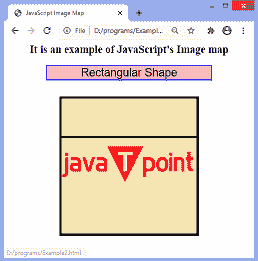
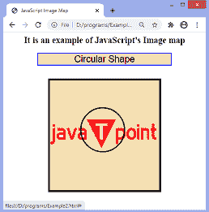

# 如何用 JavaScript 创建图像地图？

> 原文:[https://www . javatpoint . com/如何用 javascript 创建图像地图](https://www.javatpoint.com/how-to-create-an-image-map-in-javascript)

JavaScript 可以用来创建客户端图像映射。图像地图是网页上具有到其他页面的多个链接的图像。这些链接被称为**热点**。图像地图用于导航到其他页面或同一网页上的不同链接。

在图像地图中，图像可以分为不同的部分。我们可以包含每个部分的链接，点击一个部分后，它会打开相应的链接。剖面可以分为不同的形状，如**圆形、矩形、**或**多边形**。为了创建一个矩形图像地图，我们需要两个不同的坐标，即**右上角**和**左下角**。同样，为了创建五边形图像地图，我们需要五个坐标。

图像映射提供了一种链接图像各个部分的方法，而不需要创建图像文件。**使用地图**属性在 [**< img >** 标签](https://www.javatpoint.com/html-image)中定义该图像的地图描述。该属性调用应用于特定图像的地图描述。每个图像地图都有一个唯一的地图，所以我们必须在地图元素中使用**名称**属性。

还有一个标签叫做 [**<区域>** 标签](https://www.javatpoint.com/html-area-tag)，它定义了每个截面的坐标和形状。我们可以使用 **[onclick](https://www.javatpoint.com/html-button-onclick) 、ondblclick、onmouseover、onmouseout、on bulr、**等事件。用 **<区>** 标记。

定义图像映射的代码如下。

### 句法

```


<map name = "jtp">
    <area shape = "rect" coords="x, y" />
    <area shape = "circle" coords = "x, y, r" />
</map>

```

现在，让我们看一些使用图像地图来更清楚地理解它的插图。

### 例子

在这个例子中，有一个我们用来创建图像地图的图像。我们将图像分成两个部分，分别为矩形和圆形。

第一部分是图像的顶部区域，第二部分是图像的中间区域。

```

<html>
<head>
<title> JavaScript Image Map </title>
<script>
function show(name) {
document.my.res.value = name;
}
</script>
</head>

<body style = "text-align: center;">
<h2> It is an example of JavaScript's Image map </h2>
<form name = "my">
<input type = "text" name = "res" size = "25px" style = "font-size: 25px; text-align: center; border: 2px solid blue; background-color: pink;"/>
</form>
<br>


<map name = "names">
<area shape = "rect" coords = "0, 0, 325, 90" href = "#" onclick = "show('Rectangular Shape')" />

<area shape = "circle" coords = "150, 140, 60" href = "#" onclick = "show('Circular Shape')" />
</map>
</body>
</html>

```

[Test it Now](https://www.javatpoint.com/oprweb/test.jsp?filename=how-to-create-an-image-map-in-javascript1)

**输出**

执行上述代码后，输出将是-


点击顶部区域，输出将是-



点击中间区域，输出将是-



### 示例 2

这里，我们正在传递 **<区域>** 标签的 **href** [属性](https://www.javatpoint.com/html-attributes)中的图像。这意味着当我们点击这些部分时，将显示相应的图像。

图像分为两部分。第一部分是图像的顶部区域，第二部分是图像的中间区域。单击相应的部分时，首先在给定的文本字段中显示链接图像的名称，然后显示图像。

```

<html>
<head>
<title> JavaScript Image Map </title>
<script>
function show(name) {
document.my.res.value = name;
}
</script>
</head>

<body style = "text-align: center;">
<h2> It is an example of JavaScript's Image map </h2>
<form name = "my">
<input type = "text" name = "res" size = "25px" style = "font-size: 25px;text-align: center;border: 2px solid blue; background-color: pink;"/>
</form>
<br>


<map name = "names">
<area shape = "rect" coords = "0, 0, 325, 90" href = "forest.jpg" onclick = "show('Forest.jpg')" />

<area shape = "circle" coords = "150, 140, 60" href = "tiger.png" onclick = "show('Tiger.png')" />
</map>
</body>
</html>

```

[Test it Now](https://www.javatpoint.com/oprweb/test.jsp?filename=how-to-create-an-image-map-in-javascript2)

**输出**

执行上述代码后，输出将是-


点击顶部区域，输出将是-


点击中间区域，输出将是-


* * *