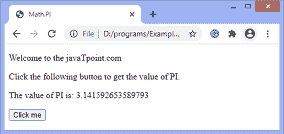
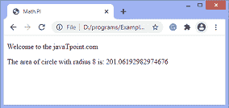

# 如何用 JavaScript 获取 PI 的值？

> 原文：<https://www.javatpoint.com/how-to-get-the-value-of-pi-using-javascript>

**PI** 是一个数学常数。小写希腊字母 **π** 代表符号**π**。它是 ***外围*** 的缩写。

圆周率可以定义为圆的周长除以直径。这意味着对于任何大小的圆，圆周率的值都将保持不变。

在 [JavaScript](https://www.javatpoint.com/javascript-tutorial) 中，我们可以使用**数学。PI** 属性获取 **PI** 的值。该属性返回圆的周长与其直径的比值，约等于 **3.14159** 。**数学。PI** 是 **Math** 对象的一个属性，而不是一个函数，所以用这个作为函数会造成错误。

PI 的值通常用在公式中。使用**数学。PI** 属性，我们可以轻松计算圆的面积，也可以进行其他需要 PI 值的计算。

### 句法

```

Math.PI

```

让我们看一些使用**数学的例子。PI** 属性。

### 示例 1

在这个例子中，我们正在打印**数学的值。PI** 属性。点击给定的按钮，得到圆周率的值。

```

<!DOCTYPE html>
<html>
<head>
<title>
Math.PI
</title>

</head>

<body>
<p>
Welcome to the javaTpoint.com
</p>
<p> Click the following button to get the value of PI. </p>
<p id = "para"></p>
<button onclick = "get()">
Click me
</button>
<script> 
  function get() 
  { 
    document.getElementById("para").innerHTML = "The value of PI is: " + Math.PI;
  } 
</script> 

</body>

</html>

```

[Test it Now](https://www.javatpoint.com/oprweb/test.jsp?filename=how-to-get-the-value-of-pi-using-javascript1)

**输出**

执行上述代码后，点击给定按钮后，输出将为-



### 示例 2

在这个例子中，我们正在计算圆的面积。求面积的公式是(***)π* r * r***)需要圆周率的值。所以，我们用的是 [**数学。PI**](https://www.javatpoint.com/pi) 属性获取 **PI** 的值。

这里，圆的半径为 **8** 。

```

<!DOCTYPE html>
<html>

<head>
<title>
Math.PI
</title>

</head>

<body>
<p>
Welcome to the javaTpoint.com
</p>
<p id = "para"></p>

<script> 
var r = area(8);
document.getElementById('para').innerHTML = 'The area of circle with radius 8 is: ' + r ;
  function area(radius) 
  { 
return Math.PI * radius * radius;
  } 

</script> 

</body>

</html>

```

[Test it Now](https://www.javatpoint.com/oprweb/test.jsp?filename=how-to-get-the-value-of-pi-using-javascript2)

**输出**



* * *