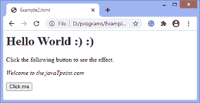
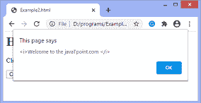

# 如何使用 JavaScript 使文本倾斜

> 原文：<https://www.javatpoint.com/how-to-make-a-text-italic-using-javascript>

在 JavaScript 中，**斜体()**方法用于显示斜体字符串。它使文字类似于文字是在 **< i > < /i >** (斜体标记)。因为**斜体()**方法是字符串对象的方法，所以必须通过字符串类的特定实例来调用。

它负责字符串的斜体。它不改变原始字符串的值；相反，它返回斜体字符串。

通常，此方法以下面给出的格式返回字符串。假设我们有一串**“你好世界！”**我们在上面应用**斜体()**方法，并使用 alert 方法显示输出，然后我们将得到-

```js

<i>Hello world!</i> 

```

输出将是一个写在**<></I>**标签中的字符串。

### 句法

```js

string.italics();

```

此方法不需要任何参数。现在我们通过一些插图来了解一下**斜体()**法的用法。

### 示例 1

在本例中，我们将字符串用斜体显示。这里有一个字符串 **str** ，我们在上面应用**斜体**方法使字符串的字符斜体。

我们必须点击给定的 HTML 按钮才能看到输出。这里我们使用 **document.write()** 方法来显示输出。

```js

<html>
<head>

</head>
<body>
<h1> Hello World :) :) </h1>
<p> Click the following button to see the effect. </p>
<p id = "para"> </p>
<button onclick = "fun()"> Click me </button>
<script>
function fun(){
var str = "Welcome to the javaTpoint.com ";
document.getElementById('para').innerHTML = str.italics();
}
</script>
</body>

</html>

```

[Test it Now](https://www.javatpoint.com/oprweb/test.jsp?filename=how-to-make-a-text-italic-using-javascript1)

**输出**

在执行代码并点击给定的 HTML 按钮后，输出将是-



现在，在下一个示例中，我们使用 **alert()** 方法显示输出。让我们看看下一个例子的结果。我们可能会得到不同的结果。

### 示例 2

我们要点击给定的 [HTML 按钮](https://www.javatpoint.com/html-button-tag)才能看到输出。

```js

<html>
<head>

</head>
<body>
<h1> Hello World :) :) </h1>
<p> Click the following button to see the effect. </p>
<p id = "para"> </p>
<button onclick = "fun()"> Click me </button>
<script>
function fun(){
var str = "Welcome to the javaTpoint.com ";
alert(str.italics());
}
</script>
</body>

</html>

```

[Test it Now](https://www.javatpoint.com/oprweb/test.jsp?filename=how-to-make-a-text-italic-using-javascript2)

**输出**

执行代码并点击给定的 [HTML](https://www.javatpoint.com/html-tutorial) 按钮后，输出将为-



我们可以使用 **alert()** 方法看到输出的格式。虽然我们在两个例子中对同一个字符串应用了相同的方法，但是输出的格式是不同的。

* * *