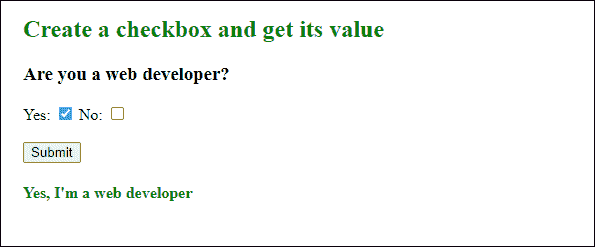
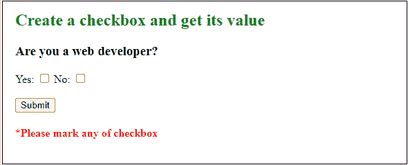
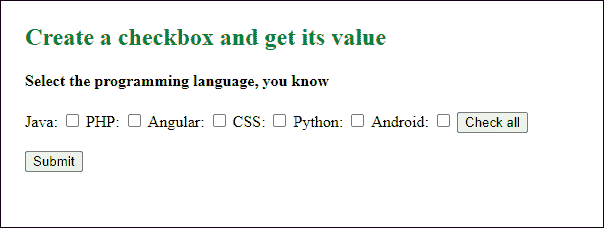
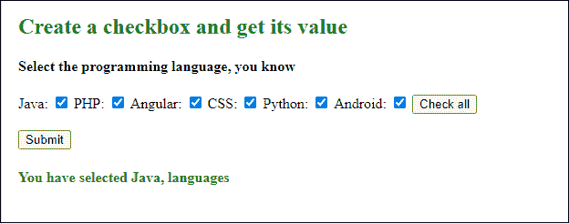
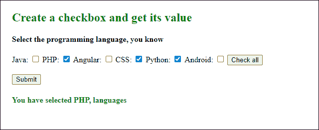
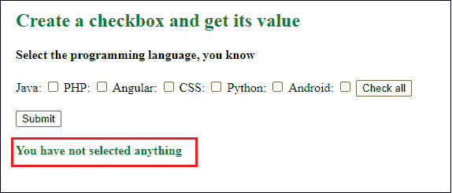
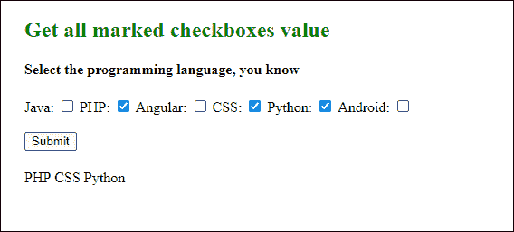

# 如何在 JavaScript 中获取所有选中的复选框值？

> 原文:[https://www . javatpoint . com/how-to-all-checkbox-value-in-JavaScript](https://www.javatpoint.com/how-to-get-all-checked-checkbox-value-in-javascript)

复选框是一个选择框，允许用户通过选中和取消选中来进行二进制选择(真或假)。基本上，复选框是一个图标，在图形用户界面表单和应用程序中经常使用它来从用户那里获得一个或多个输入。

*   如果勾选了复选框，则表示**为真**；这意味着用户已经选择了该值。
*   如果复选框未被标记或未被选中，则表示为**假**；这意味着用户尚未选择该值。

**请记住**复选框不同于单选按钮和下拉列表，因为它允许一次选择多个选项。相比之下，单选按钮和下拉菜单只允许我们从给定的选项中选择一个。

在本章中，现在我们将看到如何使用 [JavaScript](https://www.javatpoint.com/javascript-tutorial) 获取所有标记的[复选框](https://www.javatpoint.com/html-checkbox-tag)值。

## 创建复选框语法

要创建复选框，请使用 [HTML <输入>](https://www.javatpoint.com/html-input-tag) 选项卡，并在选项卡内键入=“复选框”，如下所示-

```

<input type="checkbox" id="c1" value="on" name="cb1">Yes

```

虽然也可以通过 JavaScript 创建 checkbox 对象来创建 checkbox，但是这个方法有点复杂。我们稍后会讨论这两种方法-

## 例子

### 创建并获取复选框值

在这个例子中，我们将创建两个复选框，但条件是用户必须在它们之间只标记一个复选框。然后我们将获取标记复选框的值。请参见下面的代码:

**复制代码**

```

<html>
<body>

<h2 style="color:green">Create a checkbox and get its value</h2>
<h3> Are you a web developer? </h3>
Yes: <input type="checkbox" id="myCheck1" value="Yes, I'm a web developer">
No: <input type="checkbox" id="myCheck2" value="No, I'm not a web developer">
<br> <br>
<button onclick="checkCheckbox()">Submit</button> <br>

<h4 style="color:green" id="result"></h3> 
<h4 style="color:red" id="error"></h3> 

<script>
function checkCheckbox() {
  var yes = document.getElementById("myCheck1");
  var no = document.getElementById("myCheck2");
  if (yes.checked == true && no.checked == true){
    return document.getElementById("error").innerHTML = "Please mark only one checkbox either Yes or No";
  }
  else if (yes.checked == true){
    var y = document.getElementById("myCheck1").value;
    return document.getElementById("result").innerHTML = y; 
  } 
  else if (no.checked == true){
    var n = document.getElementById("myCheck2").value;
    return document.getElementById("result").innerHTML = n;
  }
  else {
    return document.getElementById("error").innerHTML = "*Please mark any of checkbox";
  }
}
</script>

</body>
</html>

```

[Test it Now](https://www.javatpoint.com/oprweb/test.jsp?filename=how-to-get-all-checked-checkbox-value-in-javascript1)

**输出**

如果您选中**是**复选框，然后点击**提交**按钮，将显示如下消息:



如果您点击**提交**按钮而没有选中任何复选框，将显示一条错误消息。



同样，您可以检查输出中的其他条件。

## 获取所有复选框值

现在，您将看到如何获取用户标记的所有复选框值。见下面的例子。

**复制代码**

```

<html>
<body>

<h2 style="color:green">Create a checkbox and get its value</h2>
<h4> Select the programming language, you know </h4>
<tr>
<td> Java: <input type="checkbox" id="check1" class="pl" value="Java"> </td>
<td> PHP: <input type="checkbox" id="check2" class="pl" value="PHP"> </td> 
</tr> <tr>
<td> Angular: <input type="checkbox" id="check3" class="pl" value="Angular"> </td>
<td> CSS: <input type="checkbox" id="check4" class="pl" value="CSS"> </td>
</tr> <tr>
<td> Python: <input type="checkbox" id="check5" class="pl" value="Python"> </td>
<td> Android: <input type="checkbox" id="check6" class="pl" value="Android"> </td>
<button onclick="checkAll()">Check all</button> <br><br>
<button onclick="getCheckboxValue()">Submit</button> <br>
<h4 style="color:green" id="result"></h4>  

<script>
function checkAll() {
        var inputs = document.querySelectorAll('.pl'); 
        for (var i = 0; i < inputs.length; i++) { 
            inputs[i].checked = true; 
        } 
}
function getCheckboxValue() {

  var l1 = document.getElementById("check1");
  var l2 = document.getElementById("check2");
  var l3 = document.getElementById("check3");
  var l4 = document.getElementById("check4");
  var l5 = document.getElementById("check5");
  var l6 = document.getElementById("check6");

  var res=" "; 
  if (l1.checked == true){
    var pl1 = document.getElementById("check1").value;
    res = pl1 + ","; 
  } 
  else if (l2.checked == true){
    var pl2 = document.getElementById("check2").value;
    res = res + pl2 + ","; 
  }
  else if (l3.checked == true){
  document.write(res);
    var pl3 = document.getElementById("check3").value;
    res = res + pl3 + ","; 
  }
  else if (l4.checked == true){
    var pl4 = document.getElementById("check4").value;
    res = res + pl4 + ","; 
  }
  else if (l5.checked == true){
    var pl5 = document.getElementById("check5").value;
    res = res + pl5 + ","; 
  }
  else if (l6.checked == true){
    var pl6 = document.getElementById("check6").value;
    res = res + pl6; 
  } else {
  return document.getElementById("result").innerHTML = "You have not selected anything";
  }
  return document.getElementById("result").innerHTML = "You have selected " + res + " languages";
}
</script>

</body>
</html>

```

[Test it Now](https://www.javatpoint.com/oprweb/test.jsp?filename=how-to-get-all-checked-checkbox-value-in-javascript2)

**输出**

通过执行这段代码，我们将获得如下截图所示的响应，其中包含一些编程语言，您可以选择您知道的语言。



在这里，你点击**全部勾选**按钮，它会标记所有的编程语言复选框。之后，点击**提交**按钮获得回复。



虽然您可以通过选中一个单独的复选框，然后点击**提交**按钮来获得结果，从而逐个选择语言。



**输出:当你没有选择任何东西时**



## 使用 querySelectorAll()方法获取所有标记的复选框值

还有一种方法可以从用户标记的复选框中获取所有选定的值。现在，您将看到如何使用用户标记的 querySelectorAll()方法获取所有复选框的值。这将从 [HTML 表单](https://www.javatpoint.com/html-form)中获取复选框值并显示结果。

### 获取所有复选框值

现在，您将看到如何获取用户标记的所有复选框值。见下面的例子。

**复制代码**

```

<html>
<body>

<h2 style="color:green"> Get all marked checkboxes value </h2>
<h4> Select the programming language, you know </h4>
<tr>
<td> Java: <input type="checkbox" id="check1" name="pl" value="Java"> </td>
<td> PHP: <input type="checkbox" id="check2" name="pl" value="PHP"> </td> 
</tr> <tr>
<td> Angular: <input type="checkbox" id="check3" name="pl" value="Angular"> </td>
<td> CSS: <input type="checkbox" id="check4" name="pl" value="CSS"> </td>
</tr> <tr>
<td> Python: <input type="checkbox" id="check5" name="pl" value="Python"> </td>
<td> Android: <input type="checkbox" id="check6" name="pl" value="Android"> </td> <br> <br>
<button id="btn">Submit</button> <br>
<h4 style="color:green" id="result"></h4>  

<script>
document.getElementById('btn').onclick = function() {
  var markedCheckbox = document.getElementsByName('pl');
  for (var checkbox of markedCheckbox) {
    if (checkbox.checked)
      document.body.append(checkbox.value + ' ');
  }
}
</script>

</body>
</html>

```

[Test it Now](https://www.javatpoint.com/oprweb/test.jsp?filename=how-to-get-all-checked-checkbox-value-in-javascript3)

**输出**

在这里，您可以看到所有标记的复选框值都已返回。



### 获取标记复选框值的不同 JavaScript 代码

获取所有选中复选框值的 JavaScript 代码

```

<script>
document.getElementById('btn').onclick = function() {
  var markedCheckbox = document.getElementsByName('pl');
  for (var checkbox of markedCheckbox) {
    if (checkbox.checked)
      document.body.append(checkbox.value + ' ');
  }
}
</script>

```

您也可以使用下面的代码来获取所有选中复选框的值。

```

<script>
document.getElementById('btn').onclick = function() {
  var markedCheckbox = document.querySelectorAll('input[type="checkbox"]:checked');
  for (var checkbox of markedCheckbox) {
    document.body.append(checkbox.value + ' ');
  }
}
</script>

```

所以，复选框元素允许多选。这意味着用户可以选择在 [HTML](https://www.javatpoint.com/html-tutorial) 表单中定义的一个或多个选项。甚至你可以选择所有的复选框。在上面的例子中，您已经看到了这一点。

* * *