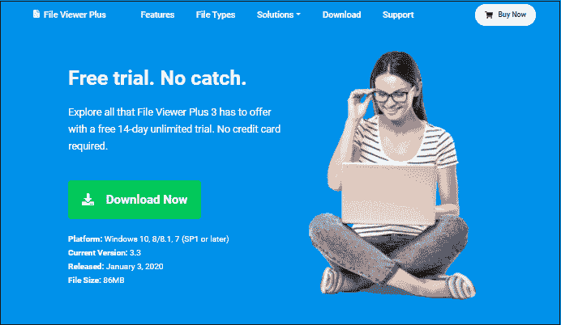
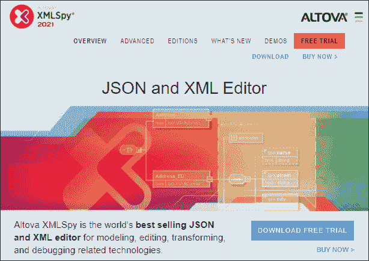
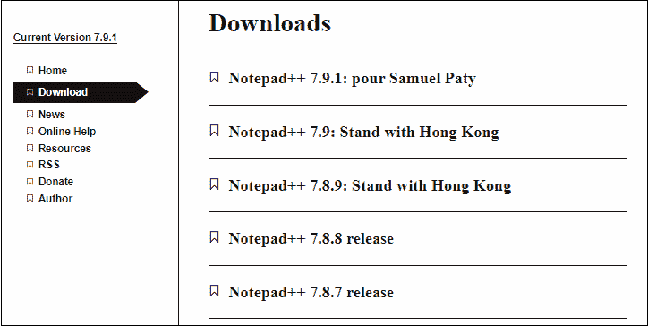
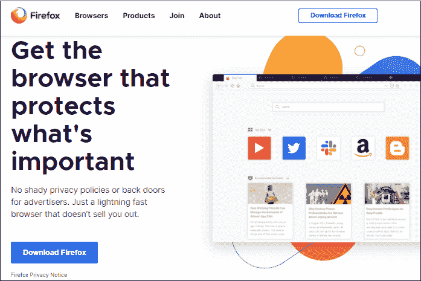
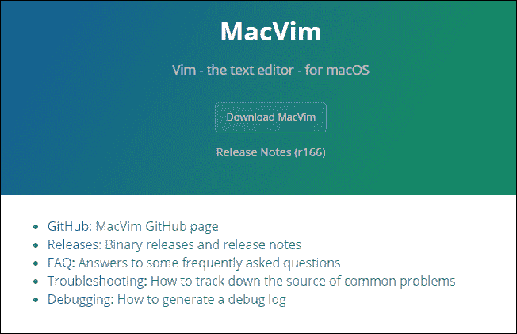
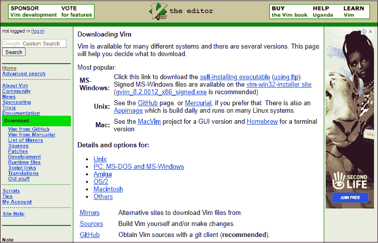
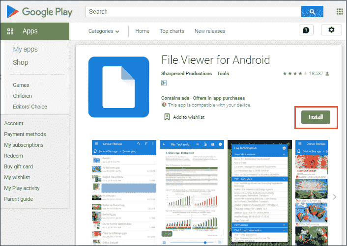
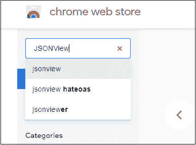
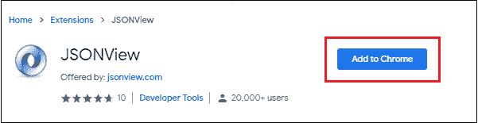
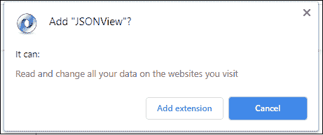

# 如何打开 JSON 文件？

> 原文：<https://www.javatpoint.com/how-to-open-json-file>

JSON 是指用于存储简单对象和数据结构的 **JavaScript 对象符号**格式。通常，JSON 文件是备份文件，用于备份需要时恢复回应用程序的数据。

**早期使用 [JSON](https://www.javatpoint.com/json-tutorial) 文件在服务器和 web 应用之间传输数据。但是现在，JSON 文件被用于其他几个目的。**有几个热门网站或搜索引擎使用 JSON 文件。其中一些如下:

*   **Mozilla Firefox** 使用 JSON 文件保存书签备份。
*   **Google+** 使用 JSON 文件保存配置文件数据。
*   **像 Elasticsearch 和 MongoDB 这样的 NoSQL 数据库**使用它来存储非结构化数据。
*   几个基于服务器的 JavaScript 应用程序，如 node.js、reactJS 等。，使用此文件存储配置信息。

## 为什么使用 JSON 文件？

这是一种标准类型的数据交换格式。用户通常使用它将数据从 web 应用程序传输到服务器(备份数据)，反之亦然，从服务器传输到 web 服务器(恢复数据)。JSON 文件使用**。json** 保存时扩展名类似 XML 文件格式。

让我们看看为什么我们应该使用 JSON 文件-

*   JSON 文件是轻量级的，需要存储的存储空间更少。
*   这些文件通常可以由文本编辑器创建和编辑。这些文本编辑器大多是免费提供的。
*   JSON 文件是人类可读的，这意味着用户可以轻松地阅读它们。
*   这些文件可以在任何简单的文本编辑器中打开，比如记事本，这很容易使用。
*   几乎每种编程语言都支持 JSON 格式，因为它们有库和函数来读/写 JSON 结构。

## 如何在不同的 OS 上打开 JSON 文件？

JSON 文件是简单的纯文本文件。通常，你可以在任何文本编辑器中打开它，但是不同的操作系统，如[窗口](https://www.javatpoint.com/windows)、iMac、 [Linux](https://www.javatpoint.com/linux-tutorial) ，以及 MacOS X 使用不同的工具或应用软件在它们上面打开 JSON 文件。通常，这些都是开源工具，因此在使用它们时，您不需要支付任何费用。

**Vim** 是一款文件打开软件，可以用来打开 **Linux 平台**上的 JSON 文件。 **GitHub Atom** 是打开 JSON 文件的**跨平台**工具。除了这些工具之外，还可以使用 **[【谷歌 Chrome】](https://www.javatpoint.com/google-chrome)****[等 web 浏览器打开 JSON 文件，我们后面会详细讨论。](https://www.javatpoint.com/mozilla-firefox)**

下面是针对不同操作系统的工具列表。

### 打开 JSON 文件的 Windows 工具

下面是可以在 Windows 平台上打开 JSON 文件的工具列表:

*   笔记本
*   记事本++
*   微软记事本
*   微软写字板
*   Mozilla Firefox
*   文件查看器 Plus
*   altova xmlspy

所有这些工具都运行在视窗操作系统上，其中一些是系统软件，另一些可以从网站上下载。

### 打开 JSON 文件的 Linux 工具

Linux 平台上有一个用来打开 JSON 文件的工具列表:

*   精力
*   微微
*   GNU emacs(GNU emacs)
*   GitHub Atom(跨平台)
*   Mozilla Firefox，以及
*   谷歌 Chrome

### 打开 JSON 文件的 iMac 工具

iMac 和 MacOS X 提供了一些工具或应用程序来打开一个 JSON 文件。以下是这些工具的列表:

*   麦克维
*   苹果文本编辑
*   Mozilla Firefox
*   裸骨文字牧马人

## JSON 文件的优点

**以下是 JSON 文件的一些优点-**

1.  JSON 文件是计算机可读的，也是人类可读的。因此，人类和计算机都可以读写 JSON 文件。
2.  JSON 格式被认为是一种独立的文件格式。然而，这种格式最初是基于 JavaScript 的一个子集。
3.  几乎每种编程语言都支持 JSON 格式，因为它们有库和函数来读/写 JSON 结构。
4.  JSON 文件很紧凑。
5.  它可以很容易地与大多数编程语言使用的数据结构进行映射。

## JSON 文件的用途

**早期，JSON 文件的主要目标是服务器和 web 应用程序之间的数据传输。但是现在，JSON 文件被用于其他几个目的。以下是 JSON 文件的高级用途-**

### 数据存储

大多数 [NoSQL 数据库](https://www.javatpoint.com/nosql-databases)引擎，如 [MongoDB](https://www.javatpoint.com/mongodb-tutorial) 和 [Elasticsearch](https://www.javatpoint.com/elasticsearch) 使用 JSON 结构将非结构化数据存储在其数据库中。它们以 JSON 文件格式存储数据。因此，JSON 格式是 NoSQL 数据库现在广泛使用的文件格式。

### 文件配置

几个基于服务器的 JavaScript 应用程序，如 [node.js](https://www.javatpoint.com/nodejs-tutorial) 、 [reactJS](https://www.javatpoint.com/reactjs-tutorial) 等。，使用此文件存储配置信息。

### 申请和通知

除了存储非结构化数据和配置信息，它还将通知从 web 应用程序传递到服务器。web 应用程序也使用它来下载 web 应用程序的状态。

## 从网上下载工具打开 JSON 文件

**这里有下载软件打开 JSON 文件的链接:**

### 文件查看器增强版(窗口)

文件查看器 Plus (FVP)是 Windows 操作系统的开源软件，用于打开 JSON 文件。它被广泛认为是一个通用的文件打开器。您可以在其中打开、编辑、更新和保存文件。它支持 300 多种文件格式。

点击[下载文件查看器 Plus](https://fileviewerplus.com/download) 即可下载。

**价格:**免费

### 阿尔托娃圣诞礼物(视窗)

Altova XMLSpy 也是一款 windows 软件，用于在 windows 操作系统上打开 JSON 文件。对于 [XML](https://www.javatpoint.com/xml-tutorial) 和 JSON 编辑器来说，它在世界范围内非常受欢迎。它支持几种格式，例如。xml，。json，。dtd，。xsl，。xsd，。xqy，。rdf，。qx，。qxl，还有更多。

点击[链接](https://www.altova.com/xmlspy-xml-editor)，在系统上下载 Altova XMLSpy。这是一个**付费工具**，但它为用户提供 30 天的免费试用。

**价格**

**专业 XML 编辑器:**目前€439.00

**企业 XML 编辑器:** €799.00 目前

### 记事本++ (Windows)

[记事本++](https://www.javatpoint.com/notepad-plus-plus-alternative-software) 是**在 Windows 操作系统上运行的记事本**的高级版本。它通常被称为**源代码编辑器**，用于编写 [HTML](https://www.javatpoint.com/html-tutorial) 、JavaScript、 [CSS](https://www.javatpoint.com/css-tutorial) 或 [Java](https://www.javatpoint.com/java-tutorial) 等编程语言的代码。这也可以用来打开 JSON 文件。这是一个自由软件工具。

点击系统上的[链接](https://notepad-plus-plus.org/downloads/)即可下载记事本++，无需支付任何费用。

**价格:**免费

### Mozilla Firefox(跨平台)

Mozilla Firefox 是一个网络浏览器，主要用于在互联网上搜索信息。它提供了许多安全功能，如增强的跟踪保护。Mozilla Firefox 也可以打开 JSON 文件。

**支持文件格式:**支持-等多种文件格式。HTML，。XHTML，。JPEG，。**JS。JSON** ，。CSS，。RSS，。SESSION，。MAFF，。MFL。JPX。BAK。JSP，。网址，等等。

可以从这里[下载最新版本的 Mozilla Firefox 下载 Mozilla Firefox](https://www.mozilla.org/en-US/firefox/new/) 。

**价格:**免费

### Apple TextEdit （Mac）

Apple TextEdit 是一款运行在 iMac 或苹果操作系统上的软件。这个软件已经和苹果操作系统一起提供了。它支持 JSON 文件格式。因此，您可以在其中编辑和保存 JSON 文件。除此之外，它还支持。xml 和。rtf 文件格式。

除此之外，您还可以将音频、视频、图形插入到文档中，并将其转换为 RTFD 格式。苹果文本编辑是一个开源产品，这意味着它是一个免费的工具。

点击此链接[下载苹果文本编辑](https://support.apple.com/en-in/guide/textedit/welcome/mac)下载苹果文本编辑。

**价格:**免费

### 麦克维(Mac)

如果您使用的是 Mac 操作系统版本 OS X 10.6 或更高版本，那么 MacVim 是一个满足编程需求的有用的源代码编辑器。它提供了一个易于使用和更方便地编写源代码的图形界面。MacVim 软件也可以用来打开 Mac 操作系统上的 JSON 文件。

**支持的文件格式:** MacVim 支持许多文件格式以及。json (JSON)。这些流行的支持格式如下。JAVA，。XML，。PHP，。JSP，。CSS，。c、。CPP，。PY，。SH，。TXT，。HTML，。JS，。ASPX。AWK。BSH。CONF。政务司司长，以及更多。

使用以下链接在 Mac 操作系统上下载 MacVim[下载 MacVim](https://macvim-dev.github.io/macvim/) 。

记住一件事“ **MacVim 不适用于 10.9 版 Mavricks** ”。

**价格:**免费

### Vim (Linux)

Vim 是一个运行在 Linux 操作系统上的软件工具。它可以用来打开 JSON 文件，并对其执行编辑、更新和保存操作。像其他 JSON 文件打开器一样，它也是一个免费的开源产品。Vim 应用程序也可以在 Windows 和 Mac 操作系统上下载。

Vim 软件是为 Linux 操作系统打开 json 和其他文本文件的好选择，因为它免费且易于使用。

**支持的文件格式:** Vim 支持很多文件格式，比如。TXT，。a、。CFG，。COMMAND，。CGI，。JSP，。CSS，。c、。CPP，。PY，。CSH。INC .。属性，。HTML，。JS，。ASPX。YML，。AWK。BSH。CONF。医学博士。ML，。RPY，。政务司司长，以及更多。

使用以下链接[在 Linux 操作系统上下载 Vim 下载 Vim](https://www.vim.org/download.php) 。

**价格:**免费

### 安卓文件打开器(安卓)

**安卓文件开启器**是一款在安卓操作系统上运行和下载的安卓应用。基本上，这个应用程序是设计运行在手机上打开不同格式的文件。您也可以从应用商店将其安装在您的计算机系统上。这是一个免费的应用程序。

**支持的文件格式:[安卓](https://www.javatpoint.com/android-tutorial)的**文件开启器可以显示 150 多种文件格式的内容。一些受支持的文件格式是-。c，。cs，。css，。cpp，。bsh，。mk，。尼姆。pl，。sql，。xml，。vb，。json，。js，。ini，。爪哇。htaccess，。达特。葛瑞德。咖啡等。

使用此[链接](https://play.google.com/store/apps/details?id=com.sharpened.androidfileviewer&hl=en_IN)直接下载安卓的**文件打开器。**

**价格:**免费

### 为所有操作系统打开 JSON 文件的常见步骤

1.  从安装位置打开系统上的 JSON 文件打开工具或应用程序。
2.  导航至菜单栏中的**文件**菜单，点击下拉列表中的**打开**。
3.  将会打开一个窗口，您需要移动到存储 JSON 文件的目录/文件夹位置。
4.  不要忘记从文本文档(*)中更改文件类型。txt)到所有文件。
5.  现在，选择 JSON 文件来打开它，以执行读取、写入或更新操作。
6.  JSON 文件将在阅读模式下向您打开。

### 在网络浏览器上打开 JSON 文件的步骤(Chrome，Mozilla)

1.  使用应用程序选项菜单或直接使用此[链接](https://chrome.google.com/webstore/category/extensions)在网络浏览器上打开网络商店。
2.  这里，在扩展类别下的搜索栏中键入 JSON 视图。
3.  您将获得类似于 JSON 视图的各种扩展来打开 JSON 格式的文件。
    
4.  从这些扩展选项中，选择“ **JSONView** ”扩展，点击**添加到 Chrome**
    将其添加到浏览器中
5.  它会打开一个弹出框，要求确认。
    
6.  点击**添加**一旦分机添加到浏览器，重启浏览器启用并使用分机。
7.  从浏览器打开 **JSONView** 扩展名，并标记**允许访问文件 URL**以允许通过该扩展名访问 JSON 和其他文件。
8.  设置完所有设置后，转到系统中存储 JSON 文件的文件夹。
9.  右键点击选中的 JSON 文件，选择**属性**改变应用打开文件。
10.  在这里，通过从**更改**下拉列表中进行选择，将**打开方式:**从其他应用程序(如照片查看器或记事本)更改为**谷歌浏览器**。
    
11.  选择浏览器打开 JSON 文件后，点击**确定**关闭窗口。
12.  现在，双击 JSON 文件，用网页浏览器中添加的 **JSONView** 扩展名打开它。

您的 JSON 文件现在将在浏览器中打开，您可以在其中读取数据。

* * *