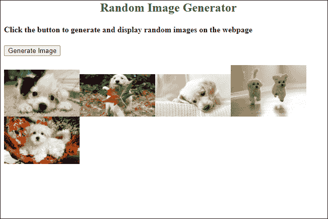

# JavaScript 中的随机图像生成器

> 原文：<https://www.javatpoint.com/random-image-generator-in-javascript>

在本章中，您将学习如何在 JavaScript 的帮助下在网页上生成随机图像。因此，我们将使用 JavaScript 和 HTML 源代码创建不同的随机图像生成器。首先，它需要一个数组来包含要在网页上显示的图像的网址。

随机图像生成器的概念主要用于广告。您在网站上看到的随机生成的图像已经存储在数据库或数组中。这些图像在固定的时间间隔内显示给用户，或者通过点击改变。您也可以直接从互联网上提供图像的地址。

我们将使用 [JavaScript](https://www.javatpoint.com/javascript-tutorial) 讨论随机图像生成器的两种不同方法。请参见下面的两种方法:

## 方法 1

在这种方法中，只需单击一个按钮，图像就会以固定的时间间隔随机显示在网页上。我们将使用 JavaScript 的**设置间隔()**内置的[功能来设置要显示的图像之间的计时器。](https://www.javatpoint.com/javascript-function)

在本例中，我们使用了图像的原始大小。您还可以定义要显示的每个图像的大小。现在，按照以下步骤操作:

### 随机图像生成器的步骤

*   使用 JavaScript 声明一个数组来存储图像。
*   提供声明数组中图像的链接或网址。您还可以在数组中传递图像大小的高度和宽度，以便在网页上显示。
*   声明一个 JavaScript 变量来存储使用这个**floor(math . random()* random image . length)**方法计算的随机值。它将生成一个介于 0 和数组长度之间的随机数，该随机数将被分配给要随机显示的图像。
*   现在，返回使用上一步中计算的数字选择的随机图像。
*   将上述所有步骤放入一个用户定义的函数(getRandomImage)中，点击**生成图像**调用该函数
*   在 HTML 代码中，我们将使用一个选项卡并提供一个标识来在另一个图像上显示一个图像。所以，这些图像会一个接一个地展示给你，通过互相包装。

将这些步骤转化为实际的实现。

**复制代码**

```js

<html>
<head> 
<title> Random Image Generator </title>
</head>
<script>
function getRandomImage() {
//declare an array to store the images
var randomImage = new Array();

//insert the URL of images in array
randomImage[0] = "https://images.pexels.com/photos/858115/pexels-photo-858115.jpeg?auto=compress&cs=tinysrgb&dpr=1&w=500";
randomImage[1] = "http://www.petsworld.in/blog/wp-content/uploads/2014/09/running-cute-puppies.jpg";
randomImage[2] = "https://images.pexels.com/photos/142497/pexels-photo-142497.jpeg?auto=compress&cs=tinysrgb&dpr=1&w=500";
randomImage[3] = "https://images.unsplash.com/photo-1543877087-ebf71fde2be1?ixlib=rb-1.2.1&ixid=eyJhcHBfaWQiOjEyMDd9&auto=format&fit=crop&w=500&q=60";
randomImage[4] = "https://wi.wallpapertip.com/wsimgs/156-1565522_puppies-desktop-wallpaper-desktop-background-puppies.jpg";
randomImage[5] = "https://images.unsplash.com/photo-1501265976582-c1e1b0bbaf63?ixlib=rb-1.2.1&ixid=eyJhcHBfaWQiOjEyMDd9&auto=format&fit=crop&w=500&q=60";

//generate a number and provide to the image to generate randomly
var number = Math.floor(Math.random()*randomImage.length);

//return the images generated by a random number
return document.getElementById("result").innerHTML = '';
}

</script>
<body>
<center><h2 style="color:green"> Random Image Generator </h2></center>
<h4> Click the button to generate and display random images on the webpage </h4>
<!-- call user-defined getRandomImage function after 2 seconds -->  
<button onclick = "setInterval(getRandomImage, 2000)"> Generate Image </button>
<br> <br>
<span id="result" align="center"> </span> 

</body>  
</html>

```

[Test it Now](https://www.javatpoint.com/oprweb/test.jsp?filename=random-image-generator-in-javascript1)

**输出**

通过执行该代码，将出现一个带有**生成图像**按钮的网页。当您点按此按钮时，图像将开始随机显示在网页上。


点击**生成图像**按钮，显示随机生成的图像。一旦点击**生成图像**按钮，这些图像将每隔几秒钟自动改变一次。


请参见下面的输出:


**“记住**我们已经从网上提供了数组中的图像地址。我们没有在我们的数据库中下载或存储这些图像”。

### 示例 2:生成多个随机图像

在这个例子中，当用户点击一个按钮时，我们将一次生成并显示多个随机图像。我们将使用 [HTML](https://www.javatpoint.com/html-tutorial) 代码名称生成图像来创建一个按钮。这些图像将存储在用户选择的阵列中。每次当用户点击此**生成图像**按钮时，网页上会生成并显示五张批量随机图像。

请参见下面的步骤，了解如何做到这一点:

*   使用 JavaScript 声明一个数组，并提供该数组中图像的链接或 URL 来存储图像。
*   使用 for 循环一次生成多个随机图像。我们将使用 0 到 5 的循环在一次按钮点击中显示五个图像。
*   将以下步骤放入此 for 循环中。
*   使用**floor(math . random()* random mage . length)**方法计算 0 到数组长度之间的随机数。这个生成的数字将分配给随机显示的图像。
*   现在，使用上一步中计算的数字打印所有五个随机选择的图像。
*   将上述所有步骤放入一个用户定义的函数(getRandomImage)中，点击**生成图像**调用该函数

将这些步骤转化为实际实现，并查看下面的代码:

**复制代码**

```js

<html>
<head> 
<title> Random Image Generator </title>
</head>
<script>
function getRandomImage() {
//declare an array to store the images
var randomImage = new Array();

//insert the URL of images in array
randomImage[0] = "https://wi.wallpapertip.com/wsimgs/15-155208_desktop-puppy-wallpaper-hd.jpg";
randomImage[1] = "http://www.petsworld.in/blog/wp-content/uploads/2014/09/running-cute-puppies.jpg";
randomImage[2] = "https://wi.wallpapertip.com/wsimgs/156-1564365_golden-retriever-puppy-desktop-wallpaper-desktop-wallpaper-puppy.jpg";
randomImage[3] = "https://wi.wallpapertip.com/wsimgs/156-1564140_free-puppy-wallpapers-for-computer-wallpaper-cave-cute.jpg";
randomImage[4] = "https://wi.wallpapertip.com/wsimgs/156-1565522_puppies-desktop-wallpaper-desktop-background-puppies.jpg";
randomImage[5] = "https://wi.wallpapertip.com/wsimgs/156-1566650_cute-puppies-desktop-wallpaper-cute-puppies.jpg";

//loop to display five randomly chosen images at once
for (let i=0; i< 5; i++) {
//generate a number and provide to the image to generate randomly
var number = Math.floor(Math.random()*randomImage.length);
//print the images generated by a random number
document.getElementById("result").innerHTML += '';
}
}

</script>
<body>
<center><h2 style="color:green"> Random Image Generator </h2></center>
<h4> Click the button to generate and display the five random images: </h4>
<!-- call user-defined getRandomImage function to generate image -->  
<button onclick = "getRandomImage()"> Generate Image </button>
<br> <br>
<span id="result" align="center"> </span> 

</body>  
</html>

```

[Test it Now](https://www.javatpoint.com/oprweb/test.jsp?filename=random-image-generator-in-javascript2)

**输出**

通过运行上述代码，您将获得响应以及一个**生成图像**按钮。最初，不会有图像。


当您点击此**生成图像**按钮时，随机选择的五幅图像将在网页上显示给您。



再次点击**生成图像**按钮，与之前的输出再次随机显示五幅图像。


## 方法 2

在这种方法中，我们将通过每次点击一个按钮来显示随机图像。这些图像不会像以前的方法那样自动改变。

在本例中，我们还将提供要在网页上显示的每个图像的大小(高度和宽度)。因此，图像将以您在 JavaScript 代码中指定的大小显示。

### 随机图像生成器的步骤

*   创建一个用户定义的函数**随机化图像生成器()**，并将以下所有步骤放入其中。
*   使用包含要在网页上显示的图像的位置/网址、高度和宽度的 JavaScript 创建图像数组。
*   将图像的 URL、高度和宽度存储在另一个数组索引中。
*   使用 **floor()** 方法生成一个随机数，该随机数将使用图像数组在网页上随机显示。它将生成一个 0 到数组长度之间的随机数，该随机数将被分配给要随机显示的图像。
*   显示索引号与上一步生成的随机数相匹配的图像。
*   我们将使用一种方法移除先前的图像，并用新图像覆盖。
*   在 HTML 中创建一个按钮来更改图像。

将这些步骤转化为实际实现，并查看下面的代码:

**复制代码**

```js

<html>
<head>
<title>Display random images</title>
<style>
body {
margin-top: 30px;
}
</style> 
</head>

<script>
function displayRandomImages() 
{
   //array of images with image location, height, and width
   var imageArray = [
   { 
     //address URL of the image
     src: "https://wi.wallpapertip.com/wsimgs/15-155208_desktop-puppy-wallpaper-hd.jpg",
     //size for the image to be display on webpage
     width: "280",
     height: "200"
   }, 
   {
     src: "https://wi.wallpapertip.com/wsimgs/156-1564365_golden-retriever-puppy-desktop-wallpaper-desktop-wallpaper-puppy.jpg",
     width: "320",
     height: "195"
   }, 
   {
     src: "https://wi.wallpapertip.com/wsimgs/156-1564140_free-puppy-wallpapers-for-computer-wallpaper-cave-cute.jpg",
     width: "320",
     height: "195"
   },
   {
     src: "https://wi.wallpapertip.com/wsimgs/156-1566650_cute-puppies-desktop-wallpaper-cute-puppies.jpg",
     width: "350",
     height: "250"
    } ];

    //find the length of the array of images
    var arrayLength = imageArray.length;
    var newArray = [];
    for (var i = 0; i < arrayLength; i++) {
        newArray[i] = new Image();
        newArray[i].src = imageArray[i].src;
        newArray[i].width = imageArray[i].width;
        newArray[i].height = imageArray[i].height;
    }

  // create random image number
  function getRandomNum(min, max) 
  {
      // generate and return a random number for the image to be displayed 
      imgNo = Math.floor(Math.random() * (max - min + 1)) + min;
      return newArray[imgNo];
  }  

  // 0 is first image and (preBuffer.length - 1) is last image of the array
  var newImage = getRandomNum(0, newArray.length - 1);

  // remove the previous images
  var images = document.getElementsByTagName('img');
  var l = images.length;
  for (var p = 0; p < l; p++) {
     images[0].parentNode.removeChild(images[0]);
  }
  // display the new random image  
  document.body.appendChild(newImage);
}
</script>

<body>
<div>
<center>
<h2 style="color:green"> Random Image Generator </h2>
<h4> Press the button to display and change the image </h4>
<button onclick="displayRandomImages();"> Display Images </button>
</center> 
</div>
</body>
</html>

```

[Test it Now](https://www.javatpoint.com/oprweb/test.jsp?filename=random-image-generator-in-javascript3)

**输出**

通过执行该代码，将出现一个带有**显示图像**按钮的网页。单击此按钮生成图像。


点击**显示图像**按钮，看到一个图像随机显示。


每次点击这个**显示图像**按钮，就会出现一个新的图像。


为了更容易理解，我们将逐步解释上面的 JavaScript 代码。

**声明并初始化数组**

声明一个数组，并存储要在 web 上显示的图像的地址、高度和宽度。

```js

var imageArray = [
   { 
     //address URL of the image
     src: "https://wi.wallpapertip.com/wsimgs/15-155208_desktop-puppy-wallpaper-hd.jpg",
     //size for the image to be display on webpage
     width: "280",
     height: "200"
   }, 
   {
     src: "https://wi.wallpapertip.com/wsimgs/156-1564365_golden-retriever-puppy-desktop-wallpaper-desktop-wallpaper-puppy.jpg",
     width: "320",
     height: "195"
   }];

```

**将图像 URL、高度和宽度存储到另一个数组索引中**

此代码用于将图像的图像 URL、高度和宽度存储到另一个数组索引中，以便于访问。因此，我们将找到初始数组的长度，并将它们的元素转移到另一个新数组中。

```js

    //find the length of the array of images
    var arrayLength = imageArray.length;
    var newArray = [];
    for (var i = 0; i < arrayLength; i++) 
   {
        newArray[i] = new Image();
        newArray[i].src = imageArray[i].src;
        newArray[i].width = imageArray[i].width;
        newArray[i].height = imageArray[i].height;
    }

```

**生成随机数**

这将生成一个 0 到数组长度之间的随机数。

```js

function getRandomNum(min, max) 
  {
      // generate and return a random number for the image to be displayed 
      imgNo = Math.floor(Math.random() * (max - min + 1)) + min;
      return newArray[imgNo];
  }  

  // 0 is first image and (preBuffer.length - 1) is last image of the array
  var newImage = getRandomNum(0, newArray.length - 1);

```

**移除上一张图片**

此代码用于从网站上删除以前的图像，以便显示新图像。

```js

// remove the previous images
  var images = document.getElementsByTagName('img');
  var l = images.length;
  for (var p = 0; p < l; p++) {
     images[0].parentNode.removeChild(images[0]);
  }

```

**显示图像**

最后，我们使用了这段代码来显示移除前一个图像后的图像。

```js

// display the new random image  
  document.body.appendChild(newImage);

```

* * *