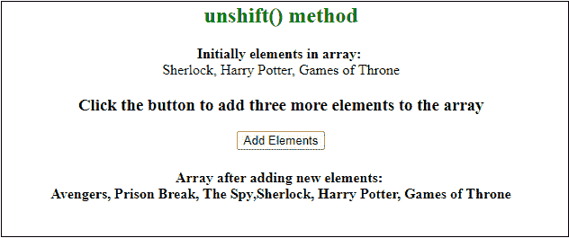
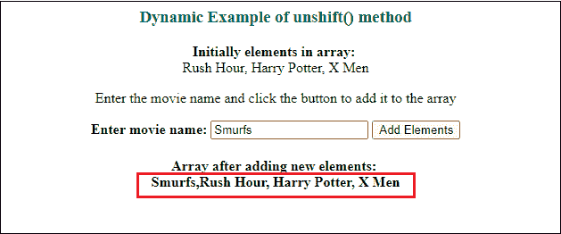

# 如何用 JavaScript 在数组中添加对象？

> 原文：<https://www.javatpoint.com/how-to-add-object-in-array-using-javascript>

JavaScript 提供了三个内置函数来在数组中添加或插入对象。这些方法是-

*   **推()**
*   **拼接()**
*   **unshift()**

您可以使用这些方法中的任何一种将对象添加到数组中。对象是数组中的元素或值。我们将详细讨论每种方法。

## 方法 1:推送()

push()函数是 JavaScript 的内置数组方法。它用于添加数组中的对象或元素。此方法在数组的末尾添加元素。

"**注意**在数组中可以使用 push()方法添加任意数量的元素。"

### 句法

对象作为参数在 array.push()函数中传递，如下语法所示-

```js

array.push(objectName)

```

这里，数组是用户定义的数组名称，例如汽车、水果、电影等。

### 返回值

push()函数在添加新元素后返回数组的新长度。

### 例 1

这是 push()方法的一个简单例子，我们将初始化一个包含三个元素(电影名)的数组。然后，我们将通过在 movieList.push()方法中传递对象名，向数组中再添加两个对象。

**复制代码**

```js

<html>
<body>
<script> 
    var movieList = ["Rush hour", " X-Men", " Avengers"]; 
    document.write("<b><br> Initially elements in array: </b>" + movieList + "<br>");

    function pushFunction() { 
      //add new elementin list array      
      var noOfElement = movieList.push(" Twilight", " Caption America"); 
      document.write("<b> Elements after adding new elements: </b>" + movieList);
      document.write("<br> Number of elements in array: " + noOfElement);
    } 
    pushFunction();
</script> 

</body>   
</html>

```

[Test it Now](https://www.javatpoint.com/oprweb/test.jsp?filename=how-to-add-object-in-array-using-javascript1)

**输出**

在下面的响应中，您可以看到 push()方法在添加到 movieList 数组后返回了 5 作为元素数。


### 例 2

这是 push()函数的另一个例子，在这个例子中，我们使用了一个 [HTML 按钮](https://www.javatpoint.com/html-button-tag)来调用函数，在数组中插入新元素。

**复制代码**

```js

<html>
<script> 
    var seriesList = ["Sherlock", " Harry Potter", " Games of Throne"]; 
    document.write("<b> Initially elements in array: </b>" + seriesList + "<br>");

    function pushFunction() { 
      //add new element in array      
      seriesList.push(" Avengers", " Prison Break", " The Spy"); 
      //return the array with new values
      document.getElementById("result").innerHTML = "<b> Array after adding new elements: </b> </br>" + seriesList;
    } 
</script> 

<body>
<h3> Click the button to add three more elements to the array </h3>
<button onclick="pushFunction()"> Push Elements </button>
<h4 id="result">
</body>   
</html>

```

[Test it Now](https://www.javatpoint.com/oprweb/test.jsp?filename=how-to-add-object-in-array-using-javascript2)

**输出:点击按钮前**

通过执行上述代码，响应将与下面给出的相同。我们还创建了一个**按钮来添加新的元素到数组中。**


**输出:点击按钮**后

我们已经在 [JavaScript](https://www.javatpoint.com/javascript-tutorial) 代码中提供了另外三个系列名称来添加到该数组中。所以，当你点击这个**推动元素**按钮，这些元素将被添加到数组中。


在上面的两个例子中，您已经注意到元素被插入到数组的末尾。

### 示例 3:接受用户的输入

在这个例子中，我们将通过 [HTML](https://www.javatpoint.com/html-tutorial) 表单接受用户的输入，使用 push()方法插入元素。

**复制代码**

```js

<html>
<center>
<h3 style="color:green"> push() method </h3>
<script> 
    var seriesList = ["Rush Hour", " Harry Potter", " X Men"]; 
    document.write("<b> Initially elements in array: </b> <br>" + seriesList + "<br>");

    function addObject() { 
    var movie = document.getElementById("mv").value;
      //add new elementin list array      
      seriesList.push(movie); 
      document.getElementById("result").innerHTML = "<b> Array after adding new elements:</b> <br>" + seriesList;
    } 
</script> 

<body>
<p> Enter the movie name and click the button to add it to the array </p>
<b> Enter movie name: </b> 
<input type="text" id="mv"> 
<button type=submit onclick="addObject()"> Add Elements </button>
<h4 id="result"> </h4>
</body>   
</center>
</html>

```

[Test it Now](https://www.javatpoint.com/oprweb/test.jsp?filename=how-to-add-object-in-array-using-javascript3)

**输出:进入新输入前**

通过执行上面的代码，您最初将获得具有三个电影名称的输出。有一个输入字段接受用户输入，还有一个**添加元素**按钮提交输入值。

请参见下面的输出:


**输出:输入新值后**

我们提供了 **Titanic** 作为新元素值，并点击了**添加元素**按钮。你会看到**泰坦尼克号**成功的添加到了下面输出的数组的末尾。


## 方法 2:拼接()

splice()函数是 JavaScript 的另一种内置数组方法。这是一种特殊类型的函数，用于在数组的特定索引中添加和移除元素。它可以同时执行这两种操作。

此方法在其中定义的特定索引处添加或移除元素/对象。新对象在指定的索引处插入。拼接()方法接受三个参数- **起始索引** **待删除元素个数****待添加新元素**。

**注意**与 push()方法类似，可以在数组中使用 splice()方法添加任意数量的新元素

### 句法

请参见下面 splice()方法的语法-

```js

array.splice(startindex, howmany, objectName)

```

通过将第二个参数指定为 0，可以在不从数组中移除任何其他元素的情况下添加对象。

```js

array.splice(startindex, 0, objectName)

```

这里，**数组**是用户自定义的数组名称，如汽车、水果、电影等。

让我们借助于如何工作的例子来理解这个数组函数。我们将讨论这两种情况:

1.  通过移除其他元素
2.  而不移除其他元素

### 示例 1:通过移除其他元素

在本例中，我们将移除数组的其他元素，以向其中添加新元素。新元素/对象将被添加到代码中指定索引处的数组中。

**复制代码**

```js

<html>
<center>
<h3 style="color:green"> splice() method </h3>
<script> 
    var seriesList = ["Sherlock", " Harry Potter", " Games of Throne"]; 
    document.write("<b> Initially elements in array: </b> <br>" + seriesList + "<br>");

    function addObject() { 
      //add new elementin list array      
      seriesList.splice(1, 2, " Prison Break", " The Spy", " Avengers"); 
      document.getElementById("result").innerHTML = "<b> Array after adding new elements:</b> <br>" + seriesList;
    } 
</script> 

<body>
<h3> Click the button to add three elements to the array </h3>
<button onclick="addObject()"> Add Elements </button>
<h4 id="result"> </h4>
</body>   
</center>
</html>

```

[Test it Now](https://www.javatpoint.com/oprweb/test.jsp?filename=how-to-add-object-in-array-using-javascript4)

**输出**

在执行上述代码时，您将获得具有三个系列名称(夏洛克、哈利·波特、王座游戏)和一个**添加元素**按钮的响应，如下所示:


当你点击这个**添加元素**按钮时，首先数组索引 1 中的元素，例如 a[1] ( **哈利波特，王座游戏**)将被移除，然后新的元素(**越狱，间谍，复仇者**)将被添加到数组中。


### 示例 2:不移除其他元素

在这个例子中，我们不会移除数组的其他元素来添加新的元素。我们将按照代码中的指定，将新的元素从索引追加到数组中。

**复制代码**

```js

<html>
<center>
<h3 style="color:green"> splice() method </h3>
<script> 
    var seriesList = ["Sherlock", " Harry Potter", " Games of Throne"]; 
    document.write("<b> Initially elements in array: </b>" + seriesList + "<br>");

    function addObject() { 
      //add new elementin list array      
      seriesList.splice(2, 0, " Prison Break", " The Spy"); 
      document.getElementById("result").innerHTML = "<b> Array after adding new elements: </b> </br>" + seriesList;
    } 
</script> 

<body>
<h3> Click the button to add three more elements to the array </h3>
<button onclick="addObject()"> Add Elements </button>
<h4 id="result"> </h4>
</body>   
</center>
</html>

```

[Test it Now](https://www.javatpoint.com/oprweb/test.jsp?filename=how-to-add-object-in-array-using-javascript5)

**输出**

在执行上面的代码时，您将得到如下所示的数组中有三个元素/对象的响应:


当你点击这个**添加元素**按钮时，它会在序列列表中再添加两个我们定义的元素/对象。


## 方法 3:卸载()

unshift()函数是 JavaScript 的又一个内置数组方法。它用于添加数组中的对象或元素。与 push()方法不同，它在数组的开头添加元素。

"**注意**可以使用 unshift()方法在数组中添加任意数量的元素。"

### 句法

对象在 array.unshift()函数中作为参数传递，如下语法所示-

```js

array.unshift(objectName)

```

这里，数组是用户定义的数组名称，例如汽车、水果、电影等。

### 返回值

unshift()方法在向数组中添加新元素后返回数组的新长度。您可以将 unshift()函数返回的数组长度存储在一个 JavaScript 变量中。

### 例 1

这是 unshift()函数的一个简单例子，我们将在一个数组中有三个元素(电影名)。然后，我们将通过在 movieList.unshift()方法中传递对象名称，向数组中再添加两个对象。

**复制代码**

```js

<html>
<body>
<center>
  <h3 style="color:green"> Simple unshift() method Example </h3>
</center>
</body>

<script> 
    var movieList = ["Rush hour", " X-Men", " Avengers"]; 
    document.write("<b><br> Initially elements in array: </b>" + movieList + "<br>");

    function addFunction() { 
      //add new element in the beginning of array      
      var noOfElement = movieList.unshift(" Twilight", " Caption America"); 
      document.write("<b> Elements after adding new elements: </b>" + movieList);
      document.write("<br> Number of elements in array: " + noOfElement);
    } 
    addFunction();
</script>   
</html>

```

[Test it Now](https://www.javatpoint.com/oprweb/test.jsp?filename=how-to-add-object-in-array-using-javascript6)

**输出**

在下面的响应中，您可以看到 unshift()方法在添加到 movieList 数组后返回了 5 作为元素数。


### 例 2

这是 unshift()函数的另一个例子，其中我们使用了一个 HTML 按钮来调用函数，以在数组中插入新元素。

**复制代码**

```js

<html>
<center>
<h2 style="color:green"> unshift() method </h2>
<script> 
    var seriesList = ["Sherlock", " Harry Potter", " Games of Throne"]; 
    document.write("<b> Initially elements in array: </b><br>" + seriesList + "<br>");

    function addElement() { 
      //add new element at the beginning of the array      
      seriesList.unshift(" Avengers", " Prison Break", " The Spy"); 
      //return the array with new values
      document.getElementById("result").innerHTML = "<b> Array after adding new elements: </b> </br>" + seriesList;
    } 
</script> 

<body>
<h3> Click the button to add three more elements to the array </h3>
<button onclick="addElement()"> Add Elements </button>
<h4 id="result">
</body>   
</center>
</html>

```

[Test it Now](https://www.javatpoint.com/oprweb/test.jsp?filename=how-to-add-object-in-array-using-javascript7)

**输出:点击按钮前**

通过执行上述代码，您将获得具有三个元素和一个**添加元素**按钮的响应，如下所示。这个**添加元素**按钮将帮助添加新的元素到数组中。


**输出:点击按钮**后

我们在 JavaScript 代码中提供了另外三个系列名称来添加到该数组中。所以，当你点击这个**添加元素**按钮时，这些元素将被添加到数组中。



### 示例 3:接受用户的输入

在本例中，我们将通过 HTML 表单接受用户的输入，并使用 unshift()方法插入元素。

**复制代码**

```js

<html>
<center>
<h3 style="color:green"> Dynamic Example of unshift() method </h3>
<script> 
    var seriesList = ["Rush Hour", " Harry Potter", " X Men"]; 
    document.write("<b> Initially elements in array: </b> <br>" + seriesList + "<br>");

    function addObject() { 
    var movie = document.getElementById("mv").value;
      //add new element in list array      
      seriesList.unshift(movie); 
      document.getElementById("result").innerHTML = "<b> Array after adding new elements:</b> <br>" + seriesList;
    } 
</script> 

<body>
<p> Enter the movie name and click the button to add it to the array </p>
<b> Enter movie name: </b> 
<input type="text" id="mv"> 
<button type=submit onclick="addObject()"> Add Elements </button>
<h4 id="result"> </h4>
</body>   
</center>
</html>

```

[Test it Now](https://www.javatpoint.com/oprweb/test.jsp?filename=how-to-add-object-in-array-using-javascript8)

**输出:进入新输入前**

通过执行上面的代码，您将最初获得具有三个电影名称的输出，一个从用户处获取输入的输入字段和一个提交输入值的**添加元素**按钮。

请参见下面的输出:


**输出:输入新值后**

我们提供了 **Titanic** 作为新元素值，并点击了**添加元素**按钮。你会看到**泰坦尼克号**在下面的输出中成功添加到数组的开头。



以上所有方法都是将元素添加到数组中的详细示例。它们的工作方式不同，因为 push()方法在数组末尾添加元素，而 unshift()方法在开头添加元素，并且 splice()函数将元素添加到数组中的指定索引。

* * *